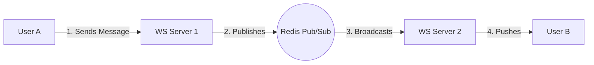

# Scalable Real-time Chat: WebSockets & Redis Pub/Sub

1. 💡 **The "Big Picture" (Plain English)**
   - **What is this?** Imagine you want to talk to a friend instantly. In the old web (HTTP), it’s like sending a letter and waiting for a reply. You have to keep checking your mailbox to see if they wrote back. With WebSockets, it’s like a **Phone Call**. Once the line is open, both people can talk at the same time without hanging up and redialing.
   - **The Real-World Analogy:** Think of a **Radio Station**. 
     - The **WebSocket** is the private line between a listener and the station. 
     - **Redis Pub/Sub** is the transmitter tower. If the station has 10 different towers (servers) across the country, Redis ensures that when the DJ speaks into the mic in New York, the listeners connected to the tower in Los Angeles hear it instantly too.
   - **Why care?** Without this, your chat app would feel "laggy." You’d have to refresh the page to see new messages, or your phone battery would die from constant "Are there new messages yet?" requests (Polling).

2. 🛠️ **How it Works (Step-by-Step)**
   1. **The Handshake:** The client asks the server, "Can we upgrade this HTTP connection to a WebSocket?" If the server agrees, the "phone line" stays open.
   2. **The Message:** User A sends a message through their open line to **Server 1**.
   3. **The Broadcast:** Server 1 doesn't know where User B is. User B might be connected to **Server 2**. So, Server 1 "publishes" the message to a specific **Redis Channel**.
   4. **The Pickup:** Server 2 is "subscribed" to that Redis channel. It sees the message, looks at its local connections, finds User B, and pushes the message down User B's open WebSocket line.

```javascript
// Simplified Node.js + Redis Pub/Sub Logic
const WebSocket = require('ws');
const Redis = require('ioredis');

const pub = new Redis();
const sub = new Redis();
const wss = new WebSocket.Server({ port: 8080 });

// 1. Listen for new WebSocket connections
wss.on('connection', (ws) => {
  
  // 2. When a message arrives from a client
  ws.on('message', (data) => {
    const message = JSON.parse(data);
    // Publish to Redis so ALL server instances see it
    pub.publish('CHAT_CHANNEL', JSON.stringify(message));
  });

  // 3. Subscribe this server instance to Redis
  sub.subscribe('CHAT_CHANNEL');
  sub.on('message', (channel, msg) => {
    // 4. Send the message to the actual connected client
    ws.send(msg); 
  });
});
```

**The Flow:**


3. 🧠 **The "Deep Dive" (For the Interview)**
   - **Statefulness vs. Statelessness:** Unlike standard REST APIs, WebSocket servers are **stateful**. The server must keep the TCP connection alive in memory (RAM). This means you can't just use a standard Load Balancer; you need **"Sticky Sessions"** or a way to track which user is on which server.
   - **Horizontal Scaling:** This is where Redis Pub/Sub shines. Without Redis, if User A is on Server 1 and User B is on Server 2, they are invisible to each other. Redis acts as the **Message Bus** that unites isolated servers into one cohesive system.
   - **The Trade-off (Memory vs. Speed):** Redis Pub/Sub is "fire and forget." It is incredibly fast (sub-millisecond), but it doesn't store messages. If User B is offline for 2 seconds during a server restart, they miss the message. To fix this, you’d need a persistent store (like Redis Streams or a Database).

   - **Interviewer Probe 1: "What happens if the Redis instance crashes?"**
     - *Answer:* The entire "broadcast" system fails. You should mention using **Redis Sentinel** or **Redis Cluster** for High Availability (HA) to ensure there's a failover.
   - **Interviewer Probe 2: "How do you handle 1 million concurrent connections?"**
     - *Answer:* You need to discuss **C10k/C1m problem** limits (Linux file descriptors), memory per connection (usually 10-50KB), and using a Distributed Load Balancer (like Nginx or AWS ALB) that supports the `Upgrade` header.
   - **Interviewer Probe 3: "Redis Pub/Sub doesn't guarantee delivery. How do you handle 'at-least-once' delivery?"**
     - *Answer:* Transition the conversation from **Redis Pub/Sub** to **Redis Streams** or **Kafka**. These allow for "acknowledgments" and message offsets so clients can catch up on what they missed.

4. ✅ **Summary Cheat Sheet**
   - **WebSockets** provide a persistent, bi-directional pipe for low-latency communication.
   - **Redis Pub/Sub** is the "glue" that allows multiple WebSocket servers to talk to each other so the system can scale horizontally.
   - **State management** is the biggest challenge; servers must remember who is connected to them.

   > **Golden Rule:** HTTP is for *pulling* data; WebSockets are for *pushing* data. Use Redis Pub/Sub to make sure everyone is in the same "room," regardless of which server they hit.