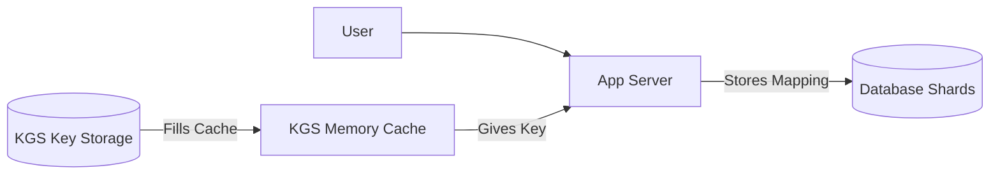

# URL Shortener: Key Generation Service (KGS) & Sharding

1. 💡 **The "Big Picture" (Plain English):**
   - **What is this?** Imagine you run a massive coat check at a stadium. Instead of writing a custom description for every coat that comes in (which takes forever), you have a giant roll of pre-printed raffle tickets (001, 002, 003...). When someone gives you a coat, you just tear off the next ticket and hand it to them.
   - **KGS (Key Generation Service):** This is the "Ticket Roll." Instead of calculating a hash for a URL and worrying if it's unique, we have a separate service that just hands out unique, pre-made IDs.
   - **Sharding:** This is having multiple coat check rooms. If one room gets full or the line gets too long, you spread the coats across Room A, Room B, and Room C.
   - **Why care?** If you try to generate unique IDs and check the database for duplicates every single time, your app will crawl to a halt as you scale. This approach makes your system lightning-fast and "collision-proof."

2. 🛠️ **How it Works (Step-by-Step):**
   1. **Pre-generation:** The KGS generates millions of unique strings (keys) ahead of time and stores them in a "Key DB."
   2. **Caching:** To avoid hitting the DB for every request, the KGS loads a "chunk" of keys into memory.
   3. **Handing Out:** When a user wants to shorten a URL, the Application Server asks the KGS for a key.
   4. **Mapping:** The App Server maps `ShortKey -> LongURL` and saves it to the Sharded Database.
   5. **Encoding:** We use **Base62** (0-9, a-z, A-Z) to make the keys look like `6bA9fL` instead of just long numbers.

**Clean Code Snippet (Base62 Encoding):**
```python
# Converting a unique numeric ID from KGS into a short string
def encode_base62(n):
    characters = "0123456789abcdefghijklmnopqrstuvwxyzABCDEFGHIJKLMNOPQRSTUVWXYZ"
    result = []
    while n > 0:
        result.append(characters[n % 62])
        n //= 62
    return "".join(reversed(result))

# Example: KGS gives us ID 1234567
# encode_base62(1234567) -> "5be9"
```

**System Flow:**


3. 🧠 **The "Deep Dive" (For the Interview):**
   - **The KGS "Single Point of Failure":** If KGS dies, the whole system stops shortening URLs. 
     - *Solution:* Run multiple KGS instances. Use **Apache Zookeeper** to coordinate which KGS instance "owns" which range of keys (e.g., KGS-1 gets 1-1000, KGS-2 gets 1001-2000) so they never hand out the same key.
   - **Database Sharding (Horizontal Partitioning):**
     - Since we have billions of URLs, we split the data.
     - **Hash-Based Sharding:** Take the `ShortKey`, hash it, and use `hash % number_of_shards` to decide which DB to store it in. This distributes data evenly.
   - **Concurrency & Locking:**
     - In the KGS, once a key is pulled from the cache into an App Server, it must be marked as "Used" immediately. To keep this fast, we use an `AtomicUpdate` or a `SELECT FOR UPDATE` to ensure two servers don't grab the same "ticket."
   - **Trade-offs:** 
     - *KGS vs. Hashing:* Hashing (MD5) is stateless but requires "collision handling" (checking the DB to see if the hash exists). KGS is stateful (requires more infrastructure) but is significantly faster for writes because there are **zero collisions**.

   **Interviewer Probes:**
   - *"What happens if the KGS cache crashes? Do we lose keys?"* 
     - **Answer:** Yes, the keys currently in memory are lost, but that’s okay! Keys are cheap. We just start from the next range in the DB. We prioritize speed over "using every single number."
   - *"How do you handle 'Hot Keys' (a viral URL that everyone clicks)?"*
     - **Answer:** Sharding helps, but for reads, we should put a **Redis cache** in front of the DB shards to serve the most popular 20% of URLs from memory.

4. ✅ **Summary Cheat Sheet:**
   - **KGS:** A dedicated service that pre-generates and hands out unique "tickets" (IDs) to avoid collisions and DB lookups.
   - **Sharding:** Splitting the database into smaller pieces based on the Short Key to handle massive scale.
   - **Base62:** The standard way to turn a big number into a short, URL-friendly string.

**The Golden Rule:** 
> "In high-scale systems, don't compute what you can pre-calculate, and don't centralize what you can shard."