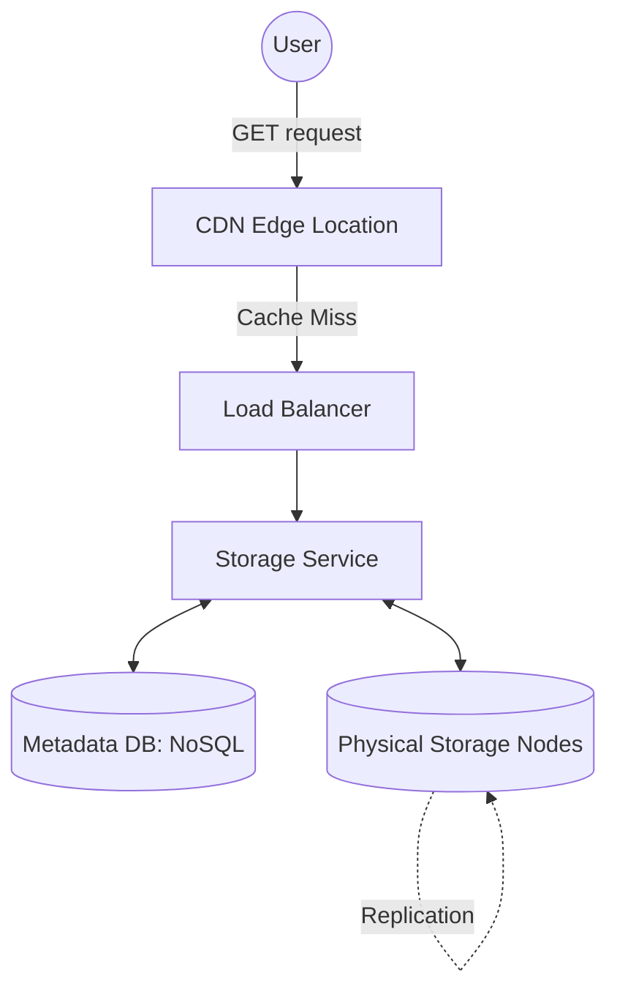

# Distributed Object Storage & Global Delivery Architecture

1. 💡 **The "Big Picture" (Plain English):**
   - **What is this?** Imagine you have a billion photos. You can’t put them on one computer because it will run out of space or crash. A Scalable File Storage System (like Amazon S3) is an "infinite" warehouse where you drop a file, get a "claim check" (a URL/Key), and never worry about which physical hard drive it’s on. 
   - **Real-world analogy:** Think of **Valet Parking**. You don't drive around looking for a spot; you give your keys to the valet and get a ticket. You don't care if they park it on the 1st floor or the 5th floor, or if they move it later to make room. When you want it back, you show the ticket, and they bring the car to you. A **CDN (Content Delivery Network)** is like having valet substations in every neighborhood so you don't have to travel to the main garage downtown.
   - **Why care?** Traditional file systems (like the folders on your laptop) break when you hit millions of files. This architecture allows apps like Instagram or Netflix to store petabytes of data that stay available even if entire data centers go offline.

2. 🛠️ **How it Works (Step-by-Step):**
   - **The Upload Flow:**
     1. **Client** sends a file (Object) via a `PUT` request to an API Endpoint.
     2. **Load Balancer** routes the request to a **Storage Service**.
     3. **Metadata Service** records *where* the file will live (ID, permissions, size) in a fast NoSQL database.
     4. **Data Node** writes the actual bytes to multiple physical disks.
   - **The Delivery Flow (CDN):**
     1. User requests `image.jpg`.
     2. The request hits the **Edge Location** (the server closest to the user).
     3. If the Edge has it (Cache Hit), it returns it instantly.
     4. If not (Cache Miss), it asks the **Origin Storage**, sends it to the user, and saves a copy for the next person.

### Clean Code Snippet (The "Mental Model" of an Object Store)
```python
# A highly simplified view of how an Object Storage Service handles an upload
class ObjectStore:
    def __init__(self):
        self.metadata_db = {} # Stores: Key -> {Physical_Path, Version, Owner}
        self.storage_nodes = ["node_a", "node_b", "node_c"]

    def upload_file(self, file_bytes, key):
        # 1. Determine placement (e.g., Consistent Hashing)
        target_nodes = self.get_target_nodes(key)
        
        # 2. Write to multiple nodes for durability (Replication)
        for node in target_nodes:
            physical_path = f"/data/{node}/{key}"
            write_to_disk(physical_path, file_bytes)
            
        # 3. Update Metadata (Atomic operation)
        self.metadata_db[key] = {
            "path": physical_path,
            "size": len(file_bytes),
            "status": "READY"
        }
        return f"https://mystore.com/{key}"
```

### System Flow Diagram


3. 🧠 **The "Deep Dive" (For the Interview):**
   - **Object vs. Block Storage:** Why not use a standard Linux Filesystem? Standard filesystems (ext4) use a "directory tree." Searching a tree with billions of files causes massive I/O overhead. Object storage uses a **Flat Namespace**. You find a file via a hash-table-like lookup, which is $O(1)$ complexity.
   - **Durability via Erasure Coding:** Senior devs know that "Triple Replication" (storing 3 copies) is expensive (200% overhead). Modern S3-like systems use **Erasure Coding**. We break a file into $k$ chunks, add $m$ parity chunks, and spread them across $k+m$ nodes. You can lose any $m$ nodes and still reconstruct the data. This provides high durability with only ~30-50% overhead.
   - **Data Consistency:** Most distributed storage systems are **Eventually Consistent** for overwrites but **Read-after-Write Consistent** for new uploads. This means if you update an existing image, someone might see the old version for a few seconds due to CDN caching and internal replication lag.
   - **Interviewer Probes:**
     - *Probe:* "What happens if one specific file becomes 'Hot' (viral)?" 
       - *Answer:* We use a **CDN** to offload the traffic. If the CDN is bypassed, we implement **Dynamic Partitioning** or move the hot object to a high-performance SSD tier.
     - *Probe:* "How do you handle a Metadata DB that grows too large?"
       - *Answer:* We shard the Metadata DB using a hash of the `FileKey`. This ensures no single database node becomes a bottleneck.
     - *Probe:* "How do you ensure data hasn't been corrupted over time?"
       - *Answer:* **Background Scrubbing**. The system periodically calculates the checksum (MD5/SHA) of stored chunks and compares them against the metadata. If a mismatch is found, it repairs the chunk from replicas.

4. ✅ **Summary Cheat Sheet:**
   - **Separation of Concerns:** Keep the "File Bytes" (Data) and the "File Info" (Metadata) in two different systems.
   - **Immutability:** Treat objects as immutable. Don't "edit" a file; upload a new version. This simplifies caching and consistency.
   - **Edge Strategy:** Use a CDN to reduce latency and protect your origin storage from crashing during traffic spikes.

   > **Golden Rule:** In a scalable system, **Hard Drives are temporary, but Metadata is forever.** Design your metadata layer to be the most resilient part of your stack.