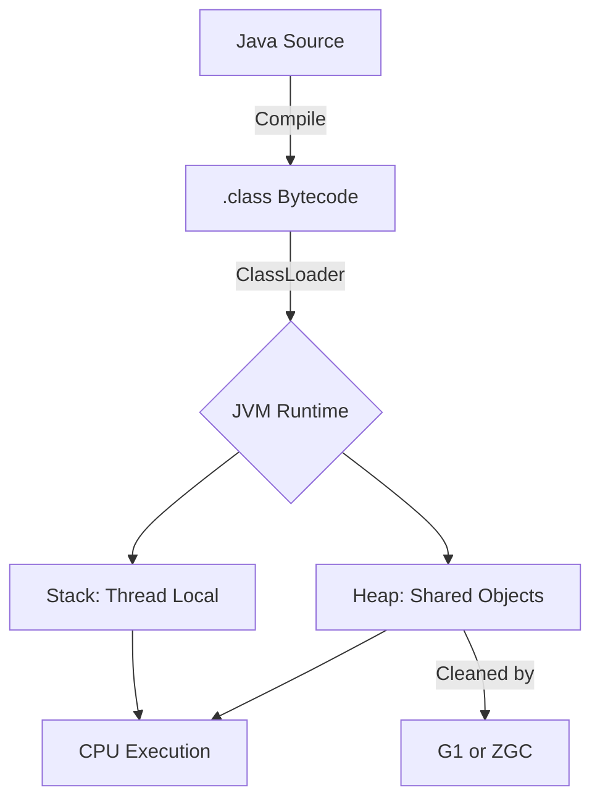

# JVM Architecture: The Engine, The Warehouse, and The Janitors

1. 💡 **The "Big Picture" (Plain English):**

Imagine you are opening a high-end, 24/7 restaurant. 
- **Class Loading** is your **Supply Chain**: It’s the process of finding the recipes (code), checking if they are safe to cook, and bringing the ingredients into the kitchen.
- **The Memory Model** is the **Kitchen Layout**: You have a common pantry where everyone shares ingredients (The Heap) and private prep stations for each chef where they keep track of their own tasks (The Stack).
- **G1/ZGC** are your **Cleaning Crews**: If the kitchen gets buried in vegetable scraps and empty boxes (dead objects), the restaurant shuts down. These modern crews are so fast they clean *while* the chefs are still cooking, so the customers never notice a delay.

**Why should you care?** 
If you don't understand the supply chain, your app won't start. If you don't understand the kitchen layout, your chefs will bump into each other (Race Conditions). If you don't understand the cleaning crew, your app will "hiccup" or freeze during busy hours.

---

2. 🛠️ **How it Works (Step-by-Step):**

### Step 1: The Loading Pipeline
Before a line of code runs, the **ClassLoader** follows three steps:
1.  **Loading:** Finding the `.class` file.
2.  **Linking:** Verifying the bytecode is safe and preparing memory for static variables.
3.  **Initialization:** Executing the static blocks (the "setup" instructions).

### Step 2: The Memory Split
Java divides memory into two main "buckets":
*   **Stack:** Short-term memory. Stores local variables and method calls. It’s fast and private to each thread.
*   **Heap:** Long-term memory. Stores all objects created with `new`. This is shared by everyone.

### Step 3: The Modern Janitors (GC)
*   **G1 (Garbage First):** Breaks the heap into small regions. It identifies which regions are mostly "trash" and cleans those first to save time.
*   **ZGC (Zero GC):** The "Ferrari" of collectors. It performs almost all work while the app is running, keeping pause times under **1 millisecond**, regardless of whether your heap is 100MB or 16TB.

### Mermaid Flow: The Request Journey


### The Code: Memory in Action
```java
public class Restaurant {
    // 1. Loaded into Metaspace (Class Metadata)
    static String restaurantName = "The Java Grill"; 

    public void serveOrder(int tableNumber) {
        // 2. 'tableNumber' stays on the STACK (Thread-private)
        // 3. 'new Order()' is allocated on the HEAP (Shared)
        Order currentOrder = new Order(tableNumber); 
        
        System.out.println("Serving: " + currentOrder);
    } // 4. When this method ends, 'currentOrder' (the reference) is popped 
      // off the stack. The 'Order' object on the heap is now 
      // "eligible" for G1/ZGC to clean up.
}
```

---

3. 🧠 **The "Deep Dive" (For the Interview):**

### The Java Memory Model (JMM) & "Happens-Before"
The JMM isn't just about where things sit; it’s a set of rules for **Visibility**. If Thread A changes a variable, when is Thread B guaranteed to see it? 
*   **The Problem:** Modern CPUs use caches and reorder instructions for speed. Without JMM rules, Thread B might see a "stale" value.
*   **The Fix:** Using `volatile` or `synchronized` creates a "Happens-Before" relationship, forcing the CPU to sync the local cache with the main RAM.

### G1 vs. ZGC: The Technical Magic
*   **G1 (Garbage First):** Introduced "Regions." Instead of cleaning the whole Heap (which takes a long time), it targets regions with the most garbage. It uses a **Stop-the-World** pause to copy surviving objects to new regions.
*   **ZGC (Zero GC):** Uses **Colored Pointers**. It marks bits directly in the memory address (pointer) to track object state. It also uses **Load Barriers**—a tiny piece of code that runs whenever you access an object to ensure you aren't pointing to an old, "moved" version of that object.

### Trade-offs:
*   **G1:** High throughput (gets more total work done) but has predictable, brief pauses.
*   **ZGC:** Lowest possible latency (no pauses), but uses about 5-10% more CPU overhead to manage the "Load Barriers."

### Interviewer Probes:
1.  **"What is the 'Parent Delegation Model' in Class Loading?"**
    *   *Answer:* It means a ClassLoader always asks its parent to load a class before trying itself. This prevents a malicious user from writing their own `java.lang.Object` and overriding the core system.
2.  **"Can ZGC handle a 1TB heap better than G1?"**
    *   *Answer:* Yes. G1 pause times scale with the number of objects. ZGC pause times are constant (under 1ms) because it does the heavy lifting (marking/compacting) concurrently with the application threads.
3.  **"What is 'Metaspace'?"**
    *   *Answer:* Since Java 8, class metadata is stored in Metaspace (Native Memory), not on the Heap. This prevents `java.lang.OutOfMemoryError: PermGen space`.

---

4. ✅ **Summary Cheat Sheet:**

*   **Class Loading:** Load -> Link -> Init. Uses Parent Delegation for security.
*   **Memory Structure:** **Stack** (Method execution/locals, Thread-safe) vs. **Heap** (Objects, GC-managed).
*   **GC Selection:** Use **G1** for general throughput; use **ZGC** if you need sub-millisecond response times (low latency).

**The Golden Rule:**
> "The Stack is for *where* you are in the code; the Heap is for *what* you are working with. If you lose the reference on the Stack, the Janitor (GC) will eventually take the object from the Heap."