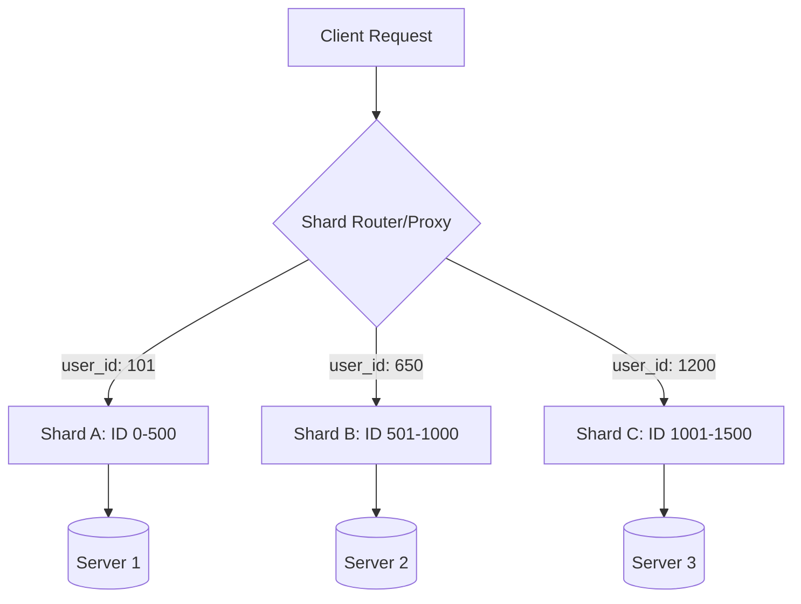

# Horizontal Sharding: Scaling Out Your Data

1. 💡 **The "Big Picture" (Plain English):**
   - **What is it?** Sharding is the process of breaking up one massive database table into smaller, more manageable pieces called "shards" and spreading them across multiple servers.
   - **Real-World Analogy:** Imagine you own a single, giant filing cabinet for a city’s records. As the city grows, the cabinet gets so full that it takes forever to find a file, and eventually, you can't even fit another piece of paper in it. To fix this, you buy four smaller cabinets. You put residents with last names A-G in the first, H-N in the second, and so on. Now, you can look for files faster, and you have room to grow.
   - **Why should I care?** A single database server has physical limits (CPU, RAM, Disk). When your app goes from 1,000 users to 100 million, a single server will crash. Sharding allows you to "scale out" (add more cheap servers) rather than "scaling up" (buying a multi-million dollar supercomputer).

2. 🛠️ **How it Works (Step-by-Step):**
   - **Step 1: Pick a Shard Key.** This is the column used to decide which shard the data goes into (e.g., `user_id`).
   - **Step 2: Define a Hashing Strategy.** You apply a mathematical formula to the Shard Key.
   - **Step 3: Routing.** The application (or a middleware proxy) calculates the hash and directs the query to the correct server.

**Example Code (Simple Shard Router in Python):**
```python
class DatabaseRouter:
    def __init__(self, shard_connections):
        # List of database connection objects
        self.shards = shard_connections

    def get_shard_index(self, user_id):
        # A simple modulo-based sharding logic
        # If user_id is 105 and we have 3 shards: 105 % 3 = 0 (Shard 0)
        return user_id % len(self.shards)

    def execute_query(self, user_id, query):
        shard_idx = self.get_shard_index(user_id)
        target_shard = self.shards[shard_idx]
        print(f"Routing query for User {user_id} to Shard {shard_idx}")
        return target_shard.execute(query)
```

**The Architecture Flow:**


3. 🧠 **The "Deep Dive" (For the Interview):**
   - **The Technical 'Magic':** In production, we rarely use simple modulo (like my code above) because adding a new shard would require moving *every* piece of data (resharding). Instead, we use **Consistent Hashing**. This maps keys and nodes onto a logical circle, so when you add a new server, you only need to move a small fraction of the data.
   - **The Trade-offs:** 
     - **Complexity:** Your application logic becomes much harder. You can no longer easily perform `JOIN` operations across shards.
     - **No More Global Constraints:** You can't easily enforce a "Unique" constraint on a column across the whole system unless that column is your shard key.
     - **Transaction Issues:** ACID properties are hard to maintain across multiple physical servers (Distributed Transactions).
   - **Interviewer Probe Questions:**
     - *Question:* "What is a 'Hot Spot' in sharding?" 
       - *Answer:* It’s when your shard key is poorly chosen (e.g., sharding by 'Date' for a social media app). Everyone is hitting the 'Today' shard, while the 'Last Year' shards sit idle. This is called a "Hot Partition."
     - *Question:* "How do you handle a query that needs data from multiple shards?"
       - *Answer:* This is a "Scatter-Gather" query. The router sends the request to ALL shards, waits for them to return results, and merges them. This is very slow and should be avoided for high-frequency queries.

4. ✅ **Summary Cheat Sheet:**
   - **3 Key Takeaways:**
     1. Sharding is **Horizontal Partitioning**: Splitting rows, not columns.
     2. The **Shard Key** is the most important decision; a bad one will ruin your performance.
     3. Sharding solves **Storage and Throughput** bottlenecks but introduces **Operational Complexity**.
   - **Golden Rule:** *Don't shard until you've exhausted all other options (Optimizing queries, Adding Indexes, and Read Replication).* Sharding is a "one-way door" that is very expensive to undo.