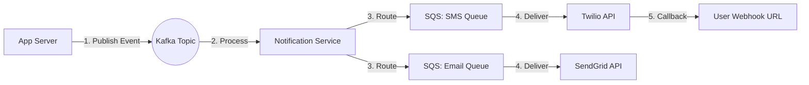

# Designing a Scalable Notification System (Kafka + SQS + Webhooks)

1. 💡 The "Big Picture" (Plain English)
### What is this in simple terms?
Think of a notification system as a **Global Logistics Company** (like FedEx). When you buy something online, the order isn't just handed directly to a delivery driver who runs to your house. It goes through a massive sorting facility, gets put on a truck, sent to a local hub, and finally dropped at your door. 

In software, a notification system takes an event (like "User A liked User B’s photo") and delivers it via Email, SMS, Push, or Webhooks.

### Real-World Analogy: The Pizza Chain
- **The Order (Kafka):** Orders from all over the city pour into a central high-speed processing center. They don't cook the pizza here; they just record every single order instantly so nothing is lost.
- **The Local Kitchens (SQS):** The central center sends orders to local branches. If one branch is slammed (e.g., the SMS provider is slow), only *that* branch's queue gets backed up. The rest of the city gets their pizza on time.
- **The Doorbell (Webhooks):** The delivery person rings the customer's doorbell. If the customer isn't home, the driver might try again later or leave a note.

### Why should I care?
If you try to send an email directly from your main web server, and the email provider is slow, your whole website freezes. By using this architecture, your app stays lightning-fast, and the "heavy lifting" of delivery happens in the background.

---

2. 🛠️ How it Works (Step-by-Step)

1.  **Ingestion:** Your backend sends a "Notification Event" to **Kafka**. Kafka acts as the "source of truth" that can handle millions of events per second.
2.  **Fan-out:** A "Notification Service" reads from Kafka. It looks up user preferences (e.g., "User wants SMS, not Email") and pushes messages into specific **SQS Queues** based on the provider (e.g., `sqs-twilio-sms`, `sqs-sendgrid-email`).
3.  **Execution:** Worker nodes pull from SQS and call the external APIs.
4.  **Webhooks:** If the "user" is another server (like a Slack integration), the system sends an HTTP POST request to their URL.

### Mermaid Flow Diagram


### Clean Code Snippet (The Producer logic)
```python
# Simple example of sending a notification event to Kafka
from kafka import KafkaProducer
import json

producer = KafkaProducer(bootstrap_servers='localhost:9092')

def trigger_notification(user_id, message_type, content):
    payload = {
        "user_id": user_id,
        "type": message_type, # e.g., "ORDER_SHIPPED"
        "body": content,
        "timestamp": "2023-10-27T10:00:00Z"
    }
    
    # We send to Kafka to ensure the 'order' is recorded instantly
    producer.send('notification-events', json.dumps(payload).encode('utf-8'))
    print(f"Event queued for user {user_id}")

trigger_notification("user_123", "SMS", "Your pizza is here!")
```

---

3. 🧠 The "Deep Dive" (For the Interview)

### Why Kafka AND SQS? (The Senior Strategy)
A common interview question is: *"Why use both?"*
- **Kafka** is your **Commit Log**. It stores events for days. If your notification logic changes, you can "replay" the last 24 hours of events to fix mistakes. It’s built for high throughput.
- **SQS** is your **Delivery Buffer**. It supports **Individual Acknowledgments** and **Visibility Timeouts**. If a specific SMS provider (like Twilio) goes down, SQS will hold those specific messages and retry them automatically. Kafka isn't great at "retrying just one specific message" without blocking the whole line.

### Handling Idempotency (The "Exactly-Once" Challenge)
In distributed systems, "at-least-once" delivery is easy, but "exactly-once" is hard. 
- **The Problem:** A network glitch happens after the email is sent but before the database updates. The system tries again. The user gets two emails.
- **The Solution:** Generate a unique `request_id` or `deduplication_id` at the very start. The Delivery Service checks a fast cache (Redis) before sending: `IF NOT EXISTS(id) THEN SEND()`.

### Webhook Security & Reliability
When you send a Webhook to a third party:
1.  **Signing:** You must sign the payload using an `HMAC` (Hash-based Message Authentication Code) so the receiver knows it actually came from you.
2.  **Backoff:** If their server returns a `500 Error`, use **Exponential Backoff** (wait 1s, then 2s, then 4s...) to avoid DDOSing a struggling client.

### Interviewer Probes:
- **"What happens if Kafka is down?"** 
  - *Answer:* Use a "Local Fallback." The API writes the event to a local database (Transactional Outbox pattern) and a separate process moves them to Kafka once it's healthy.
- **"How do you handle 'Whale Users' (users with 1M followers)?"**
  - *Answer:* Use "Sharded Queues." Don't put a 1-million-person blast in the same queue as a high-priority "Password Reset" email. Use priority lanes.

---

4. ✅ Summary Cheat Sheet

### 3 Key Takeaways
1.  **Decouple Everything:** Your main app shouldn't know how to send an SMS; it should only know how to tell Kafka that "something happened."
2.  **Isolate Failures:** Use separate SQS queues for different providers so that a bug in your Email code doesn't stop your SMS messages.
3.  **Plan for Failure:** External APIs (Twilio, SendGrid) *will* fail. Your system must have a retry strategy and idempotency keys to prevent duplicate spam.

### 1 "Golden Rule" 
> **Never let an external API's latency become your internal system's bottleneck.** (Always queue before you call!)