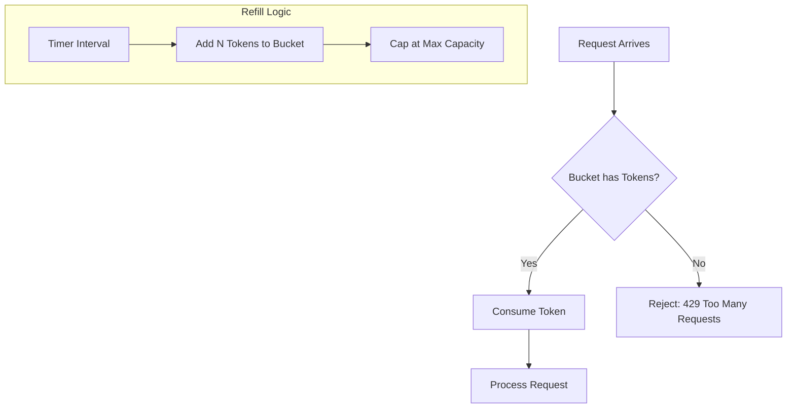

# Rate Limiting: The Token Bucket vs. The Leaky Bucket

1. 💡 **The "Big Picture" (Plain English):**
   - **What is this?** A Rate Limiter is a "traffic cop" for your API. It decides who gets through and who has to wait or go away.
   - **The Analogy:** 
     - **Token Bucket:** Imagine a coffee shop loyalty card. Every hour, the shop adds one "Free Coffee" stamp to your card (up to a max of 5). You can use all 5 stamps at once if you're hosting a meeting (a **burst**), but once they're gone, you must wait for the next hour's refill.
     - **Leaky Bucket:** Imagine a funnel. You can pour a gallon of water into it all at once, but the water only drips out the bottom at a steady, constant rate of one drop per second. If the funnel gets too full, any extra water just spills over the side and is lost.
   - **Why care?** Without this, one "noisy neighbor" (or a bot) can spam your server with 10,000 requests a second, crashing your database and ruining the experience for everyone else.

2. 🛠️ **How it Works (Step-by-Step):**

   ### **Token Bucket (The "Burst" Friendly Choice)**
   1. **Refill:** A "refiller" adds tokens to a bucket at a fixed rate (e.g., 10 tokens/sec).
   2. **Capacity:** The bucket has a limit (e.g., 100 tokens). Excess tokens are discarded.
   3. **Request:** When a request arrives, we check the bucket.
   4. **Action:** If tokens > 0, remove one token and let the request pass. If tokens = 0, reject (HTTP 429).

   ### **Leaky Bucket (The "Steady Flow" Choice)**
   1. **Queue:** Requests enter a queue (the bucket).
   2. **Capacity:** If the queue is full, the request is dropped immediately.
   3. **Process:** A background worker pulls requests off the queue at a **fixed, constant rate** (e.g., exactly 5 requests per second).

   **The Code (Token Bucket - "Lazy" Implementation):**
   *Note: Real systems don't use a background thread to refill; they calculate the refill "on the fly" when a request hits.*

```python
import time

class TokenBucket:
    def __init__(self, capacity, refill_rate):
        self.capacity = capacity
        self.refill_rate = refill_rate  # tokens per second
        self.tokens = capacity
        self.last_refill_time = time.time()

    def allow_request(self):
        now = time.time()
        # 1. Calculate how many tokens were "earned" since the last request
        passed_time = now - self.last_refill_time
        new_tokens = passed_time * self.refill_rate
        
        # 2. Add them to the bucket, but don't exceed capacity
        self.tokens = min(self.capacity, self.tokens + new_tokens)
        self.last_refill_time = now

        # 3. Check if we can fulfill the request
        if self.tokens >= 1:
            self.tokens -= 1
            return True # Request Allowed
        return False # HTTP 429 Too Many Requests
```

**The Flow (Mermaid):**


3. 🧠 **The "Deep Dive" (For the Interview):**
   - **The Technical "Magic": Concurrency & Distributed State.**
     In a real-world high-scale system (like Amazon or Stripe), your Rate Limiter isn't sitting in one Python object—it's likely in **Redis**. 
     - **The Race Condition:** If two requests hit two different app servers at the exact same millisecond, they both might read "1 token left" from Redis and both allow the request. 
     - **The Solution:** Use **Lua Scripts** in Redis. This ensures the "Read-Update-Write" cycle happens **atomically** (all at once), preventing anyone from "stealing" a token.
   
   - **The Trade-offs:**
     - **Token Bucket:** Memory efficient (you only store two numbers: `last_refill_timestamp` and `current_token_count`). It allows **bursts**, which is usually what developers want (if I haven't used the API all day, let me send 10 requests at once!).
     - **Leaky Bucket:** Smooths out traffic perfectly. However, if a burst happens, the requests stay in the queue, increasing **latency** for those requests. If the queue is full, new requests are dropped.

   - **Interviewer Probes (The Tricky Questions):**
     1. *"How do you handle a distributed environment where your service has 100 nodes?"*
        - **Answer:** You centralize the state in a fast, in-memory store like Redis so all 100 nodes share the same "bucket" count.
     2. *"What if the Redis cluster becomes a bottleneck?"*
        - **Answer:** You can implement **Local Batching**. Each node keeps a small local bucket and only syncs with Redis every few seconds or after 50 requests to reduce network overhead.
     3. *"Which one would you use for an API that talks to a very old, fragile legacy database?"*
        - **Answer:** Leaky Bucket. It guarantees a steady, predictable flow that won't overwhelm a sensitive downstream system, even if the user tries to burst.

4. ✅ **Summary Cheat Sheet:**
   - **Token Bucket:** Best for general APIs. Allows bursts. Very common (used by AWS, Stripe).
   - **Leaky Bucket:** Best for protecting sensitive/legacy systems. Enforces a rigid, constant flow.
   - **Atomic Operations:** Use Redis + Lua to avoid race conditions in distributed systems.

   **The Golden Rule:**
   > Use **Token Bucket** when you want to be fair to users but allow for occasional bursts of speed; use **Leaky Bucket** when you need to protect a system that *cannot* handle a spike under any circumstances.