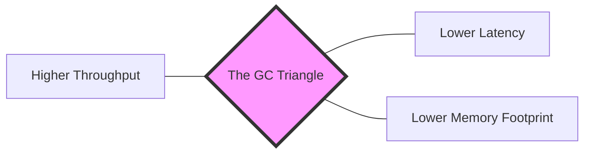

# Garbage Collection Tuning: Throughput vs. Latency Optimization

1. 💡 The "Big Picture" (Plain English)
### What is this in simple terms?
Garbage Collection (GC) tuning is the art of telling your computer how to balance its "cleaning schedule." Your application generates "trash" (objects no longer needed), and the GC has to clean it up. Tuning is simply choosing whether you want the cleaner to work in short bursts while you’re busy, or in one giant sweep while you take a break.

### The Real-World Analogy: The "Drive-Thru vs. Fine Dining"
Imagine a fast-food drive-thru. 
- **Throughput** is the goal: They want to serve 100 cars per hour. They don't care if one specific car waits 5 minutes, as long as the total volume is high.
- **Latency** is the goal of a Fine Dining restaurant: The moment a guest finishes a plate, a waiter whisks it away instantly. The "pause" in the experience must be invisible, even if it means hiring more staff (more memory/CPU) to do it.

### Why should I care?
If you don't tune your GC, your application might "stutter" (High Latency) during a sale or crash because it’s spending 90% of its time cleaning instead of working (Low Throughput). Tuning ensures your app stays responsive under pressure.

---

2. 🛠️ How it Works (Step-by-Step)
GC tuning is a cycle of **Measure → Adjust → Repeat**. You don't just "turn it on"; you select a strategy based on your app's personality.

1.  **Select the Collector:** Choose a GC algorithm (G1GC, ZGC, or Parallel) that matches your goal.
2.  **Set the Boundaries:** Define how much memory (Heap) the app can use.
3.  **Set the "Pace":** Tell the GC how long you are willing to let the app pause (the "Pause Time Goal").
4.  **Monitor Logs:** Use tools to see if the GC is meeting those goals.

### The "Tuning Flags" (Code Snippet)
Here is how you would configure a Java application for **Low Latency** (using the G1 Collector), which is the standard for most modern web services.

```bash
# Start your app with these JVM arguments
java -Xms4g -Xmx4g \                # 1. Set min/max heap to same size (prevents resizing jitters)
     -XX:+UseG1GC \                 # 2. Use the G1 Garbage Collector
     -XX:MaxGCPauseMillis=200 \     # 3. Goal: Don't pause the app for more than 200ms
     -XX:ParallelGCThreads=4 \      # 4. Use 4 threads for cleaning
     -Xlog:gc*:file=gc.log \        # 5. Record what happened for later analysis
     -jar my-service.jar
```

### The Trade-off Flow

*Note: You can usually only pick **two** sides of this triangle to optimize at once.*

---

3. 🧠 The "Deep Dive" (For the Interview)

### The Technical Magic: Region-Based Collection
Modern collectors like **G1 (Garbage First)** and **ZGC** stopped treating the heap as one big block. Instead, they chop it into hundreds of small **Regions**. 
- **Why?** It allows the GC to prioritize. It looks at all regions and says, "This region is 90% trash; I'll clean that one first because it gives me the best 'bang for my buck'." This is why it's called "Garbage First."
- **ZGC/Shenandoah (Ultra-low Latency):** These collectors perform "Concurrent Marking and Compaction." They move objects around in memory *while the application threads are still running*. They use "Load Barriers" (small bits of code injected by the JIT) to intercept object access and ensure the app doesn't grab an object that is currently being moved.

### The Trade-offs
- **G1GC:** Great all-rounder. High throughput but can have occasional "Stop-The-World" pauses.
- **ZGC:** Sub-millisecond pauses regardless of heap size (even 16TB!). **Trade-off:** It consumes more CPU cycles to do the cleaning while the app runs, which might lower your overall throughput by 5-10%.
- **Parallel GC:** Maximizes throughput. **Trade-off:** When it cleans, it stops *everything*. Fine for batch jobs, terrible for a UI or API.

### Interviewer Probes (Tricky Questions)
1.  **"We increased the Heap size from 8GB to 32GB, but the application got slower. Why?"**
    *   *Answer:* Larger heaps mean the GC has more "territory" to scan. If using an older collector (like CMS or Parallel), the "Stop-The-World" pauses grow linearly with the heap size. You essentially traded a "full trash can" for a "dumpster" that takes much longer to empty.
2.  **"What is 'GC Overhead Limit Exceeded'?"**
    *   *Answer:* This happens when the JVM spends more than 98% of its time doing GC and recovers less than 2% of the heap. It’s the JVM’s way of saying: "I'm spinning my wheels and not getting work done; I'm going to shut down before I take the whole server with me."
3.  **"How do you distinguish a memory leak from a GC tuning issue?"**
    *   *Answer:* Look at the "Sawtooth" pattern in your metrics. If the "low point" of memory usage after a Full GC is steadily rising over time, it's a **leak**. If memory usage is high but returns to the same baseline after a Full GC, you just have a **tuning/sizing issue**.

---

4. ✅ Summary Cheat Sheet

### 3 Key Takeaways
1.  **Know your goal:** If it's a Batch Job, optimize for **Throughput** (Parallel GC). If it's a Web API, optimize for **Latency** (G1GC or ZGC).
2.  **Size Matters:** Always set `-Xms` (start size) and `-Xmx` (max size) to the same value in production to avoid performance hits during heap resizing.
3.  **Log it:** You cannot tune what you cannot measure. Always enable GC logging (`-Xlog:gc`).

### The Golden Rule
> **"The best Garbage Collection is the one that doesn't have to happen."** 
> (Before tuning flags, look at your code: reduce object allocation, use `StringBuilder`, and avoid loading massive datasets into memory at once.)