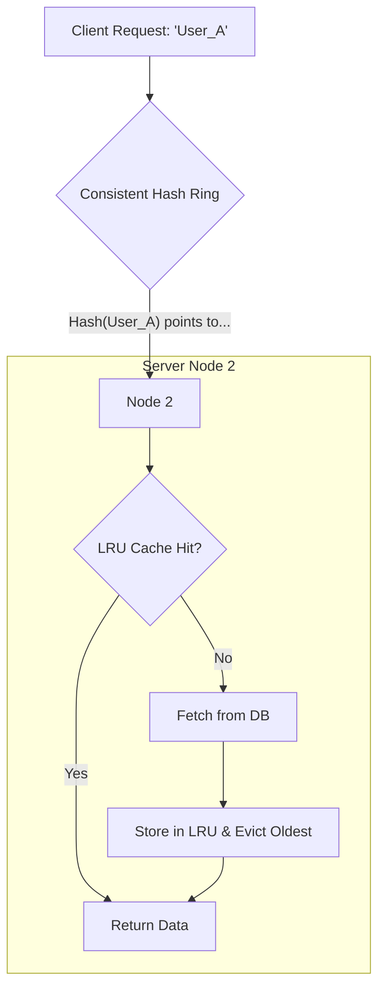

# Distributed Cache Design: Consistent Hashing & LRU

1. 💡 **The "Big Picture" (Plain English)**

Imagine you run a massive chain of pizza parlors across the country. You have millions of customers, and you want to remember their "favorite toppings" so you can suggest them instantly. 

One computer (a cache) isn't big enough to hold everyone's data. You need 50 computers. 
*   **The Problem:** If you just randomly pick a computer to store a customer's data, you'll never find it again without checking all 50. If you use a simple formula like `customer_id % 50`, and one computer crashes, your entire formula breaks, and you "lose" everyone's location.
*   **The Solution:** **Consistent Hashing** is like a giant circular track where both customers and pizza shops have a specific spot. You always find your data by walking clockwise to the nearest shop. **LRU (Least Recently Used)** is how each individual shop manages its limited shelf space—tossing out the old, dusty recipes to make room for the ones people are ordering *today*.

**Why care?** This is how Netflix remembers where you paused your movie and how Twitter handles millions of tweets per second without crashing the main database.

---

2. 🛠️ **How it Works (Step-by-Step)**

### The Workflow:
1.  **Hashing the Key:** The system takes a key (e.g., `user_123`) and maps it to a point on a logical "Ring" (0 to 2^32-1).
2.  **Locating the Node:** The system looks clockwise on the ring to find the first available Server (Node).
3.  **Local Cache Check (LRU):** Once the Server is found, it checks its local memory. 
    *   If the data is there (**Hit**), it returns it.
    *   If not (**Miss**), it fetches it from the Database, stores it in its LRU cache, and returns it.
4.  **Eviction:** If the Server's memory is full, the LRU policy kicks out the data that hasn't been touched for the longest time.

### The Logic (Python-style Pseudocode):
```python
import collections

class LRUCache:
    def __init__(self, capacity):
        self.capacity = capacity
        # OrderedDict maintains order of insertion; perfect for LRU
        self.cache = collections.OrderedDict()

    def get(self, key):
        if key not in self.cache:
            return None
        # Move to end to mark as "Recently Used"
        self.cache.move_to_end(key)
        return self.cache[key]

    def put(self, key, value):
        if key in self.cache:
            self.cache.move_to_end(key)
        self.cache[key] = value
        if len(self.cache) > self.capacity:
            # Pop the first item (Least Recently Used)
            self.cache.popitem(last=False)

# Distributed wrapper logic
def get_data(key):
    # 1. Consistent Hashing finds the server
    node = hash_ring.get_node(key)
    # 2. Ask that specific server for data
    return node.lru_cache.get(key)
```

### The Visual Flow:


---

3. 🧠 **The "Deep Dive" (For the Interview)**

### The "Magic" of Consistent Hashing
In a traditional `hash(key) % N` setup, if you add one server (N+1), nearly every key relocates. This causes a **Cache Rehash Storm**, nuking your database performance. 
Consistent Hashing ensures that when a node is added/removed, only **1/N** keys need to move. 

**Pro Tip (The Virtual Node):** Real-world servers have different capacities. We use "Virtual Nodes." Instead of Node A appearing once on the ring, it appears 100 times. This prevents "hotspots" (where one server gets all the traffic) and ensures an even distribution of data.

### The Internals of LRU
A true LRU is implemented using a **Doubly Linked List** and a **HashMap**.
*   **HashMap:** Provides $O(1)$ lookup.
*   **Doubly Linked List:** Provides $O(1)$ updates to the "recency" by moving nodes to the head.
*   **Trade-off:** LRU is great for general workloads, but it can be "polluted" by a one-time mass scan (e.g., a search engine indexing the site) which kicks out all your valuable frequent data.

### Interviewer Probes:
1.  **"What happens if a node goes down in your ring?"**
    *   *Answer:* The requests naturally "skip" the dead node and hit the next one clockwise. However, this could cause a "Cascade Failure" as the next node gets double the traffic. We solve this by having **Replication** (storing the same key on the next 2 nodes in the ring).
2.  **"How do you handle 'Hot Keys' (e.g., a celebrity tweet)?"**
    *   *Answer:* Consistent hashing maps a key to *one* node. If that key is too hot, we can use "Candidate Caching" on the client side or detect the hot key and temporarily replicate it across all nodes.
3.  **"LRU is local to the node. Does that mean we have duplicate data across the cluster?"**
    *   *Answer:* Yes. If you need 100% uniqueness, you'd need a global index, but that introduces a bottleneck. Distributed systems trade some memory redundancy for massive speed and scale.

---

4. ✅ **Summary Cheat Sheet**

*   **Consistent Hashing** minimizes data movement when the cluster size changes (prevents the "Rehash Storm").
*   **Virtual Nodes** ensure data is spread evenly across servers of different sizes.
*   **LRU (Least Recently Used)** keeps the most relevant data in memory using a Doubly Linked List + HashMap for $O(1)$ speed.

**The Golden Rule:**
> "Consistent Hashing scales the **cluster** (where to go); LRU scales the **node** (what to keep)."