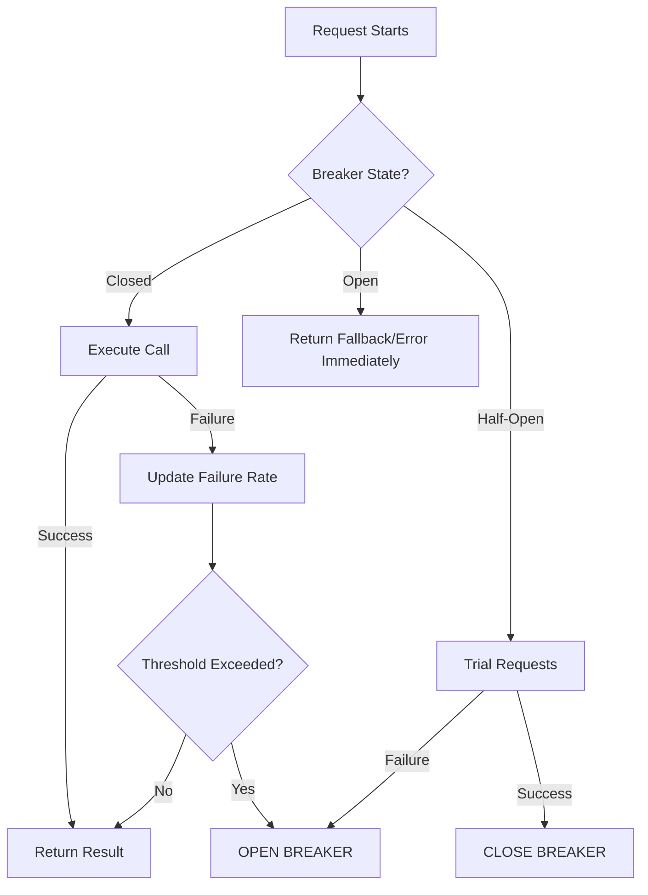

# The Circuit Breaker Pattern: Preventing Cascading Failures

1. 💡 The "Big Picture" (Plain English)
- **What is it?** A Circuit Breaker is a safety mechanism that stops a system from trying to perform an action that is likely to fail. 
- **The Analogy:** Think of the electrical circuit breaker in your home. If a toaster malfunctions and pulls too much power, the breaker "trips." This shuts off electricity to that one outlet so the wires in your walls don't catch fire and burn the whole house down. 
- **Why should I care?** In a distributed system, if Service A calls Service B and Service B is struggling (running slow or crashing), Service A shouldn't keep banging on the door. If it does, Service A will exhaust its own threads waiting for responses, causing Service A to crash too. This is called a **Cascading Failure**. The Circuit Breaker solves this by "failing fast"—it tells Service A to stop calling Service B immediately until Service B is healthy again.

2. 🛠️ How it Works (Step-by-Step)
The Circuit Breaker exists in three states:
1.  **Closed:** Everything is normal. Requests flow through. If a few fail, we just keep track of them.
2.  **Open:** The failure threshold (e.g., 50% failure rate) was hit. The breaker "trips." All calls fail immediately without even trying to hit the remote service.
3.  **Half-Open:** After a "sleep window," the breaker lets a few test requests through. If they succeed, it closes. If they fail, it opens again.

**Clean Code Snippet (Java with Resilience4j style):**

```java
// 1. Define the configuration
CircuitBreakerConfig config = CircuitBreakerConfig.custom()
    .failureRateThreshold(50) // Trip if 50% of calls fail
    .waitDurationInOpenState(Duration.ofMillis(10000)) // Wait 10s before testing again
    .slidingWindowSize(10) // Look at the last 10 calls
    .build();

// 2. Wrap your remote call
CircuitBreaker breaker = CircuitBreaker.of("inventoryService", config);

String result = breaker.executeSupplier(() -> {
    // This is the risky network call to another service
    return restTemplate.getForObject("http://inventory-api/items/1", String.class);
});

// 3. Optional: Provide a Fallback (What to do when it's broken)
// If the circuit is OPEN, return a cached value or a friendly "Service Busy" message.
```

**The Flow:**



3. 🧠 The "Deep Dive" (For the Interview)
- **The Internals (Sliding Windows):** Circuit breakers don't just count total failures; they use a **Sliding Window**. This is usually implemented as a Ring Bit Buffer or an array of buckets. As time moves forward, old success/failure data is evicted. This ensures the breaker reacts to *current* health, not an error that happened three hours ago.
- **Trade-offs:** 
    - **Resource Overhead:** Storing state and metrics for every remote call consumes memory.
    - **Complexity:** You must define meaningful "Fallbacks." If the inventory service is down, do you return an empty list? A cached list? An error? This impacts the user experience.
    - **Incomplete Data:** During the "Open" state, you have zero visibility into whether the downstream service has actually recovered until the "Half-Open" phase begins.

- **Interviewer Probes:**
    - *"How do you distinguish between a 'fast failure' (404 Not Found) and a 'slow failure' (Timeout) in a circuit breaker?"* 
        - **Answer:** You configure the breaker to track **Slow Calls** separately. A service might not be throwing errors, but if it's taking 10 seconds to respond, it’s just as dangerous to system stability as a 500 error.
    - *"What happens if you have 100 microservices all with their own breakers? How do you monitor them?"* 
        - **Answer:** You need a centralized dashboard (like Grafana or Hystrix Dashboard) to visualize the state of all breakers. If a core "Auth Service" breaker trips, it helps you identify the root cause of the "Global Outage" immediately.
    - *"Why not just use a simple Retry logic instead?"* 
        - **Answer:** Retries are for *transient* (flickering) errors. Circuit Breakers are for *persistent* (structural) errors. Retrying against a dead service is like a "Self-Inflicted DDOS"—it makes the problem worse.

4. ✅ Summary Cheat Sheet
- **3 Key Takeaways:**
    1. **Prevents Cascading Failure:** Keeps a single failing service from taking down your entire architecture.
    2. **Fails Fast:** Returns an error immediately rather than making the user wait for a timeout.
    3. **Self-Healing:** Automatically tests the downstream service and recovers when it's healthy.
- **Golden Rule:** "Retries are for when you think it might work *now*; Circuit Breakers are for when you know it won't work *for a while*."