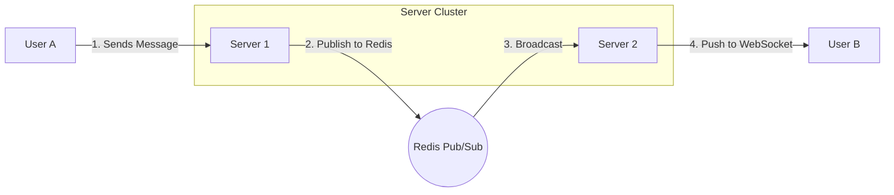

# Horizontal Scaling of WebSockets with Redis Pub/Sub

1. 💡 The "Big Picture" (Plain English):
- **What is this?** Imagine you are building a chat app like WhatsApp. When you have 100 users, one server can handle them all. But when you have 1 million users, you need 10 servers. The problem? User A is connected to Server 1, and User B is connected to Server 10. How does Server 1 send a message to User B?
- **Real-World Analogy:** Think of a large hotel with multiple front desks. If a guest at **Front Desk A** wants to send a physical note to a guest currently checking in at **Front Desk B**, the receptionist at Desk A can't see the guest at Desk B. They need a "Building Intercom." Desk A announces the message over the intercom, and Desk B hears it and hands the note to the guest. **Redis Pub/Sub is that Intercom.**
- **Why should I care?** Without this, your chat app only works if everyone is in the same "room" (on the same server). This pattern allows your app to grow infinitely by letting servers talk to each other.

2. 🛠️ How it Works (Step-by-Step):
1. **The Connection:** User B connects to Server 2 via a WebSocket. Server 2 "Subscribes" to a unique channel for User B in Redis.
2. **The Message:** User A (on Server 1) sends a message addressed to User B.
3. **The Publish:** Server 1 doesn't know where User B is. So, it "Publishes" the message to User B’s channel in Redis.
4. **The Delivery:** Redis broadcasts the message. Server 2 (which is listening) picks it up and pushes it down the open WebSocket to User B.

### The Flow


### Simple Implementation (Node.js Logic)
```javascript
const WebSocket = require('ws');
const Redis = require('ioredis');

const pub = new Redis();
const sub = new Redis();
const wss = new WebSocket.Server({ port: 8080 });

wss.on('connection', (ws, req) => {
    const userId = getUserId(req); // Assume we extract ID from URL/Auth

    // 1. Subscribe this server to this specific user's 'intercom'
    sub.subscribe(`user_channel_${userId}`);

    sub.on('message', (channel, message) => {
        if (channel === `user_channel_${userId}`) {
            ws.send(message); // 4. Deliver message to the phone/browser
        }
    });

    ws.on('message', (data) => {
        const { recipientId, text } = JSON.parse(data);
        // 2. Instead of looking for the user locally, tell Redis to broadcast it
        pub.publish(`user_channel_${recipientId}`, text);
    });
});
```

3. 🧠 The "Deep Dive" (For the Interview):
- **The Magic of Pub/Sub Internals:** Redis Pub/Sub is a "fire-and-forget" mechanism. It doesn't store messages in a database. It simply maintains a mapping of patterns/channels to a list of connected subscribers (the servers). When a message hits Redis, it iterates through the subscribers and pushes the data into their TCP buffers.
- **Trade-offs:** 
    - **Pros:** Extremely low latency (sub-millisecond) and very little memory overhead because messages aren't stored.
    - **Cons:** If Server 2 crashes or the network blips for a second, the message is lost forever (No persistence). To fix this, you’d need **Redis Streams** or a message queue like Kafka for "At-Least-Once" delivery.
- **Interviewer Probes:**
    - *"How do you handle 'Sticky Sessions' at the Load Balancer level?"* 
        - **Answer:** Since WebSockets start as an HTTP request before "upgrading," the Load Balancer must support sticky sessions (Session Affinity) to ensure the client stays on the same server for the duration of the socket, or else the initial handshake might fail.
    - *"What happens if the Redis instance becomes a bottleneck?"* 
        - **Answer:** We use **Redis Cluster**. We can shard channels across multiple Redis nodes based on the hash of the `channel_id`. This prevents a single Redis instance from being overwhelmed by too many "intercom" announcements.
    - *"How do you handle 'Presence' (Who is online)?"*
        - **Answer:** Pub/Sub isn't enough. We'd use a **Redis Set or Sorted Set** to store heartbeats. When a socket connects, we set a key `user:123:status` to "online" with a TTL (Time-to-Live).

4. ✅ Summary Cheat Sheet:
- **3 Key Takeaways:**
    1. **WebSockets are stateful:** A server must remember who is connected to it.
    2. **Redis Pub/Sub is the "Glue":** It allows stateful servers to behave like a unified system.
    3. **Fire-and-Forget:** Pub/Sub is for real-time speed; use a database for message history.
- **The Golden Rule:**
    > "In a distributed system, never assume the sender and the receiver are on the same machine. Always publish to a common 'bus' (Redis) and let the 'bus' find the recipient."