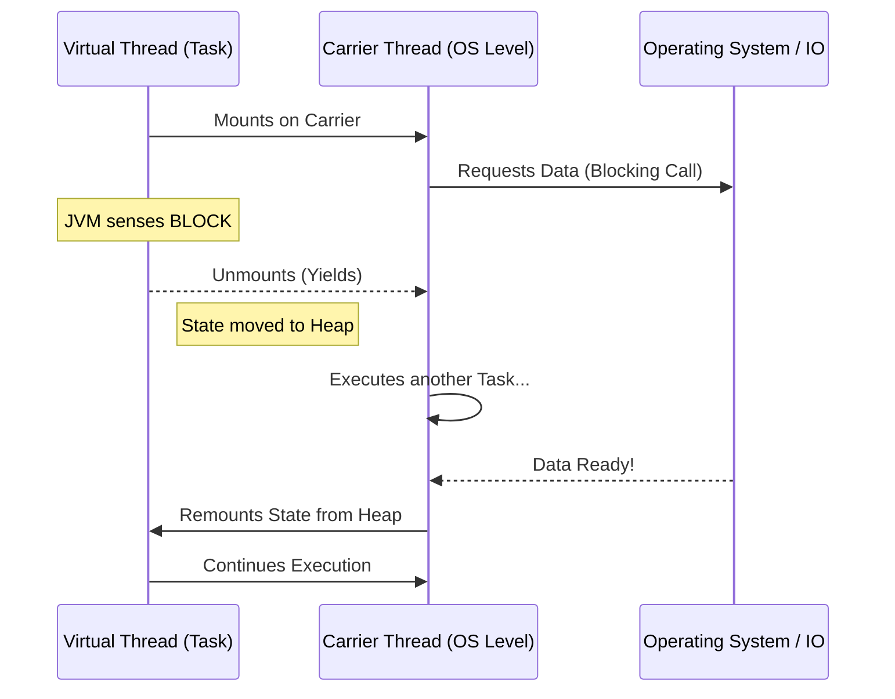

# The New Concurrency Paradigm: Scaling to Millions with Virtual Threads

1. 💡 **The "Big Picture" (Plain English):**
   - **What is this?** Historically, Java threads were "heavy." If you wanted to handle 10,000 users at once, your server would likely crash because it couldn't handle 10,000 "Platform Threads" (which are tied directly to the Operating System). Virtual Threads (introduced in Java 21) are "lightweight" threads that live inside the JVM, not the OS.
   - **The Analogy:** Imagine a busy **Call Center**. 
     - **Old Way (Platform Threads):** Every time a customer calls, a physical desk and a computer are assigned to that call. If the customer puts the agent on hold, the agent just sits there, and that desk cannot be used by anyone else. You can only have as many calls as you have desks.
     - **New Way (Virtual Threads):** When a customer puts an agent on hold, the agent "freezes" the call, saves the notes, and jumps to a different desk to help someone else. When the first customer returns, any available agent picks up the notes and resumes. The "desk" (OS Thread) is never wasted.
   - **Why care?** It solves the **"Thread-per-Request"** scaling limit. You can now write simple, readable, blocking code (like `result = db.query()`) and still scale like a complex, reactive system.

2. 🛠️ **How it Works (Step-by-Step):**
   1. **Mounting:** A Virtual Thread (the "task") is assigned to a Carrier Thread (an actual OS thread managed by a ForkJoinPool).
   2. **The Block:** When your code hits a blocking operation (like a database call or `Thread.sleep()`), the Virtual Thread "yields."
   3. **Unmounting:** The JVM takes the Virtual Thread’s stack (its local variables and state) and moves it to the Heap. The Carrier Thread is now free to run a different Virtual Thread.
   4. **Resuming:** Once the data returns from the database, the JVM moves the stack back onto an available Carrier Thread and continues where it left off.

```java
// Using a Virtual Thread Executor
try (var executor = Executors.newVirtualThreadPerTaskExecutor()) {
    IntStream.range(0, 10_000).forEach(i -> {
        executor.submit(() -> {
            // This looks like standard blocking code!
            Thread.sleep(Duration.ofSeconds(1)); 
            System.out.println("Finished task " + i + " on " + Thread.currentThread());
            return i;
        });
    });
} // Executor automatically waits for all tasks to finish
```

**The Flow of Execution:**


3. 🧠 **The "Deep Dive" (For the Interview):**
   - **The Magic of Continuations:** Under the hood, Virtual Threads are powered by *Continuations*. A Continuation is a JVM object that represents a pause-able point in a program. When a Virtual Thread blocks, the JVM "freezes" the call stack into the heap and "thaws" it later. This is significantly cheaper than an OS context switch.
   - **The Scheduler:** Java uses a `ForkJoinPool` as the default scheduler for Virtual Threads. Unlike the standard `ForkJoinPool` used for parallel streams, this one is tuned specifically for task scheduling, not just compute-heavy work.
   - **The "Pinning" Trap (Trade-off):** If you call a native method (JNI) or stay inside a `synchronized` block while a Virtual Thread is running, the Virtual Thread becomes **pinned** to the Carrier Thread. It cannot unmount. If all your Carrier Threads get pinned, your application stalls. 
     - *Fix:* Use `ReentrantLock` instead of `synchronized` for long-running I/O.
   - **ThreadLocals:** Since you can have millions of Virtual Threads, huge `ThreadLocal` objects can lead to massive memory overhead (Heap usage).
   
   **Interviewer Probes:**
   - *"Do Virtual Threads make code run faster?"*
     - **Answer:** No. They increase **throughput**, not speed. A single task won't finish faster, but you can finish 1,000,000 tasks concurrently using the same hardware that previously could only handle 1,000.
   - *"When should you NOT use Virtual Threads?"*
     - **Answer:** For CPU-bound tasks (like video encoding or heavy math). Virtual Threads excel at I/O-bound tasks. For CPU-bound tasks, stick to Platform Threads or Parallel Streams to avoid the overhead of the continuation mechanism.

4. ✅ **Summary Cheat Sheet:**
   - **Key Takeaway 1:** Virtual Threads are "cheap." You don't need to pool them (e.g., no `Thread Pool` for VTs). Just create a new one for every task.
   - **Key Takeaway 2:** They allow "Blocking Code" to perform like "Asynchronous Code" without the "Callback Hell" or complex `CompletableFuture` chains.
   - **Key Takeaway 3:** The primary bottleneck shifts from **Thread Count** to **Memory (Heap)** and **Database Connections**.

   **The Golden Rule:**
   > "Use Platform Threads for CPU-intensive work; use Virtual Threads for I/O-intensive waiting."