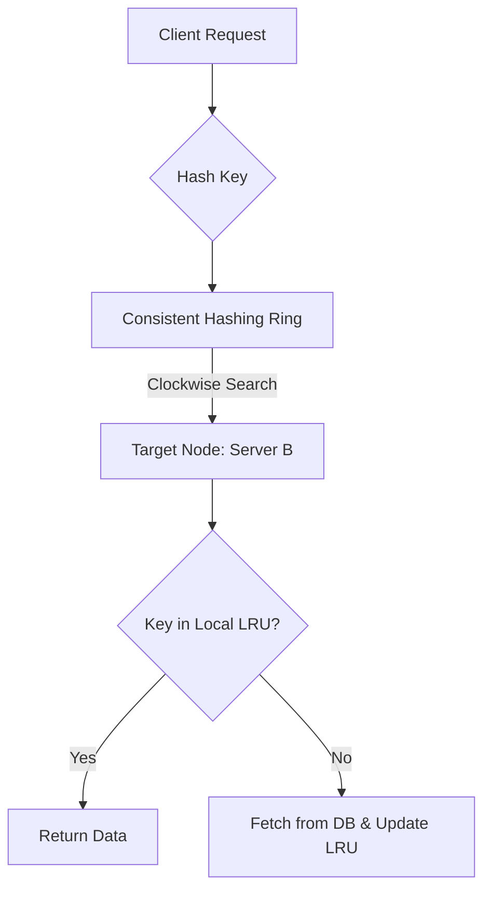

# Distributed Cache: Scaling & Data Integrity with Consistent Hashing

1. 💡 The "Big Picture" (Plain English):
Imagine you run a massive chain of libraries across the country. You have millions of books, but no single building is big enough to hold them all.
- **The Problem:** If you just assign books to libraries alphabetically (A-M in Library 1, N-Z in Library 2), and then you build a third library, you have to move *half* of all your books to new locations. That’s a logistical nightmare. 
- **The Solution:** **Consistent Hashing** is like a giant circular track. Each library (Server) and each book (Data) is placed somewhere on that track. If you add a new library, you only have to move the books in its immediate neighborhood.
- **The "Local" Problem:** Inside each library, shelf space is limited. When a shelf is full, which book do you throw out? You throw out the one nobody has touched in years. That is **LRU (Least Recently Used)**.

**Why should you care?** This design allows companies like Netflix or Facebook to add more servers to handle traffic spikes without crashing the system or losing everyone's "logged in" session data.

2. 🛠️ How it Works (Step-by-Step):
1.  **The Ring:** Imagine a circle representing a range of numbers (0 to $2^{32}-1$). 
2.  **Server Placement:** We hash the IP addresses of our cache servers to place them at specific points on the ring.
3.  **Data Mapping:** When a request for "User_123" comes in, we hash that ID. We move clockwise on the ring until we hit the first server. That server owns the data.
4.  **Local Eviction (LRU):** Once "User_123" is stored on a server, that server keeps it in a `Doubly Linked List` + `HashMap`. If the server runs out of RAM, it deletes the item at the "tail" of the list (the one used longest ago).

### Code Snippet: The Local LRU Component
Every node in your distributed cache runs this logic internally.

```python
class LRUCache:
    def __init__(self, capacity: int):
        self.cap = capacity
        self.cache = {} # Key -> Node
        self.list = DoublyLinkedList() # Custom list to track usage

    def get(self, key: str):
        if key in self.cache:
            node = self.cache[key]
            # Move to front (Most Recently Used)
            self.list.move_to_front(node)
            return node.value
        return None

    def put(self, key: str, value: str):
        if key in self.cache:
            self.list.remove(self.cache[key])
        elif len(self.cache) >= self.cap:
            # Evict the oldest
            oldest = self.list.remove_tail()
            del self.cache[oldest.key]
            
        new_node = Node(key, value)
        self.list.add_to_front(new_node)
        self.cache[key] = new_node
```

### The Architecture Flow


3. 🧠 The "Deep Dive" (For the Interview):
### The Technical Magic: Virtual Nodes
In a basic ring, servers might be spaced unevenly, creating "hotspots" where one server handles 80% of the traffic. 
*   **The Fix:** We use **Virtual Nodes (Vnodes)**. Instead of placing Server A once on the ring, we hash it 200 times (A_1, A_2... A_200). This "shuffles" the server's responsibility across the entire ring, ensuring that if Server A fails, its load is distributed evenly among *all* other servers, not just its immediate neighbor.

### The Trade-offs
*   **Memory vs. Precision:** More Virtual Nodes lead to better load balancing but require more memory to store the "hash ring" map on the client/proxy side.
*   **Consistency vs. Availability:** In a distributed cache, if a node goes down, do you wait for it to recover (Consistency) or route to the next node in the ring (Availability)? Most caches choose Availability.

### Interviewer Probes (The Tricky Stuff)
*   **"How do you handle Hot Keys?"** If Justin Bieber's profile is requested 1 million times a second, a single server in the ring will still melt. 
    *   *The Senior Answer:* We implement "Cache Segmentation" or "Local L1 Caching." The client-side library can temporarily cache extremely popular keys for a few seconds to prevent hitting the distributed cache at all.
*   **"What happens to the LRU during a 'Thundering Herd'?"** If a key expires and 10,000 requests hit the cache at once, they might all try to fetch from the DB.
    *   *The Senior Answer:* Use **Promise Collapsing** or **Leasing**. The first request gets a "lease" to update the cache; others wait for that single update to complete.

4. ✅ Summary Cheat Sheet:
*   **LRU** manages memory *inside* a single machine (removes old stuff).
*   **Consistent Hashing** manages data distribution *across* machines (minimizes reshuffling).
*   **Virtual Nodes** are the secret sauce that prevents one server from getting crushed while others sit idle.

**The Golden Rule:** 
To scale a cache, **Hash the Servers AND the Data** onto the same logical ring. This decouples your data locations from the number of servers you own.