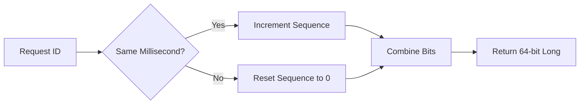

# Design a Distributed ID Generator (Snowflake ID)

1. 💡 The "Big Picture" (Plain English)
### What is this in simple terms?
Imagine you are the manager of a global pizza chain like Domino's. Every single pizza sold needs a unique order number. If every shop in the world had to call a single "Head Office" phone number to get the next ID (1, 2, 3...), the phone line would be busy constantly, and shops would stop working.

A **Snowflake ID** is a way for every pizza shop to generate its own unique order numbers locally, without ever talking to Head Office, while guaranteeing that no two shops in the world ever produce the same ID.

### Real-World Analogy: The Soda Bottle Batch Code
Look at the neck of a soda bottle. It has a code like `2023-OCT-12-NY-004`. 
- `2023-OCT-12`: Tells you **when** it was made.
- `NY`: Tells you **where** it was made (New York plant).
- `004`: Tells you it was the **4th bottle** off the line in that specific millisecond.

By combining Time + Location + Sequence, the bottle is unique across the entire world without a central "Bottle Registry."

### Why should I care?
In a modern app (like Twitter or Instagram), you have thousands of servers. If they all depend on a single Database Auto-Increment to get an ID, your app will crash under high traffic. Snowflake IDs allow for high-speed, sortable, and unique IDs across a distributed cluster.

---

2. 🛠️ How it Works (Step-by-Step)
Snowflake IDs are **64-bit integers**. We divide these 64 bits into specific sections:

1.  **Sign Bit (1 bit):** Always 0 (keeps the number positive).
2.  **Timestamp (41 bits):** Current time in milliseconds (since a custom "epoch").
3.  **Machine ID (10 bits):** A unique ID assigned to the specific server (allows $2^{10} = 1024$ nodes).
4.  **Sequence (12 bits):** A counter for IDs created within the same millisecond.

### The Flow


### Clean Code Snippet (Java-style Logic)
```java
public synchronized long nextId() {
    long timestamp = System.currentTimeMillis();

    if (timestamp < lastTimestamp) {
        throw new RuntimeException("Clock moved backwards!");
    }

    if (lastTimestamp == timestamp) {
        // If we are in the same millisecond, increment the counter
        // sequenceMask ensures it wraps around if it exceeds 12 bits (4095)
        sequence = (sequence + 1) & 4095;
        if (sequence == 0) {
            // Out of IDs for this millisecond? Wait for the next one.
            timestamp = waitNextMillis(lastTimestamp);
        }
    } else {
        sequence = 0; // New millisecond, reset counter
    }

    lastTimestamp = timestamp;

    // Shift the bits into their final positions and OR them together
    return ((timestamp - EPOCH) << 22) | (machineId << 12) | sequence;
}
```

---

3. 🧠 The "Deep Dive" (For the Interview)

### The Technical "Magic"
*   **Bit Shifting:** We don't use string concatenation. We use the bitwise Left Shift (`<<`) and OR (`|`) operators. This is incredibly fast (CPU-level instructions) and memory-efficient.
*   **The Epoch:** We don't use the standard Unix Epoch (1970). We pick a custom start date (e.g., the day the app launched). 41 bits of milliseconds gives us roughly **69 years** of IDs before we run out of space.
*   **Thread Safety:** The generation method must be `synchronized` (or use Locks) because if two threads on the same machine try to get an ID at the exact same nanosecond, they might get the same sequence number.

### Trade-offs
*   **Pro: Rough Sorting.** Because the timestamp is at the beginning of the ID, IDs generated later are numerically larger. This makes database indexing very efficient.
*   **Con: Clock Dependency.** If a server's system clock is manually reset backward (Clock Drift), it could generate duplicate IDs.
*   **Con: Complexity.** You need a way to assign and manage "Machine IDs" (often using ZooKeeper or Consul) so two servers don't claim the same ID.

### Interviewer Probes
1.  **"What happens if the system clock drifts backwards?"**
    *   *Answer:* The generator should detect this (`currentTimestamp < lastTimestamp`) and either throw an error, wait for the clock to catch up, or refuse to issue IDs until the clock is fixed.
2.  **"Why 41 bits for the timestamp?"**
    *   *Answer:* It's a balance. $2^{41}$ milliseconds is ~69 years. If we used 32 bits, we’d run out in 49 days. If we used more, we’d have less room for Machine IDs and Sequence numbers.
3.  **"Why not just use UUIDs?"**
    *   *Answer:* UUIDs are 128-bit (too big), not naturally sortable by time (bad for DB performance), and are strings (slow to index compared to a 64-bit Long).

---

4. ✅ Summary Cheat Sheet

### 3 Key Takeaways
1.  **Distributed & Independent:** No central authority is needed to generate IDs; servers work in isolation.
2.  **Composition:** An ID = Time + Machine ID + Sequence.
3.  **Sortable:** IDs are naturally ordered by time, which keeps database B-Tree indexes happy.

### 1 "Golden Rule"
> **The ID is just a 64-bit number, but it's treated like a piece of data.** It tells you exactly *when* and *where* it was born without looking at a database.