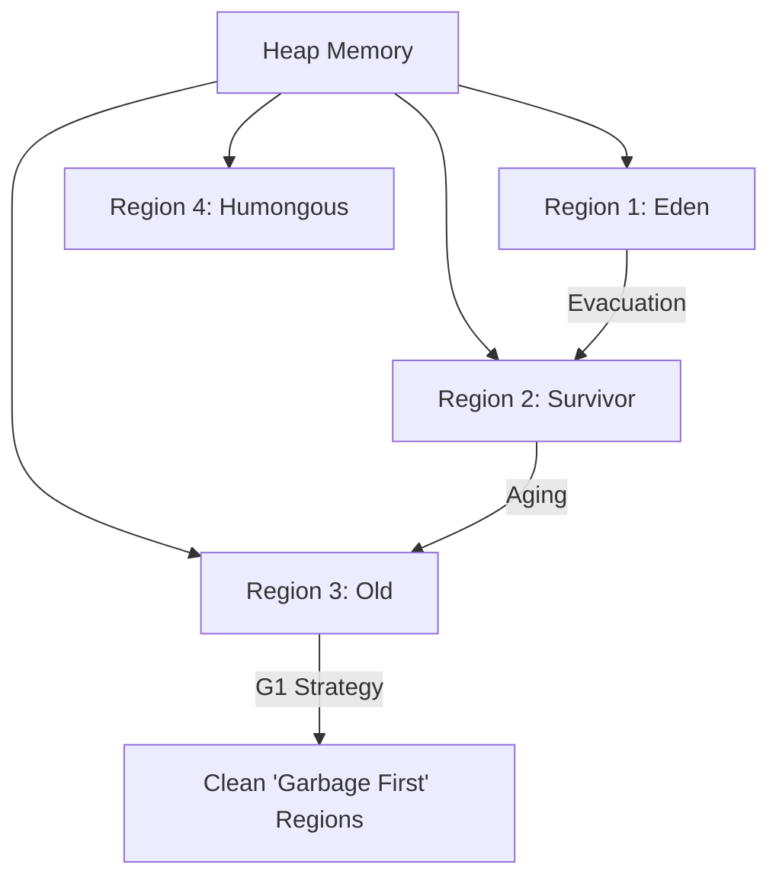

# JVM Internals: The Memory Laws, Modern Cleaners, and the Dynamic Loader

1. 💡 The "Big Picture" (Plain English)
Imagine the JVM is a **Global Logistics Hub**.
*   **The Java Memory Model (JMM)** is the **Rulebook**. It ensures that if one worker (thread) updates a manifest, the other workers actually see that change instead of looking at an outdated copy. Without it, you’d have chaos where two workers think they own the same crate.
*   **G1 and ZGC** are the **Waste Management Teams**. In the old days, the whole hub had to stop working to take out the trash (Stop-The-World). G1 is like a team that cleans the messiest sections first, while ZGC is the elite "invisible" crew that cleans while everyone keeps working.
*   **Class Loading** is the **Security and Customs**. Before any machine (class) enters the hub, it must be inspected for safety, its manual must be read, and it must be assigned a spot on the floor.

**Why care?** If you don't understand the Rulebook, you'll hit "Heisenbugs" (bugs that disappear when you look at them). If you don't understand the Cleaners, your app will "stutter" under heavy load.

---

2. 🛠️ How it Works (Step-by-Step)

### The Class Loading Pipeline
Before your code runs, it goes through a three-step "Security Checkpoint":
1.  **Loading:** Finding the `.class` file and bringing it into memory.
2.  **Linking:** Verifying the bytecode is safe, preparing memory for static variables, and resolving symbolic links to other classes.
3.  **Initialization:** Executing the `static` blocks.

### The Memory Visibility (JMM)
When two threads access the same variable, they don't look at the main RAM immediately; they look at their local CPU cache.

```java
public class VisibilityDemo {
    // Without 'volatile', thread B might never see thread A's change
    private volatile boolean stopRequested = false;

    public void requestStop() { stopRequested = true; }

    public void runLoop() {
        while (!stopRequested) {
            // Do work...
        }
    }
}
```

### Modern GC Flow (G1)
Unlike old collectors that split memory into huge chunks, G1 splits the heap into hundreds of small **Regions**.



---

3. 🧠 The "Deep Dive" (For the Interview)

### The JMM: "Happens-Before" Relationship
The JMM isn't about *how* memory is physically structured; it's a formal set of guarantees. The most important concept is **Happens-Before**. If Action A "happens-before" Action B, then the results of A are guaranteed to be visible to B.
*   **Volatile:** Writing to a volatile field happens-before every subsequent read of that same field.
*   **Synchronized:** Releasing a lock happens-before acquiring that same lock.

### G1 vs. ZGC: The Latency War
*   **G1 (Garbage First):** The default since Java 9. It targets a "pause time" (e.g., 200ms). It divides the heap into regions and uses a "Remembered Set" to track pointers between regions. 
    *   *Trade-off:* High throughput, but pauses are still noticeable in high-frequency trading or gaming.
*   **ZGC (Z Garbage Collector):** A scalable low-latency collector. It uses **Colored Pointers** and **Load Barriers**. It performs almost all work concurrently with the application threads.
    *   *Magic:* It marks memory by using the unused bits in a 64-bit pointer. It can handle terabytes of memory with pause times consistently under **1 millisecond**.
    *   *Trade-off:* It requires more CPU overhead from the "Load Barriers" (extra instructions every time you access an object).

### Interviewer Probes
1.  **"Can you load the same class twice in Java?"**
    *   *Answer:* Yes, but only if they are loaded by different **ClassLoaders**. A class is uniquely identified in the JVM by its fully qualified name *and* its ClassLoader. This is how app servers (like Tomcat) isolate different web apps.
2.  **"Why is ZGC faster than G1 for pause times?"**
    *   *Answer:* G1 has to stop application threads during the "Evacuation" phase (moving objects). ZGC uses "Load Barriers" to move objects concurrently. If an application thread tries to access an object while ZGC is moving it, the Load Barrier "fixes" the pointer on the fly.
3.  **"Does `volatile` guarantee atomicity?"**
    *   *Answer:* No. It only guarantees **visibility** and **ordering**. For example, `volatile i++` is not thread-safe because `i++` is three operations (read, increment, write). You need `AtomicInteger` or `synchronized` for atomicity.

---

4. ✅ Summary Cheat Sheet

*   **Class Loading** follows the **Parent Delegation Model**: Ask your parent loader to find a class before you try to find it yourself (prevents you from overwriting `java.lang.String`).
*   **JMM** is the contract that prevents the CPU from reordering your code in a way that breaks multi-threading.
*   **G1** is for general use (balance of speed and throughput); **ZGC** is for when milliseconds of lag mean lost money.

> **The Golden Rule:** 
> "Always code for the JMM, tune for the GC, and never assume a class is loaded until you see the static block fire."