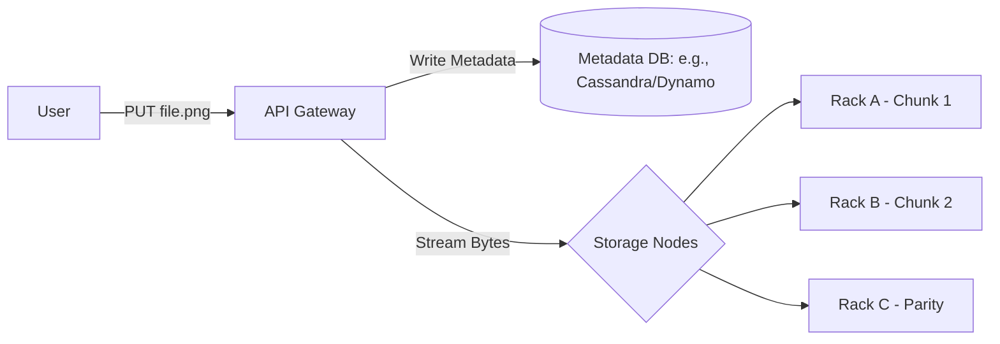

# S3 Metadata Management & Data Durability: The Brain and Body of Storage

1. 💡 **The "Big Picture" (Plain English):**
   - **What is it?** Imagine a giant warehouse (The Storage) that holds billions of boxes. To find a box quickly, you need a high-speed filing cabinet (The Metadata Store) that tells you exactly which aisle and shelf a box is on. Data Durability is the "Fireproof/Floodproof" system that ensures even if half the warehouse burns down, your items are still safe.
   - **Real-World Analogy:** Think of a **Valet Parking Service**. When you give them your car, they give you a ticket (the Key). They park the car in a massive lot (The Data Store) and write down the car’s location and color in a logbook (The Metadata). To get your car back, you only need the ticket; you don't need to know where the car is parked.
   - **Why care?** If you just "save files to a folder," your system will crash once you hit a few million files. S3-style systems solve this by decoupling the *description* of the file from the *actual bytes*.

2. 🛠️ **How it Works (Step-by-Step):**
   - **Step 1: The Upload.** The client sends a `PUT` request with the file (e.g., `my-cat.jpg`).
   - **Step 2: Metadata Indexing.** The system generates a unique ID and stores attributes (size, owner, creation date) in a highly available Key-Value store.
   - **Step 3: Sharding & Stripping.** The file isn't just "plopped" on a hard drive. It is broken into chunks.
   - **Step 4: The Durability Magic.** Those chunks are either copied 3 times (Replication) or mathematically transformed into fragments (Erasure Coding) and spread across different physical "Failure Domains" (different racks or buildings).

### A Glimpse at the "Object" Structure
```python
# Conceptual representation of how S3 stores a file internally
object_store = {
    "my-bucket/images/cat.jpg": {
        "metadata": {
            "content_type": "image/jpeg",
            "size_bytes": 1048576,
            "version_id": "v1.0",
            "acl": "private",
            "storage_class": "STANDARD"
        },
        "data_pointers": [
            "node_A_disk_1_block_99", # Chunk 1
            "node_B_disk_4_block_12", # Chunk 2
            "node_C_disk_2_block_45"  # Parity/Recovery Chunk
        ]
    }
}
```

### The Data Flow


3. 🧠 **The "Deep Dive" (For the Interview):**
   - **Metadata Scalability:** You cannot use a standard SQL database for billions of objects. S3 uses a **Distributed Key-Value Store** (like DynamoDB or a specialized LSM-Tree structure). The "Key" is the bucket name + file path, which is hashed to find the correct server in the metadata cluster.
   - **Erasure Coding (The "Magic"):** Instead of simple replication (which uses 3x the storage), advanced systems use Erasure Coding (e.g., Reed-Solomon). It breaks a file into $k$ data chunks and $m$ parity chunks. You can lose *any* $m$ chunks and still reconstruct the file. 
     - *Trade-off:* It saves massive amounts of disk space (e.g., 1.5x overhead vs 3x), but it requires more CPU to "recalculate" the file during reads.
   - **Strong vs. Eventual Consistency:** S3 famously moved from Eventual Consistency to **Strong Consistency**. This means as soon as a `PUT` is successful, a subsequent `GET` is guaranteed to see the new data. This is hard to achieve at scale because you must ensure the metadata is updated across all nodes before acknowledging success.

   **Interviewer Probes:**
   - *"What happens if two people upload a file to the same path at the exact same time?"*
     - **Answer:** This is a race condition. S3 uses "Last-Writer-Wins" semantics based on the timestamp assigned by the metadata service.
   - *"How do you handle 'Hot Shards' in the metadata?"*
     - **Answer:** If millions of people access `bucket/folder/1`, `bucket/folder/2`, etc., the metadata server handling that "prefix" might get overwhelmed. We solve this by adding a random prefix (hash) to the beginning of keys or dynamically splitting metadata partitions when they hit high traffic.

4. ✅ **Summary Cheat Sheet:**
   - **Key-Value over File System:** Never use a traditional OS folder structure for billions of files; use a distributed flat Key-Value store for metadata.
   - **Separation of Concerns:** Separate the **Data Path** (streaming bits to disks) from the **Control Path** (managing names, permissions, and locations).
   - **Durability != Availability:** Durability is "will the file exist in 10 years?" (achieved via Erasure Coding). Availability is "can I download it right now?" (achieved via multiple API endpoints and replication).

   **The Golden Rule:**
   > "In a scalable storage system, **never** let the storage nodes know the file's name, and **never** let the metadata store hold the file's actual bytes."