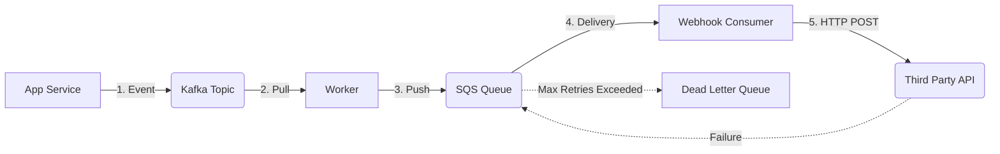

# Reliable Notification Delivery: Handling Failure at Scale

1. 💡 **The "Big Picture" (Plain English):**
   - **What is this?** Imagine a massive Post Office. Some mail is high-priority (Security Alerts), some is bulk (Marketing), and some goes to people who moved without leaving a forwarding address (Broken Webhooks). 
   - **Real-World Analogy:** Think of a **Pizza Shop**. 
     - **Kafka** is the master order log—every order ever placed is written in a book. 
     - **SQS** is the "Heat Rack"—it holds individual pizzas ready for the delivery drivers. If a driver drops a pizza, they grab another one from the rack. 
     - **Webhooks** are the delivery drivers knocking on the customer's door.
   - **Why care?** If your notification system fails, users don't get 2FA codes (locking them out) or fraud alerts (losing them money). You need a system that doesn't just *send* messages, but *guarantees* they arrive even if the internet is glitching.

2. 🛠️ **How it Works (Step-by-Step):**
   1. **Ingestion (Kafka):** Your main app drops a "UserLoggedIn" event into Kafka. Kafka acts as the "source of truth"—it’s fast and keeps a permanent record.
   2. **Buffering (SQS):** A consumer reads from Kafka and pushes a message into an SQS queue. Why? Because SQS allows us to retry *individual* messages if they fail, without stopping the whole line.
   3. **Delivery (Webhooks):** A worker service pulls from SQS and makes an HTTP POST request to the user’s URL.
   4. **Recovery (DLQ):** If the webhook fails after 3 tries, the message goes to a **Dead Letter Queue (DLQ)** for manual inspection or later retry.

```python
# Simplified Delivery Worker Logic
import boto3
import requests

def deliver_notification(sqs_message):
    try:
        # 1. Parse the message
        url = sqs_message['target_url']
        payload = sqs_message['data']
        
        # 2. Attempt delivery with a timeout
        response = requests.post(url, json=payload, timeout=5)
        
        # 3. If successful, delete from SQS so it's not retried
        if response.status_code == 200:
            delete_from_sqs(sqs_message['receipt_handle'])
            
    except requests.exceptions.RequestException as e:
        # If it fails, we DON'T delete it. 
        # SQS will make it visible again after the "Visibility Timeout"
        print(f"Delivery failed: {e}. Message will stay in SQS for retry.")
```

**The Flow:**


3. 🧠 **The "Deep Dive" (For the Interview):**
   - **Kafka vs. SQS (The "Why Both?" Question):** 
     - **Kafka** provides **Ordered Persistence**. It’s great for replaying events or keeping a long-term log. However, Kafka isn't great at "per-message retries." If message #5 fails, the consumer often gets stuck before it can reach message #6.
     - **SQS** provides **Independent Retries**. If message A fails, it hides for 60 seconds (Visibility Timeout) and comes back, while messages B, C, and D are processed instantly. Combining them gives you the reliability of a log with the surgical precision of a queue.
   - **Idempotency (The "At-Least-Once" Trap):** Distributed systems guarantee "at-least-once" delivery. This means a user might get the same notification twice. To fix this, we attach a `request_id` or `nonce` to every notification. The receiver should check their DB: "Have I already processed notification `uuid-123`?"
   - **Backpressure & Rate Limiting:** If you are sending 100k notifications/sec to a small startup's webhook, you might crash *their* server. You need a **Leaky Bucket** or **Token Bucket** algorithm at the delivery layer to throttle outgoing traffic based on the destination's capacity.

   **Interviewer Probes:**
   - *"What happens if your SQS-to-Webhook worker crashes mid-execution?"* 
     - **Answer:** SQS uses a **Visibility Timeout**. The message isn't deleted until the worker explicitly says "I'm done." If the worker crashes, the timeout expires, and the message automatically reappears in the queue for another worker to grab.
   - *"How do you handle 'Hot Partitions' in Kafka if one user is sending millions of notifications?"*
     - **Answer:** Use a composite Partition Key (e.g., `user_id + message_type`) or a random salt to ensure data is distributed evenly across Kafka brokers.

4. ✅ **Summary Cheat Sheet:**
   - **Kafka** is your high-throughput event spine.
   - **SQS** is your per-message retry buffer.
   - **Webhooks** are the "Last Mile" of delivery, requiring strict timeouts and idempotency.

   **The Golden Rule:** 
   > "In a distributed system, failure is the default state. Design your system so that failing to send a message is an expected event with a built-in recovery path (Retries + DLQs)."