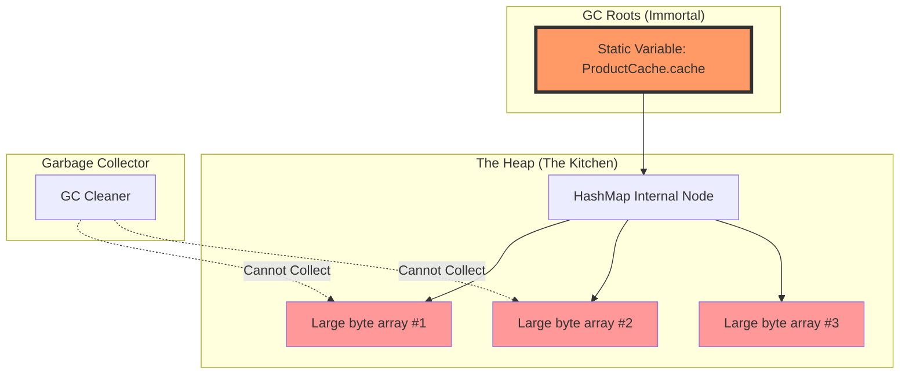

# Heap Profiling & Memory Leak Detection

1. 💡 **The "Big Picture" (Plain English):**
   - **What is it?** Imagine your computer's memory is a high-end restaurant kitchen. The Garbage Collector (GC) is the cleaning crew that comes by to take away empty plates. A **Memory Leak** happens when a customer finishes their meal but refuses to let the waiter take the plate away. Even though the plate is "empty" (the data is no longer needed), it’s still taking up space on the table. Eventually, there are no more clean tables, and the restaurant has to shut down.
   - **The Analogy:** If you hold a "Strong Reference" to an object you don't need anymore, you are basically "holding the plate" so the cleaning crew can't touch it. **Heap Profiling** is the act of walking into that kitchen with a clipboard to find out exactly who is holding onto all those empty plates.
   - **Why care?** Because your application will eventually crash with an `OutOfMemoryError` (OOME). Tuning GC is useless if your code is hoarding memory—you can't "tune" your way out of a leak.

2. 🛠️ **How it Works (Step-by-Step):**
   Memory leak detection is a detective process:
   1.  **Observe:** You notice the "Baseline" memory usage is slowly creeping up after every GC cycle.
   2.  **Snapshot:** You take a "Heap Dump" (a binary file showing every object in memory at that exact moment).
   3.  **Find the Root:** You look for the **GC Root**—the specific object that is preventing the dead weight from being cleared.
   4.  **Analyze the Path:** You identify the reference chain (e.g., `Static Map -> List -> Your Massive Object`).

**The "Leaky" Code Snippet:**
```java
public class ProductCache {
    // BUG: This static map grows forever. 
    // It is a 'GC Root' because static variables live as long as the ClassLoader.
    private static final Map<String, byte[]> cache = new HashMap<>();

    public void addToCache(String id) {
        // We add 1MB of data every time
        byte[] data = new byte[1024 * 1024]; 
        cache.put(id, data);
        // We forgot to implement a removal policy (like LRU)!
    }
}
```

**Visualizing the Leak (Mermaid):**


3. 🧠 **The "Deep Dive" (For the Interview):**
   - **The Technical Magic:** The GC uses **Reachability Analysis**. It starts at "GC Roots" (Local variables in the stack, active threads, static variables, and JNI references). It traverses the graph of references. Any object not reachable from these roots is marked for deletion. A leak occurs when an object is *logically* dead but *technically* reachable.
   - **The "Incoming" vs "Outgoing" Reference:** To find a leak, you must look at **Incoming References**. If `Object A` is leaking, we ask: "Who is pointing to me?" 
   - **The Trade-offs of Profiling:** 
     - **Sampling vs. Instrumentation:** Sampling (checking the heap every 10ms) is lightweight but might miss "spiky" allocations. Instrumentation (tracking every single allocation) gives perfect data but can slow the app down by 10x.
     - **Heap Dumps:** Taking a heap dump "freezes" the JVM. On a 32GB heap, this could stop your production app for 30+ seconds.
   - **Interviewer Probes:**
     - *Probe 1:* "Can a garbage-collected language like Java/C# actually have memory leaks?"
       - *Answer:* Yes. It’s technically a "Memory Accumulation." The language manages *unreferenced* memory, but if the developer accidentally maintains a reference (e.g., in a static collection or an unclosed listener), the GC is powerless.
     - *Probe 2:* "What is the difference between Shallow Heap and Retained Heap?"
       - *Answer:* **Shallow Heap** is the memory consumed by the object itself (e.g., just the pointers). **Retained Heap** is the total memory that would be freed if this object was deleted (the object + everything it exclusively holds). In a leak, we look for high Retained Heap.

4. ✅ **Summary Cheat Sheet:**
   - **Identify the Root:** Most leaks are caused by `static` fields, unclosed ThreadLocals, or forgotten Event Listeners.
   - **Use the Tools:** Use `jmap` or `jcmd` to trigger dumps, and `VisualVM` or `Eclipse MAT` to analyze them.
   - **Path to GC Root:** This is the "Evidence Chain." If you can't justify why an object is connected to a GC Root, cut the link.

**Golden Rule:** 
> "If the 'After-GC' memory usage line on your graph looks like a staircase going up, you don't have a GC tuning problem; you have a reference management problem."