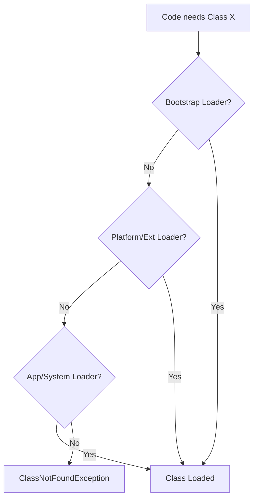

# JVM Performance & Stability: Memory Consistency, Evolution of GC, and Dynamic Linking

1. 💡 The "Big Picture" (Plain English):
- **What is this?** Imagine the JVM as a massive, high-tech **Automated Warehouse**.
    - **The Java Memory Model (JMM)** is the "Safety Manual." It ensures that if one worker moves a box, other workers actually *see* that the box has moved and don't trip over thin air.
    - **G1 and ZGC** are the "Cleanup Crews." G1 is like a team that cleans the warehouse in sections (regions), while ZGC is a futuristic robotic vacuum system that cleans *while* the warehouse is still operating at full speed, without ever telling workers to stop.
    - **Class Loading** is the "Procurement Office." It doesn't stock every blueprint at once; it only fetches the instructions for a machine the moment someone hits the "On" switch.
- **Why should I care?** Without the JMM, your multi-threaded code would produce "ghost bugs" that only happen on Tuesdays at 3 AM. Without modern GCs, your app would "hiccup" (pause) every few minutes. Without Class Loading, your app would take 10 minutes to start and use 5x more memory.

---

2. 🛠️ How it Works (Step-by-Step):

### The Class Loading Journey (Delegation Model)
1. **Request:** A line of code calls `new Order()`.
2. **Delegate Up:** The Application ClassLoader asks the Extension ClassLoader, which asks the Bootstrap ClassLoader (the "Root").
3. **Search Down:** If the Root doesn't have it, the request flows back down. If no one finds it, you get the dreaded `ClassNotFoundException`.

### Garbage Collection Evolution
- **G1 (Garbage First):** Splits the heap into ~2048 small regions. It identifies which regions are the most "trash-heavy" and cleans those first to get the best "bang for the buck."
- **ZGC (Z Garbage Collector):** A scalable, low-latency collector. It uses "Colored Pointers" (marking bits directly on the memory address) to keep track of objects, allowing it to move them while the application is still running.

### Code Snippet: The JMM in Action
```java
public class VisibilityDemo {
    // Without 'volatile', thread B might never see thread A's update 
    // because the value is cached in the CPU core's local register.
    private volatile boolean keepRunning = true; 

    public void stop() {
        keepRunning = false; // Thread A
    }

    public void runLoop() {
        while (keepRunning) { 
            // Thread B: volatile ensures it reads from Main Memory, not CPU cache
        }
        System.out.println("Stopped safely!");
    }
}
```

### Flow Diagram: Class Loading Delegation


---

3. 🧠 The "Deep Dive" (For the Interview):

### The Java Memory Model (JMM) & "Happens-Before"
The JMM isn't about *how* memory is laid out (Heap/Stack), but about **requirements**. It defines the **Happens-Before** relationship. If action A happens-before action B, then the results of A are guaranteed to be visible to B.
*   **The Magic:** To enforce this, the JVM inserts **Memory Barriers** (CPU instructions) that prevent the hardware from reordering instructions in a way that would break your logic.
*   **Trade-off:** Using `volatile` or `synchronized` prevents CPU optimizations (like instruction reordering and aggressive caching), making the code slightly slower but safe.

### G1 vs. ZGC: The Latency War
*   **G1 (Default since Java 9):** Aims for a balance between throughput and latency. It has "Stop-the-World" (STW) pauses, but they are predictable and usually short.
*   **ZGC:** Aims for **sub-millisecond pause times**, regardless of heap size (even up to 16TB!). 
    *   **The Secret:** It uses **Load Barriers**. Every time your code accesses an object pointer, ZGC runs a tiny bit of code to check if that object has been moved. If it has, it "remaps" the pointer on the fly.
*   **Trade-off:** ZGC offers incredible latency, but it might reduce overall throughput by ~10% compared to G1 because of the overhead of those load barriers.

### Class Loading: The "Parent Last" Exception
Usually, ClassLoaders follow "Parent-First." However, in **Web Servers (like Tomcat)** or **OSGi**, they often use "Child-First." This allows different web apps on the same server to use different versions of the same library (e.g., App A uses Hibernate 4, App B uses Hibernate 5) without clashing.

**Interviewer Probe Questions:**
1.  *"Can you explain 'False Sharing' in the context of the JMM?"* 
    *   **Answer:** It happens when two different variables sit on the same CPU Cache Line. When one thread updates variable A, it invalidates the cache for the other thread updating variable B, killing performance even if they aren't sharing data.
2.  *"Why would I choose G1 over ZGC for a batch processing job?"*
    *   **Answer:** Batch jobs care about *throughput* (total work done), not *latency* (pause times). G1 is generally more efficient at total throughput because it doesn't have the "Load Barrier" overhead of ZGC.

---

4. ✅ Summary Cheat Sheet:

- **Key Takeaway 1:** The **JMM** is the contract between the Java code and the CPU; it uses `volatile` and `synchronized` to ensure data visibility across threads.
- **Key Takeaway 2:** **G1** is a "Regional" collector (good for most apps); **ZGC** is a "Concurrent" collector (good for ultra-low latency).
- **Key Takeaway 3:** **Class Loading** is hierarchical. It uses delegation to ensure core Java classes (like `String`) stay secure and cannot be overridden by malicious user code.

**The Golden Rule:** 
> "Optimize for the Garbage Collector that fits your SLA: use G1 for high-volume data crunching, use ZGC for responsive user-facing APIs."