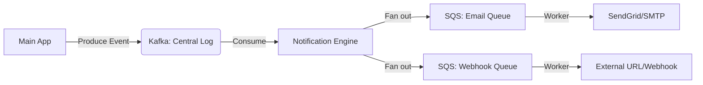

# Orchestrating Notification Flows: Kafka as the Backbone, SQS as the Buffer

1. 💡 **The "Big Picture" (Plain English):**
   - **What is this?** Imagine a massive notification system like Uber's. When you order a ride, three things happen: the driver gets an alert, your "Family Sharing" contact gets a text, and the receipt is emailed. This system ensures those messages arrive quickly, in the right order, and without crashing the whole app.
   - **The Analogy:** Think of a **Global Logistics Hub**. 
     - **Kafka** is the massive **Cargo Train**. It carries millions of items across the country in bulk. It doesn't care about individual addresses; it just moves the heavy load efficiently. 
     - **SQS** is the **Local Delivery Van**. It takes a few packages from the train station and handles the tricky "last mile" to your specific door. If the van gets stuck in traffic (a slow API), it just tries again later without stopping the whole train.
     - **Webhooks** are the **Digital Doorbell**. It's the way our system tells another company's system ( like Slack or a banking app), "Hey, your package is here!"
   - **Why care?** If you try to send 1 million emails directly from your main web server, your app will freeze. Using this "Tiered" approach ensures your app stays fast while the notifications are processed reliably in the background.

2. 🛠️ **How it Works (Step-by-Step):**
   1. **Ingestion:** Your app sends a "UserPaid" event to a **Kafka Topic**. Kafka stores this forever (or for a set time) so we don't lose the data.
   2. **Distribution:** A "Notification Service" reads from Kafka. It decides: "This needs an Email and a Webhook."
   3. **Buffering:** Instead of sending the email immediately, it drops a message into an **SQS Queue**. SQS acts as a safety buffer.
   4. **Execution:** A worker pulls from SQS and calls the external API (like SendGrid or a Webhook URL). If the API is down, SQS keeps the message and tries again.

### The Architecture Flow


### Sample Logic (Pseudo-code)
```python
# The Notification Worker (Consumer)
def process_notification(event):
    # 1. Logic: Who needs to see this?
    targets = lookup_user_preferences(event.user_id)
    
    # 2. Push to SQS for specialized delivery
    for target in targets:
        # We don't call the API here! We just put it in a queue.
        sqs.send_message(
            QueueUrl=target.type_queue, 
            MessageBody=format_payload(event, target),
            # Use MessageDeduplicationId to prevent double-sending
            MessageDeduplicationId=f"{event.id}_{target.type}"
        )

# The Webhook Executor
def deliver_webhook(sqs_message):
    # Sign the payload so the receiver knows it's us (Security!)
    signature = hmac.sign(sqs_message.body, SECRET_KEY)
    
    response = requests.post(
        sqs_message.url, 
        data=sqs_message.body, 
        headers={'X-Signature': signature}
    )
    
    if response.status_code != 200:
        # Let SQS handle the retry logic
        raise Exception("Partner site is down!")
```

3. 🧠 **The "Deep Dive" (For the Interview):**
   - **Kafka vs. SQS (The Strategy):** Why use both? Kafka is **Log-based**. It's great for high-throughput and "replaying" events (e.g., "We had a bug, let's re-process all notifications from yesterday"). SQS is **Message-based**. It’s better for "Task Management." It has built-in **Visibility Timeouts** (if a worker dies while sending an email, the message reappears for another worker) and **Dead Letter Queues (DLQ)** for failed deliveries.
   - **Webhook Security & Reliability:** 
     - **Idempotency:** What if the network blips and we send the same webhook twice? We must provide a `Webhook-ID` in the header so the receiver can ignore duplicates.
     - **SSRF Protection:** You are letting users give you a URL to call. An attacker could give you `http://localhost:8080/admin/delete-all`. You must validate that the webhook URL is public and not an internal IP.
   - **Backpressure & Throttling:** 3rd party APIs (Twilio, SendGrid) have rate limits. If you blast 10,000 requests/sec, they will block you. SQS allows you to control the "Consumer Speed" to stay within those limits.

   - **Interviewer Probe Questions:**
     - *Q: "What happens if Kafka is up, but SQS is down?"* 
       - **A:** The Kafka consumer will stop advancing its offset. The data stays safe in Kafka (it's persistent). Once SQS is back, we resume from where we left off.
     - *Q: "How do you ensure notifications are sent in the exact order they happened?"*
       - **A:** In Kafka, use a **Partition Key** (like `user_id`). All events for one user go to the same partition, ensuring sequential processing. However, once it hits SQS, "Strict Ordering" is harder unless you use **SQS FIFO queues** (which are slower).

4. ✅ **Summary Cheat Sheet:**
   - **Kafka** is your "Source of Truth" and heavy-duty event distributor.
   - **SQS** is your "Execution Buffer" that handles retries and shields you from slow external APIs.
   - **Webhooks** require security (signing) and idempotency (unique IDs) because the "outside world" is unreliable.

   > **The Golden Rule:** 
   > Never let a slow third-party API (like an Email provider) block your main application flow. Always hand off the work to a queue.