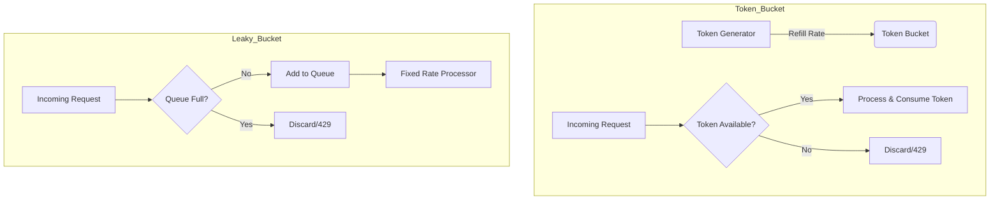

# Architecting Traffic Control: Token Bucket vs. Leaky Bucket

1. 💡 **The "Big Picture" (Plain English)**
   - **What is it?** Rate limiting is like a bouncer at a club. It decides who gets in and how fast, ensuring the "party" (your server) doesn't get overcrowded and crash.
   - **Real-World Analogy:** 
     - **Token Bucket:** Imagine a coffee shop loyalty card. You earn one "free coffee" stamp every hour (refill rate). You can save up to 10 stamps (bucket size). If you have 5 stamps, you can buy 5 coffees all at once (bursting).
     - **Leaky Bucket:** Imagine a literal funnel. No matter how much water you pour in at once, it only drips out the bottom at a steady, one-drop-per-second pace. If the funnel gets full, any new water just overflows and is lost.
   - **Why care?** Without this, a single "noisy neighbor" (a buggy script or a malicious user) can send 10,000 requests a second, knocking your entire service offline for everyone else.

---

2. 🛠️ **How it Works (Step-by-Step)**

### Token Bucket (The "Burst" Friendly Strategy)
1. A "bucket" holds tokens. It has a maximum capacity.
2. Tokens are added at a fixed rate (e.g., 10 tokens/sec).
3. Every incoming request must "grab" a token to proceed.
4. If the bucket is empty, the request is dropped (HTTP 429 Too Many Requests).

### Leaky Bucket (The "Steady Pace" Strategy)
1. Requests enter a queue (the bucket).
2. Requests are processed (leaked) at a strictly constant rate.
3. If the queue is full, new incoming requests are discarded.

#### Mermaid Flow Visualization


#### Clean Code Snippet (Token Bucket Logic)
```java
public class TokenBucket {
    private final long capacity;
    private final double refillRate; // tokens per millisecond
    private double currentTokens;
    private long lastRefillTimestamp;

    public TokenBucket(long capacity, double refillRate) {
        this.capacity = capacity;
        this.refillRate = refillRate;
        this.currentTokens = capacity;
        this.lastRefillTimestamp = System.currentTimeMillis();
    }

    public synchronized boolean allowRequest() {
        refill();
        if (currentTokens >= 1.0) {
            currentTokens -= 1.0;
            return true;
        }
        return false;
    }

    private void refill() {
        long now = System.currentTimeMillis();
        double delta = (now - lastRefillTimestamp) * refillRate;
        currentTokens = Math.min(capacity, currentTokens + delta);
        lastRefillTimestamp = now;
    }
}
```

---

3. 🧠 **The "Deep Dive" (For the Interview)**

### Technical Magic & Internals
- **Memory Efficiency:** Both algorithms are highly memory-efficient. You only need to store a few variables (timestamp, count) per user/IP.
- **Race Conditions:** In a distributed system (multiple servers), using a local variable like `currentTokens` fails. You must use **Redis** with **Lua Scripts** to ensure the "get-compare-set" operation is atomic.
- **The "Burst" Trade-off:** 
    - **Token Bucket** allows for bursts. This is great for APIs where a user might load a dashboard (10 rapid calls) and then go idle. 
    - **Leaky Bucket** smooths out traffic perfectly. This is ideal when your downstream service (like a legacy database) can only handle exactly $X$ queries per second without falling over.

### Interviewer Probes (The Tricky Stuff)
- **"How do you handle distributed rate limiting without a single point of failure?"**
  - *Answer:* You use a distributed cache like Redis. To avoid the network latency of calling Redis on every request, you can use "Local Batching" where the app server grabs 10 tokens at once and manages them locally, only hitting Redis when those 10 are gone.
- **"What happens if the system time jumps backward (NTP drift)?"**
  - *Answer:* This can break timestamp-based logic. A robust implementation uses `System.nanoTime()` or checks if `now < lastRefillTimestamp` and handles it gracefully by either resetting the window or ignoring the drift.
- **"Which one is better for a Webhook delivery system?"**
  - *Answer:* Leaky Bucket. You want to ensure you don't overwhelm the third-party receiver with a sudden burst; a steady, predictable drip is safer for their infrastructure.

---

4. ✅ **Summary Cheat Sheet**

- **Key Takeaway 1:** **Token Bucket** = Permits bursts, easy to implement, standard for most modern REST APIs.
- **Key Takeaway 2:** **Leaky Bucket** = Forces a stable flow, prevents spikes from ever hitting your backend, uses a FIFO queue.
- **Key Takeaway 3:** **Atomic Operations** are non-negotiable. Use Redis + Lua or `AtomicLong` (for single-node) to prevent "double-spending" tokens.

**The Golden Rule:**
> "Use **Token Bucket** if you want to be generous to users who occasionally work in bursts; use **Leaky Bucket** if your primary goal is to protect a fragile downstream dependency."