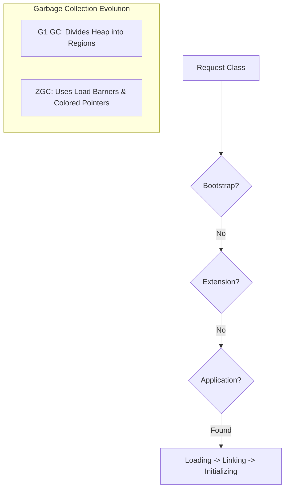

# JVM Internals: The Class Loading Hierarchy, Memory Consistency, and Zero-Pause Collectors

### 1. 💡 The "Big Picture" (Plain English)

Imagine you are running a massive, high-end **Automated Hotel**.

*   **Class Loading** is the **Architect's Blueprint Filing System**. Before a room can be built, the hotel needs to find the specific blueprint. If the local file doesn't have it, it asks the Head Office, then the Global Registry. You don't want to build the same room twice!
*   **The Java Memory Model (JMM)** is the **Hotel House Rules**. If two guests (threads) are looking at the same whiteboard in the lobby, the JMM ensures that if one guest writes a message, the other guest actually sees it instead of looking at an old, cached version in their own head.
*   **G1 and ZGC** are the **Automated Cleaning Robots**. 
    *   **G1** is the efficient robot that cleans the messiest rooms first to get the most "bang for its buck." 
    *   **ZGC** is the "ninja" robot that cleans *while you are still in the room*, so fast and so quietly that you never even notice it's there.

**Why care?** Without understanding these, your app will eventually crash with a `NoClassDefFoundError`, suffer from "ghost bugs" where data seems to disappear between threads, or lag so badly that users abandon it.

---

### 2. 🛠️ How it Works (Step-by-Step)

#### Step 1: The Class Loading "Hand-off"
Java uses a **Delegation Model**. When you need a class:
1.  **Application ClassLoader** asks the **Extension ClassLoader**.
2.  **Extension** asks the **Bootstrap ClassLoader** (the boss).
3.  If the boss doesn't have it, the request trickles back down. This prevents you from accidentally "overwriting" core Java classes like `java.lang.String`.

#### Step 2: The Memory Contract (JMM)
To keep things fast, CPUs don't always write data to main RAM immediately; they keep it in local caches. The JMM provides the `volatile` keyword and `synchronized` blocks to force the CPU to "flush" these caches so every thread sees the truth.

#### Step 3: Modern Garbage Collection (ZGC)
Unlike old collectors that stop the world (STW) to move objects, ZGC uses **Colored Pointers**. It marks bits directly on the memory address to track an object's state.

```java
public class JvmDemo {
    // JMM in action: 'volatile' ensures visibility across threads
    private static volatile boolean running = true;

    public static void main(String[] args) throws Exception {
        // 1. Class Loading: The JVM finds and loads this class on demand
        System.out.println("JVM Started...");

        Thread worker = new Thread(() -> {
            while (running) {
                // Do work... 
                // Without volatile, this thread might never see 'running' become false
            }
            System.out.println("Worker stopped safely.");
        });

        worker.start();
        Thread.sleep(1000);
        running = false; // Main thread updates memory
    }
}
```

#### The Flow of Class Loading & GC


---

### 3. 🧠 The "Deep Dive" (For the Interview)

#### The "Happens-Before" Relationship
The JMM isn't just about memory; it’s a set of formal rules. The **Happens-Before** principle guarantees that memory writes by one specific statement are visible to another specific statement. For example, a `unlock` on a monitor happens-before every subsequent `lock` on that same monitor. Without this, modern multi-core CPUs would reorder your code to be faster, inadvertently breaking your logic.

#### G1 vs. ZGC: The Trade-offs
*   **G1 (Garbage First):** Divides the heap into regions. It tracks which regions are "most full of trash" and clears them first. It’s great for balancing throughput and latency. 
    *   *Trade-off:* It still has "Stop-the-World" pauses that scale with the number of live objects.
*   **ZGC (Z Garbage Collector):** Designed for sub-millisecond max pause times, even on multi-terabyte heaps. It uses **Load Barriers**. Every time your code touches an object pointer, a tiny piece of logic checks if the object needs to be "remapped" because the GC moved it.
    *   *Trade-off:* It has a "throughput tax" (roughly 15% slower execution) because of those constant pointer checks.

#### Class Loading: The "Parent Last" Exception
While standard Java uses "Parent First" delegation, Servlet containers (like Tomcat) often use **"Parent Last"** for web apps. They look in the local `WEB-INF/lib` first so that two different apps can use two different versions of the same library without crashing the whole server.

#### 🚩 Interviewer Probes:
*   **"Why is ZGC's pause time independent of heap size?"** 
    *   *Answer:* Because ZGC does almost all its work (marking and compacting) concurrently with the application threads. The only pauses are very short "Sync points" to scan thread stacks.
*   **"What is the 'Double-Checked Locking' problem?"** 
    *   *Answer:* It's a JMM violation where a thread might see a partially initialized object because the CPU reordered the "write to memory" before the "constructor finished." Marking the instance `volatile` fixes this in Java 5+.

---

### 4. ✅ Summary Cheat Sheet

*   **Class Loading:** Delegation (Bootstrap -> Extension -> App) ensures security and prevents collisions.
*   **JMM:** The bridge between Java code and hardware reality. It uses "Happens-Before" rules to prevent data races.
*   **ZGC/G1:** G1 is the reliable general-purpose cleaner; ZGC is the ultra-low-latency specialist that uses colored pointers to clean while the app runs.

**The Golden Rule:** 
> **"Loading is hierarchical, Memory is a contract, and Modern GC is concurrent."** 
(If you remember that, you can debug almost any JVM performance or visibility issue.)