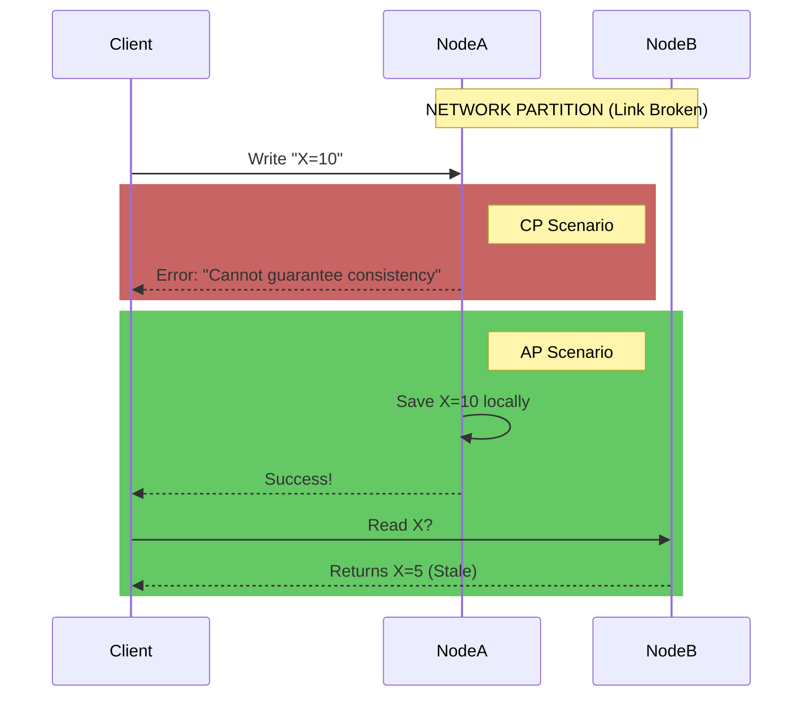

# CAP Theorem: Architecting for Consistency vs. Availability Under Network Partitions

1. 💡 The "Big Picture" (Plain English)
Imagine you and a friend are running a global "Reminder Service" over the phone. You are in New York, and your friend is in London. 

- **Consistency (C):** If a customer calls you to change their reminder, and then immediately calls your friend in London, they should get the updated reminder.
- **Availability (A):** If a customer calls, they *must* get a response, even if you and your friend can't talk to each other right now.
- **Partition Tolerance (P):** The phone line between New York and London might go down (a network partition).

**The Problem:** If the phone line between you and your friend is cut (**P**), you have a choice. If a customer calls you to update a reminder, do you:
1.  **Refuse the update** because you can't tell your friend in London? (**Choose Consistency/CP**)
2.  **Accept the update** and risk the London friend giving the customer the old info later? (**Choose Availability/AP**)

**Why should you care?** In the cloud, "the phone line goes down" all the time (network latency, router failures). You must decide upfront if your app should fail (CP) or lie (AP) when the network breaks.

---

2. 🛠️ How it Works (Step-by-Step)

When a network partition occurs, the system's behavior is dictated by its CAP classification.

1.  **The Request:** A client sends a `Write` request to Node A.
2.  **The Partition:** The network link between Node A and Node B breaks. Node A cannot "replicate" the data to Node B.
3.  **The Response Choice:**
    *   **CP (Consistency/Partition Tolerance):** Node A realizes it can't reach the majority of the cluster. It returns an **Error (500)** to the client. It prefers being offline over being wrong.
    *   **AP (Availability/Partition Tolerance):** Node A accepts the write and returns **Success (200)**. Node B still has the old data. If a client reads from Node B, they get "stale" data, but the service stays online.

### Visualizing the Choice

---

3. 🧠 The "Deep Dive" (For the Interview)

### The Technical "Magic"
In a **CP System** (like Etcd, Consul, or HBase), we use **Consensus Protocols** like **Raft** or **Paxos**. These require a "Quorum" (N/2 + 1 nodes) to agree on a state. If a partition happens and a node can't see the majority, it stops accepting writes to prevent "Split Brain" (where two halves of a cluster think they are the boss and record different data).

In an **AP System** (like Cassandra or DynamoDB), we use **Gossip Protocols** and **Conflict Resolution**. When the partition heals, the nodes compare notes using **Vector Clocks** or "Last Write Wins" (LWW) to merge the divergent data.

### The Trade-offs
*   **CP (Consistency):** Higher latency for writes (needs round-trips for agreement). It is safer for financial transactions or health records.
*   **AP (Availability):** Extremely fast and highly scalable. However, you deal with **Eventual Consistency**, meaning your code must handle the fact that a user might see old data for a few seconds.

### Beyond CAP: PACELC
Senior devs should know **PACELC**. CAP only describes what happens during a partition (P). PACELC adds: "Else (E), when the system is running normally, do you choose Latency (L) or Consistency (C)?" Even without a failure, there is a trade-off between speed and data freshness.

### Interviewer Probes
1.  **"Can we build a CA system?"**
    *   *The Trap:* Students say yes. 
    *   *The Pro Answer:* No. In a distributed system, you cannot "opt-out" of network partitions. If you choose CA, you are essentially saying "my network will never fail," which is a lie. Therefore, you are always choosing how to handle P.
2.  **"Is MongoDB CP or AP?"**
    *   *The Pro Answer:* It depends on configuration. By default, MongoDB is **CP** (one primary node handles writes). If the primary fails, the system is unavailable until a new one is elected. However, with "Read Preference: Secondary," it behaves more like an AP system.

---

4. ✅ Summary Cheat Sheet

*   **CP (Consistency + Partition Tolerance):** "I'd rather be silent than wrong." Use for: Banking, Stock Trading, Metadata stores (Zookeeper).
*   **AP (Availability + Partition Tolerance):** "I'd rather be fast than perfectly accurate." Use for: Social media feeds, Shopping carts, Metrics/Logging.
*   **The Reality:** You can't have all three. Since the network (P) will eventually fail, your architectural design is a binary choice: **C vs A.**

**The Golden Rule:** 
*If the nodes can't talk, you must decide: Do I shut down to keep the data perfect, or do I keep serving potentially 'stale' data to keep the users happy?*