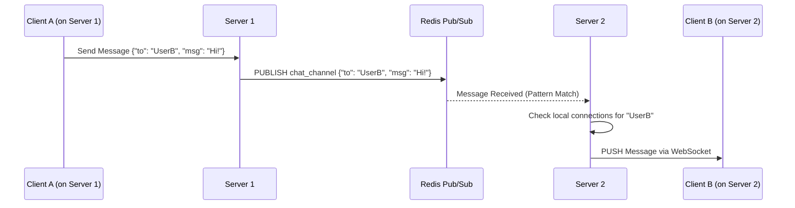

# The Anatomy of Real-time Connectivity: WebSockets & Redis Pub/Sub

1. 💡 **The "Big Picture" (Plain English):**
   - **What is this?** Imagine you are trying to get live updates on a football game. In a traditional system (HTTP), you have to keep refreshing the page or asking the server, "Has anyone scored yet?" every 5 seconds. This is "Polling." In a Real-time Chat system, the server says, "Don't call me; I'll call you the second something happens." 
   - **Real-world Analogy:** Think of a **Phone Call vs. a Letter**. Sending an HTTP request is like mailing a letter and waiting for a reply. A WebSocket is like an active phone call—the line stays open, and either person can speak whenever they want without redialing.
   - **Why should I care?** Users today expect "instant." If a message takes 3 seconds to appear, the app feels broken. WebSockets eliminate the overhead of constantly opening new connections, and Redis Pub/Sub ensures that even if your friend is connected to a different server than you, the "phone call" still connects.

2. 🛠️ **How it Works (Step-by-Step):**
   1. **The Handshake:** The client sends an HTTP request to the server asking to "Upgrade" to a WebSocket.
   2. **The Connection:** Once accepted, the TCP connection stays open. The server keeps a "Map" of who is connected (e.g., `UserID -> SocketID`).
   3. **The Broadcast (The Redis Part):** If User A sends a message to User B, but User B is connected to a *different* server instance, Server A publishes the message to a Redis "Channel."
   4. **The Delivery:** Server B, which is "Subscribed" to that Redis channel, hears the message and pushes it down the open WebSocket to User B.

### The Flow:


### Clean Code Snippet (Node.js Logic):
```javascript
// Server-side: Handling a message
const redis = require('redis');
const pub = redis.createClient();
const sub = redis.createClient();

// 1. Listen for messages from Redis (other servers)
sub.subscribe('CHAT_CHANNEL');
sub.on('message', (channel, data) => {
    const { toUserId, message } = JSON.parse(data);
    // If the recipient is connected to THIS specific server instance
    if (localSockets[toUserId]) {
        localSockets[toUserId].send(message); 
    }
});

// 2. Handle incoming WebSocket message from a client
socket.on('message', (incoming) => {
    const chatPacket = JSON.parse(incoming);
    // Publish to Redis so all server instances see it
    pub.publish('CHAT_CHANNEL', JSON.stringify(chatPacket));
});
```

3. 🧠 **The "Deep Dive" (For the Interview):**
   - **Stateful vs. Stateless:** Standard web servers are *stateless* (easier to scale). WebSocket servers are *stateful*. The server must maintain a memory-heavy TCP connection for every single user. This is why we need Redis; it acts as the "Distributed Brain" that connects these isolated stateful silos.
   - **The Redis Pub/Sub Internals:** Redis Pub/Sub is **"Fire and Forget."** If Server B crashes or the network blips for a millisecond, the message is lost forever because Redis does not store Pub/Sub messages on disk. 
   - **Trade-offs:** 
     - *Performance:* Redis Pub/Sub is incredibly fast (O(1) to O(N) complexity), but it consumes more memory as the number of channels/subscribers grows. 
     - *Reliability:* For a "Mission Critical" chat (like a bank), you might replace Pub/Sub with **Redis Streams** or **Kafka** to ensure message persistence if a client is offline.

### Interviewer Probes (The "Tricky" Questions):
- **Q: "What happens if a user has 3 tabs open?"** 
  - *Answer:* You must handle multiple socket IDs per UserID. Redis will broadcast to all servers, and any server holding *any* of that user's 3 sockets will push the message.
- **Q: "How do you prevent a 'Zombie Connection' from eating your server memory?"**
  - *Answer:* Implement **Heartbeats (Pings/Pongs)**. If the client doesn't respond to a "Ping" within 30 seconds, the server forcefully closes the socket and cleans up the memory.
- **Q: "Why use Redis Pub/Sub instead of just writing to a SQL database and having the other server read it?"**
  - *Answer:* Latency and DB Load. Polling a SQL DB creates massive I/O overhead. Redis Pub/Sub is push-based and happens in-memory, delivering messages in microseconds.

4. ✅ **Summary Cheat Sheet:**
   - **WebSockets** provide the "Permanent Pipe" between a user and a specific server.
   - **Redis Pub/Sub** provides the "Bridge" that connects all those pipes together across different servers.
   - **State Management** is the hardest part; you must track which user is on which server.

   **The Golden Rule:**
   > "WebSockets handle the **Connection**; Redis Pub/Sub handles the **Communication** between servers."