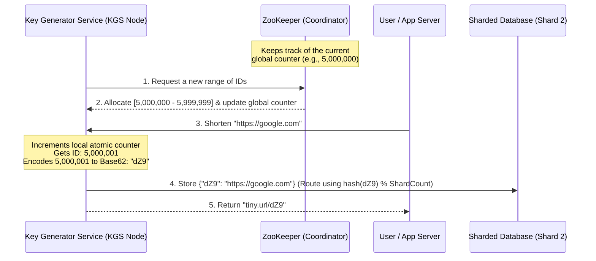

# URL Shortener: Distributed Key Range Allocation & Database Sharding

## 1. 💡 The "Big Picture" (Plain English)

### What is this in simple terms?
Imagine you are building a system that turns long web addresses into short, unique links (like `tinyurl.com/y3x8p9`). To do this at scale, you need to generate billions of unique short codes (keys) without ever generating the same code twice, and store them across multiple database servers so your system never slows down. 

This subtopic focuses on the **coordination layer**: how we assign blocks of numbers to different servers safely (Key Range Allocation) and how we split up the massive database so no single database server gets overwhelmed (Database Sharding).

### The Real-World Analogy
Think of a massive nationwide movie theater chain selling reserved seats. 

If every single ticket booth across the country had to call the head office in New York to ask, *"Can I sell ticket #1,405,201?"* for every single sale, the phone lines would crash (this is a central database bottleneck).

Instead, the head office gives **blocks of ticket numbers** to each local theater. 
* Chicago gets tickets `1,000,000` to `1,999,999`.
* Los Angeles gets tickets `2,000,000` to `2,999,999`.

The local theaters can sell tickets rapidly from their own block without talking to New York. Once Chicago runs out, they request a new block. If a local theater burns down, we might lose a few unused ticket numbers, but the system never halts, and we absolutely guarantee no duplicate tickets are ever sold.

### Why should I care?
If you build this poorly:
1. **Collisions:** Two users get the same short URL, pointing to different destination sites (a security and functional nightmare).
2. **Single Point of Failure (SPOF):** If your single ID-generating database crashes, your entire write-path dies.
3. **Database Meltdown:** A single database cannot handle the write load of millions of new URLs per second.

---

## 2. 🛠️ How it Works (Step-by-Step)

### The Architecture Workflow



### The Step-by-Step Process

1. **Coordination Setup:** A distributed coordinator (like Apache ZooKeeper) maintains a persistent global counter.
2. **Range Allocation:** When a Key Generator Service (KGS) instance boots up, it contacts ZooKeeper and "leases" a range of IDs (e.g., a block of 1 million integers). ZooKeeper updates its state atomically.
3. **Local Minting:** The KGS stores this range in memory. When an application server requests a short URL, the KGS increments a local, thread-safe counter.
4. **Base62 Encoding:** The numerical ID (e.g., `2000001`) is converted into a base-62 string (`[a-z, A-Z, 0-9]`) to make it short and URL-friendly.
5. **Sharded Database Storage:** The short key is hashed, and the modulo of the hash determines which database shard stores the mapping.

### Production-Ready Java Implementation

Below is a thread-safe implementation of a Range-Based Key Generator that uses Base62 encoding.

```java
import java.util.concurrent.atomic.AtomicLong;

public class DistributedKeyGenerator {

    // Base62 Character Set
    private static final String BASE62 = "0123456789ABCDEFGHIJKLMNOPQRSTUVWXYZabcdefghijklmnopqrstuvwxyz";
    
    // Range properties managed by this node
    private final long rangeEnd;
    private final AtomicLong currentId;

    public DistributedKeyGenerator(long rangeStart, long rangeEnd) {
        this.currentId = new AtomicLong(rangeStart);
        this.rangeEnd = rangeEnd;
    }

    /**
     * Mints a unique key. Thread-safe.
     */
    public synchronized String nextShortKey() {
        long id = currentId.getAndIncrement();
        if (id > rangeEnd) {
            throw new RangeExhaustedException("Leased range exceeded! Must request new block from ZooKeeper.");
        }
        return encodeBase62(id);
    }

    /**
     * Converts a 64-bit integer into a Base62 string.
     */
    private String encodeBase62(long number) {
        StringBuilder sb = new StringBuilder();
        while (number > 0) {
            int remainder = (int) (number % 62);
            sb.append(BASE62.charAt(remainder));
            number /= 62;
        }
        // Reverse to maintain standard place-value order
        return sb.reverse().toString();
    }

    public static class RangeExhaustedException extends RuntimeException {
        public RangeExhaustedException(String message) {
            super(message);
        }
    }
}
```

---

## 3. 🧠 The "Deep Dive" (For the Interview)

### The Technical Magic under the Hood

#### 1. Preventing Coordination Bottlenecks (ZooKeeper's Role)
If every KGS node asked ZooKeeper for a single ID on every write, ZooKeeper would fail under load. ZooKeeper is designed for high-read, low-write metadata storage. By fetching **ranges** (e.g., 1,000,000 IDs at once), a KGS node can handle 1 million write requests purely in memory before making another network call to ZooKeeper.

#### 2. Base62 Arithmetic
We convert base-10 numbers into base-62 because it uses 62 distinct alphanumeric characters. 
* A 6-character Base62 string gives us $62^6 \approx 56.8 \text{ billion}$ unique URLs.
* A 7-character Base62 string gives us $62^7 \approx 3.5 \text{ trillion}$ unique URLs.
This drastically minimizes storage and network payload sizes compared to saving raw UUIDs.

#### 3. Sharding & Hotspot Mitigation
Once we have our key (e.g., `dZ9`), how do we shard our database?
* **Range-Based Sharding:** Shard 1 stores IDs `0 - 10M`, Shard 2 stores `10M - 20M`. 
  * *The Trap:* This causes severe **write hotspots**. All new writes will hit the highest shard (the active range), leaving older shards cold and idle.
* **Hash-Based Sharding:** We calculate `Hash(Key) % Number of Shards` to determine the database node.
  * *The Win:* This distributes writes evenly across all database shards.
  * *The Trap:* If we need to scale up our database nodes (e.g., from 4 shards to 8 shards), a standard modulo operation requires rehashing and moving almost all data.
  * *The Professional Solution:* Use **Consistent Hashing** or pre-sharding with directory-based routing.

---

### Trade-offs & Architecture Decisions

| Design Choice | Pros | Cons |
| :--- | :--- | :--- |
| **Range Allocation (ZooKeeper)** | Extremely fast local ID generation (in-memory); guarantees zero collisions. | If a KGS server crashes, its remaining allocated range is lost forever (unassigned IDs). |
| **UUID (Alternative)** | No central coordinator needed; highly decentralized. | Long (36 characters!), indexed poorly in relational DBs due to non-sequential order. |
| **Hash-Based DB Sharding** | Uniformly distributes write/read workloads. | Hard to run range queries; scaling the shard count requires rebalancing. |

---

### Interviewer Probes (The Tricky Questions)

#### Probe 1: "What happens if a KGS node crashes halfway through its assigned range? Do we reuse those IDs?"
* **Your Answer:** "No, we do not reuse them. We accept those IDs as lost. In a 64-bit space (up to 9 quintillion values), losing a block of 1 million IDs is functionally negligible (less than 0.0000000001% of the total space). Trying to reclaim lost IDs requires maintaining a complex state of 'returned ranges' in ZooKeeper, which introduces massive synchronization overhead and potential race conditions. We trade a tiny portion of our massive ID space for extreme speed and simplicity."

#### Probe 2: "What if a specific short link goes viral (e.g., a tweet by a celebrity)? How does your sharded database handle this read hotspot?"
* **Your Answer:** "Since hash-sharding distributes keys uniformly, a single viral URL will land on one specific shard, overwhelming it with read requests. To prevent this, we introduce a **Cache-Aside pattern** using a distributed caching layer (e.g., Redis). Since short URL mappings are immutable (they never change after creation), they are perfect candidates for caching with a high Time-to-Live (TTL). Additionally, we can employ **Read Replicas** for our database shards and use consistent hashing with virtual nodes to distribute cache traffic."

---

## 4. ✅ Summary Cheat Sheet

### 3 Key Takeaways
1. **Never generate IDs on a single DB:** Use a central coordinator (ZooKeeper) to hand out large numeric **ranges** to stateless service workers to prevent bottlenecks.
2. **Convert Base-10 to Base-62:** It shrinks long, numeric database sequence IDs into compact, user-friendly alphanumeric strings (e.g., converting `12519772` to `8Mzs`).
3. **Use Hash-Based Sharding:** Range-based database partition models create severe write hotspots. Hashing the short key ensures uniform write distribution across all database shards.

### 👑 The Golden Rule
> *"To scale coordinate-free systems, lease bulk blocks of work centrally, but execute them locally."*