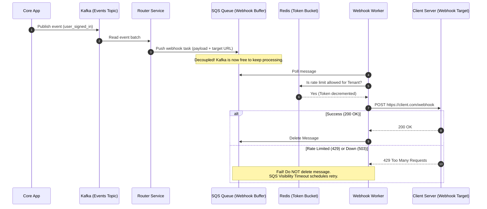

# Decoupled Webhook Dispatching: Bridging Kafka High-Throughput with SQS Rate Limiting

## 1. 💡 The "Big Picture" (Plain English)

### What is this in simple terms?
Imagine your system is a high-speed sports news desk. 
* **Kafka** is the internal news feed running at lightning speed inside your building. Journalists are shouting out updates every millisecond.
* **SQS** is a row of individual courier mailboxes, one for each external newspaper you deliver to (like Slack, Discord, or custom client servers).
* **Webhooks** are the couriers who physically run across town to deliver these newspapers to the external offices.

This design shows how to take the chaotic, ultra-fast internal stream of events (Kafka) and safely slow it down, buffer it, and deliver it via webhooks (SQS) to external servers without crashing them or blocking your own system.

```
+------------------+     +-------------------+     +-----------------+     +-------------------+
|  Internal Event  | --> | Kafka High-Speed  | --> |  Dispatcher /   | --> | SQS Buffer Queues |
|     Producer     |     |   Event Stream    |     | Router Service  |     |  (One per Tenant) |
+------------------+     +-------------------+     +-----------------+     +-------------------+
                                                                                     |
                                                                                     v
+------------------+     +-------------------+                             +-------------------+
| Third-Party API  | <-- |  Webhook Workers  | <---------------------------| Redis Rate Limit  |
|  (Slack, Teams)  |     | (Backoff/Retries) |                             |      Checker      |
+------------------+     +-------------------+                             +-------------------+
```

### Why should I care? What problem does it solve today?
If you try to trigger a webhook directly from a fast Kafka consumer, you will quickly run into a brick wall:
1. **The "Slow Client" Problem:** If Slack or a client's server is down or slow, your Kafka consumer will stall. It cannot move forward to read the next message because it is waiting for a HTTP network timeout. This is called **Head-of-Line Blocking**.
2. **The "Rate Limit" Problem:** External APIs have strict limits (e.g., Slack permits 1 request/second per channel). Kafka doesn't care about rate limits; it wants to run at 100,000 requests/second. If you blast external APIs at Kafka speed, you will get blocked, banned, or throttled with `429 Too Many Requests`.

By bridging **Kafka (for internal event ingestion)** with **SQS (for external rate-limited delivery queues)**, you get the best of both worlds: infinite internal scale, and polite, reliable external delivery.

---

## 2. 🛠️ How it Works (Step-by-Step)

### The Dispatch Flow
1. **Ingest**: Your core system publishes a `NotificationTriggered` event to **Kafka**.
2. **Route**: A lightweight **Router Service** consumes from Kafka. Its only job is to look up the recipient's webhook settings (e.g., "User X wants a webhook sent to `https://api.userx.com/webhook`").
3. **Buffer**: The Router wraps the event in a webhook envelope and drops it into an **SQS Queue**. To protect users, we use SQS message group IDs or dedicated queues to separate different target clients.
4. **Consume & Throttle**: **Webhook Workers** pull messages from SQS. Before making the HTTP call, they check a **Redis Rate Limiter** to see if the target client's quota is exhausted.
5. **Execute**: 
   * **Success (2xx)**: The worker deletes the SQS message.
   * **Failure (429/5xx)**: The worker leaves the message in SQS. SQS automatically backs off and retries it later using a **Visibility Timeout**, completely keeping your Kafka pipelines running clean and uninterrupted.

### Architectural Flow



### Webhook Worker Code (TypeScript)

Here is a clean, production-grade worker implementation using a Redis-backed token bucket to handle polite webhook delivery with SQS.

```typescript
import { SQSClient, ReceiveMessageCommand, DeleteMessageCommand, ChangeMessageVisibilityCommand } from "@aws-sdk/client-sqs";
import Redis from "ioredis";
import axios from "axios";

const sqs = new SQSClient({ region: "us-east-1" });
const redis = new Redis(process.env.REDIS_URL || "redis://localhost:6379");

const QUEUE_URL = process.env.SQS_QUEUE_URL!;
const MAX_RETRIES = 5;

interface WebhookPayload {
  tenantId: string;
  targetUrl: string;
  payload: any;
  attempt: number;
}

// Simple Redis Token Bucket Rate Limiter
async function checkRateLimit(tenantId: string, limitPerSecond: number): Promise<boolean> {
  const key = `rate:${tenantId}`;
  const now = Date.now();
  
  // Use a transaction (multi/exec) or Lua script to safely decrement tokens
  const results = await redis.multi()
    .cliptr(key, limitPerSecond, limitPerSecond, 1) // Conceptual token bucket check
    .exec();
    
  // For demonstration, simplified count check:
  const currentCount = await redis.incr(key);
  if (currentCount === 1) {
    await redis.expire(key, 1); // 1-second window
  }
  return currentCount <= limitPerSecond;
}

async function startWorker() {
  while (true) {
    const response = await sqs.send(new ReceiveMessageCommand({
      QueueUrl: QUEUE_URL,
      MaxNumberOfMessages: 1,
      WaitTimeSeconds: 20 // Long polling to save money
    }));

    if (!response.Messages || response.Messages.length === 0) continue;

    const message = response.Messages[0];
    const body: WebhookPayload = JSON.parse(message.Body!);

    // 1. Check Rate Limit for this tenant
    const isAllowed = await checkRateLimit(body.tenantId, 10); // Limit: 10 req/sec
    if (!isAllowed) {
      console.warn(`Rate limit exceeded for tenant ${body.tenantId}. Backing off...`);
      // Put message back in queue to try again in 5 seconds
      await sqs.send(new ChangeMessageVisibilityCommand({
        QueueUrl: QUEUE_URL,
        ReceiptHandle: message.ReceiptHandle!,
        VisibilityTimeout: 5
      }));
      continue;
    }

    try {
      // 2. Dispatch Webhook
      await axios.post(body.targetUrl, body.payload, {
        timeout: 4000, // Strict timeout to prevent worker lockup
        headers: { 'Content-Type': 'application/json' }
      });

      // 3. Success -> Delete message
      await sqs.send(new DeleteMessageCommand({
        QueueUrl: QUEUE_URL,
        ReceiptHandle: message.ReceiptHandle!
      }));
      console.log(`Successfully dispatched webhook to ${body.targetUrl}`);
    } catch (error: any) {
      const nextAttempt = (body.attempt || 1) + 1;
      
      if (nextAttempt > MAX_RETRIES) {
        console.error(`Max retries reached for ${body.targetUrl}. Moving to Dead Letter Queue.`);
        // SQS automatically moves to DLQ if maxReceiveCount is met on SQS configuration
      } else {
        // Calculate exponential backoff (e.g., 2^attempt * 10 seconds)
        const delay = Math.pow(2, nextAttempt) * 10;
        console.warn(`Webhook failed. Retrying attempt ${nextAttempt} in ${delay}s.`);
        
        // Update payload attempt counter
        body.attempt = nextAttempt;
        
        // Push updated message with updated backoff visibility
        await sqs.send(new ChangeMessageVisibilityCommand({
          QueueUrl: QUEUE_URL,
          ReceiptHandle: message.ReceiptHandle!,
          VisibilityTimeout: delay
        }));
      }
    }
  }
}
```

---

## 3. 🧠 The "Deep Dive" (For the Interview)

### The Technical Magic: Head-of-Line Blocking Solution
Why can’t we just process webhooks directly inside the Kafka consumer? 

**Kafka works on a strict partition-offset model.** To guarantee message order, a single partition is assigned to only one consumer thread. If that partition consumer pauses to wait for a network request to time out (e.g., 10 seconds) or sleep due to rate limits, **the entire partition stops processing**. Millions of notifications for other customers assigned to that partition are held hostage. 

By consuming from Kafka as fast as physically possible and handing the tasks to **SQS**, we decouple the stream. SQS treats every single message as an independent entity. If Message A fails or gets delayed, Message B can be processed immediately right next to it. SQS gives us **per-message visibility timeouts**, allowing fine-grained, independent retries.

### Architectural Trade-offs

| System Attribute | Kafka Alone | Kafka + SQS Bridge |
| :--- | :--- | :--- |
| **Operational Complexity** | Low (One infrastructure component) | Medium/High (Maintaining both Kafka and SQS) |
| **Delivery Ordering** | Guaranteed per-partition | Best-effort (or limited FIFO SQS scale) |
| **Fault Isolation** | Poor (One slow webhook blocks a partition) | Perfect (One slow webhook blocks only itself) |
| **Retries/Backoffs** | Hard to implement safely without stalling | Simple (Native visibility timeouts and DLQ) |
| **Cost at Scale** | Cheap (Compute/Disk bound) | High (SQS charges per API call/polling request) |

---

### Interviewer Probes: Critical System Design Questions

#### 1. "How do you protect your system if a client registers an API endpoint that systematically times out or responds with 500s?"
* **Answer**: We use SQS's native **Dead Letter Queue (DLQ)** along with a **Redrive Policy**. Each message tracking webhook attempts has a maximum retry attribute (e.g., 5). If a webhook continuously fails, SQS relocates it to the DLQ. Crucially, the worker threads never block—they set the message Visibility Timeout to back off exponentially, freeing the worker instantly to grab and deliver healthy webhooks for other tenants.

#### 2. "If SQS doesn't guarantee exact order of messages, how do we handle situations where an 'Order Updated' webhook must not arrive before an 'Order Created' webhook?"
* **Answer**: There are two patterns to solve this:
  1. **SQS FIFO (First-In-First-Out) Queues**: Use the customer's ID or `OrderId` as the `MessageGroupId`. This ensures messages within the same group are delivered in strict order. Note that SQS FIFO limits throughput to 3,000 requests/sec with batching.
  2. **Idempotency & Versioning (Preferred)**: We send a `sequence_number` or `updated_at` timestamp inside the webhook payload. The receiving system is designed to discard incoming webhooks if they contain a timestamp older than what the receiver's database has already recorded.

#### 3. "How do you secure your webhooks to prevent bad actors from spoofing notifications to your users' servers?"
* **Answer**: We compute a **cryptographic signature** for every webhook payload. Before sending, the worker hashes the raw JSON body using **HMAC-SHA256** with a shared secret key known only to us and that specific tenant. We put this hash in the header (e.g., `X-Signature-256`). When the client server receives the request, it recomputes the hash using their shared secret and compares it to our header. If they match, they know it's authentic and hasn't been tampered with.

---

## 4. ✅ Summary Cheat Sheet

### 3 Key Takeaways
1. **Never make HTTP calls inside a Kafka consumer stream.** Network I/O is slow and unpredictable. It will block the partition's offset progress and cause massive lag across your platform.
2. **Buffer with SQS for Isolation.** SQS provides message-level isolation, dynamic visibility timeouts, and native DLQs. It acts as the shock absorber for slow or rate-limited external clients.
3. **Control Rate Limits at the Worker Edge.** Use an in-memory, fast-access cache like Redis with a token-bucket algorithm to check if a client's API limits are reached before making the webhook call.

### 1 Golden Rule
> **"Fast streams (Kafka) must never touch slow networks (Webhooks) directly. Always buffer with an individual-message queue (SQS) in between."**