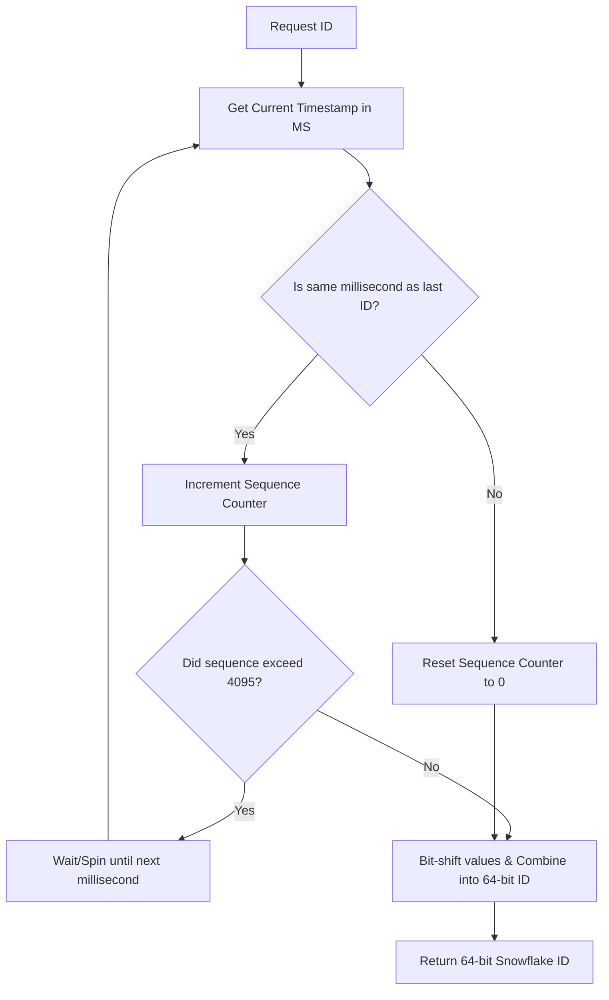

# Scalable Unique ID Generation: Designing a Distributed Snowflake Generator

---

### 1. 💡 The "Big Picture" (Plain English)

#### What is this in simple terms?
A **Snowflake ID** is a highly efficient way to generate unique, 64-bit numerical identifiers (IDs) across thousands of servers simultaneously, without them needing to talk to each other to coordinate. 

#### The Real-World Analogy
Imagine a massive global shipping company like DHL or FedEx. 
* If every warehouse in the world had to call a single headquarters in New York to ask, *"Hey, what's the next package ID I should print?"* before labeling a box, operations would grind to a halt (this is the **centralized database bottleneck**).
* Instead, headquarters gives each warehouse a unique stamp machine. 
* The stamp prints: `[Current Date & Time in Milliseconds] + [Your Unique Warehouse ID] + [The package count for this millisecond]`.

Even if Tokyo and London print a label at the exact same millisecond, the labels are guaranteed to be unique because the Warehouse IDs are different.

#### Why should I care?
In microservice architectures, you cannot rely on database auto-incrementing fields (`ID 1, 2, 3...`) because your data is spread across different databases. If you use UUIDs (Universally Unique Identifiers), they are 128-bit strings (heavy on memory) and are **not ordered**, which destroys database indexing performance. 

Snowflake IDs solve this by being:
1. **64-bit integers** (small, fast to index, half the size of a UUID).
2. **Roughly time-ordered** (making database B-Tree indexes highly performant).
3. **Decentralized** (servers can generate up to 4,096 IDs per millisecond without network lag).

---

### 2. 🛠️ How it Works (Step-by-Step)

A Snowflake ID is a 64-bit integer, structured strategically into four distinct segments:

```
 0 11111111111111111111111111111111111111111 1111111111 111111111112
 ┼ ───────────────────────────────────────── ────────── ────────────
 │                     │                          │           │
 │                     │                          │           └─ Sequence (12 bits)
 │                     │                          └─ Worker/Node ID (10 bits)
 │                     └─ Timestamp (41 bits)
 └─ Sign Bit (1 bit, always 0)
```

1. **Sign Bit (1 bit):** Unused (always `0` to ensure the generated number is positive).
2. **Timestamp (41 bits):** Represents milliseconds elapsed since a custom starting epoch (e.g., your company's launch date). 41 bits gives you $2^{41}$ milliseconds, which equals **~69.7 years** of unique IDs.
3. **Worker/Node ID (10 bits):** Allows up to $2^{10} = 1024$ independent worker nodes/servers to run simultaneously.
4. **Sequence Number (12 bits):** A counter that increments for every ID generated in the *same* millisecond. It resets to `0` every millisecond. 12 bits allow up to $2^{12} = 4096$ IDs per millisecond per node.

#### Step-by-Step Generation Flow


#### Clean Java Implementation
Here is a thread-safe, production-ready implementation of a Snowflake ID Generator:

```java
public class SnowflakeIdGenerator {

    // Bit lengths of components
    private static final long TIMESTAMP_BITS = 41L;
    private static final long WORKER_ID_BITS = 10L;
    private static final long SEQUENCE_BITS = 12L;

    // Max values using bitwise shifts
    private static final long MAX_WORKER_ID = -1L ^ (-1L << WORKER_ID_BITS); // 1023
    private static final long MAX_SEQUENCE = -1L ^ (-1L << SEQUENCE_BITS);   // 4095

    // Bit shifts
    private static final long WORKER_ID_SHIFT = SEQUENCE_BITS;
    private static final long TIMESTAMP_SHIFT = SEQUENCE_BITS + WORKER_ID_BITS;

    // Custom Epoch (January 1, 2024 00:00:00 UTC in Milliseconds)
    private static final long CUSTOM_EPOCH = 1704067200000L;

    private final long workerId;
    private long lastTimestamp = -1L;
    private long sequence = 0L;

    public SnowflakeIdGenerator(long workerId) {
        if (workerId < 0 || workerId > MAX_WORKER_ID) {
            throw new IllegalArgumentException("Worker ID must be between 0 and " + MAX_WORKER_ID);
        }
        this.workerId = workerId;
    }

    // Thread-safe ID generation
    public synchronized long nextId() {
        long timestamp = getSystemTime();

        if (timestamp < lastTimestamp) {
            throw new RuntimeException("Clock moved backwards! Rejecting requests for " 
                + (lastTimestamp - timestamp) + "ms");
        }

        if (timestamp == lastTimestamp) {
            // Same millisecond: increment sequence
            sequence = (sequence + 1) & MAX_SEQUENCE;
            if (sequence == 0) {
                // Sequence overflow: wait for the next millisecond
                timestamp = waitNextMillis(lastTimestamp);
            }
        } else {
            // New millisecond: reset sequence
            sequence = 0L;
        }

        lastTimestamp = timestamp;

        // Perform bitwise shifting to combine parts into a single 64-bit long
        return ((timestamp - CUSTOM_EPOCH) << TIMESTAMP_SHIFT) 
                | (workerId << WORKER_ID_SHIFT) 
                | sequence;
    }

    private long waitNextMillis(long lastTimestamp) {
        long timestamp = getSystemTime();
        while (timestamp <= lastTimestamp) {
            timestamp = getSystemTime();
        }
        return timestamp;
    }

    private long getSystemTime() {
        return System.currentTimeMillis();
    }
}
```

---

### 3. 🧠 The "Deep Dive" (For the Interview)

#### The Technical "Magic": Bitwise Operations
Instead of using slow string concatenation (e.g., `"timestamp" + "worker" + "seq"`), the Snowflake algorithm uses lightning-fast CPU **bitwise shift operations** (`<<`) and logical **OR** (`|`) operations. 
* The expression `(timestamp - CUSTOM_EPOCH) << TIMESTAMP_SHIFT` shifts the timestamp 22 bits to the left, leaving room for the Worker ID and Sequence bits.
* Computer processors execute bitwise operations in less than a single CPU clock cycle, which is why this algorithm is incredibly fast.

#### Trade-offs & Limitations

| Pro / Con | Detail |
| :--- | :--- |
| **Pro: Performance** | Lock-free/Atomic bitwise execution yields ~4+ million IDs per second per machine. |
| **Pro: Index Friendly**| Databases organize data using B-Trees. Because the leading bits of Snowflake IDs are timestamps, they are naturally sequential, dramatically reducing DB disk fragmentation. |
| **Con: Time Dependent**| If a server's clock drifts or is adjusted backward via NTP, duplicate IDs can be generated. |
| **Con: Coordination** | You must carefully assign the `Worker ID` (0-1023) to each instance. If two containers spin up with the same Worker ID, collisions will occur. |

---

#### Interviewer Probe Questions (How to Ace Them)

##### Probe 1: *"What happens if the system clock drifts backward (e.g., due to an NTP synchronization offset)?"*
* **The Trap:** Believing standard server time is always linear and correct. It isn't.
* **The Answer:** You must handle **clock skew**. In our code, if `timestamp < lastTimestamp`, we immediately throw a runtime exception to prevent duplicate generation. In a production environment, you can build a safety buffer: if the drift is tiny (e.g., < 5ms), the generator can sleep for `(lastTimestamp - timestamp)` ms until the physical clock catches up. If it is large, you raise an alert and route requests to healthy nodes.

##### Probe 2: *"How do you coordinate and allocate the 10-bit Worker ID in a dynamic Kubernetes environment where pods scale up and down?"*
* **The Trap:** Suggesting you hardcode IDs in environment variables (which doesn't scale and is prone to human error).
* **The Answer:** Use a centralized coordination service like **Apache ZooKeeper**, **Consul**, or **Redis**. 
  When a pod boots up:
  1. It registers itself with ZooKeeper under an ephemeral sequential node path (e.g., `/snowflake/nodes/node-000000001`).
  2. It extracts the sequence suffix (`1`) and uses it as its `Worker ID` modulo 1024.
  3. When the pod dies, ZooKeeper automatically cleans up the ephemeral node, freeing the ID for future pods.

##### Probe 3: *"Why did we use a custom epoch instead of the standard Unix Epoch (Jan 1, 1970)?"*
* **The Trap:** Not understanding bit budget.
* **The Answer:** 41 bits of milliseconds can only store ~69.7 years of elapsed time. If we used the standard Unix epoch, our ID generator would stop working around the year **2039**. By using a custom epoch starting today (e.g., 2024), we extend the system's lifespan for another 69.7 years (until 2093).

---

### 4. ✅ Summary Cheat Sheet

```
                   SNOWFLAKE ID SCHEMA (64 BITS)
 ┌───────────┬──────────────────────────────┬──────────────┬─────────────┐
 │  1 Bit    │           41 Bits            │   10 Bits    │   12 Bits   │
 ├───────────┼──────────────────────────────┼──────────────┼─────────────┤
 │ Sign Bit  │   Timestamp (Custom Epoch)   │  Worker ID   │  Sequence   │
 │ (Unused)  │   69 Years of Lifespan       │  1024 Nodes  │ 4096 / ms   │
 └───────────┴──────────────────────────────┴──────────────┴─────────────┘
```

#### 3 Key Takeaways
1. **Zero Coordination:** Nodes generate globally unique, 64-bit numbers without talking to each other, avoiding single points of failure.
2. **Naturally Ordered:** High-order bits represent timestamps, keeping database indexes highly performant (B-Tree friendly).
3. **No String Overload:** Smaller than a UUID (8 bytes vs 16 bytes), saving significant storage, network bandwidth, and memory.

#### 1 "Golden Rule" to Remember
> **"Snowflake ID generation relies entirely on the linear movement of time; if your system clock goes backward, your uniqueness guarantees go out the window."**