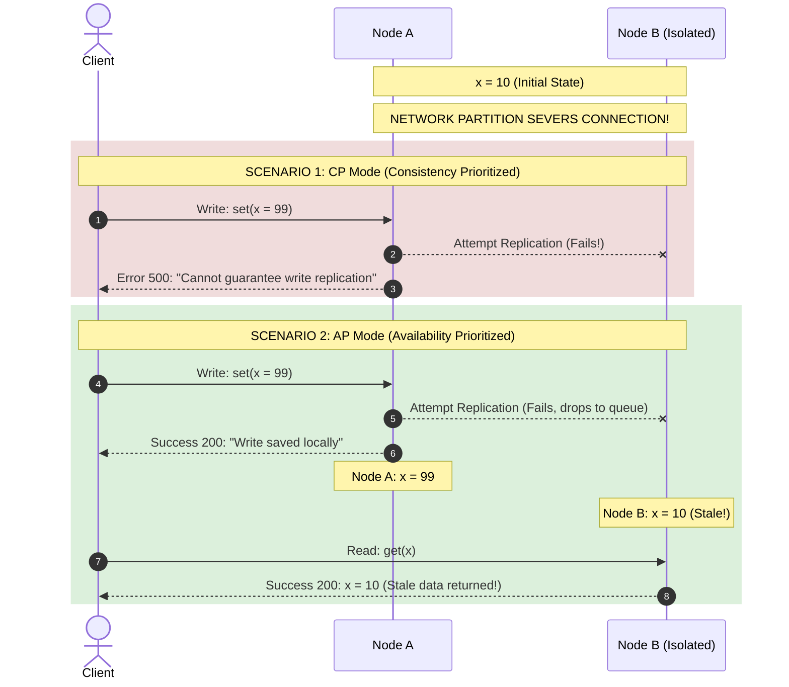

# The CAP Theorem: Demystifying CP vs. AP Systems During Network Partitions

---

## 1. 💡 The "Big Picture" (Plain English)

### What is this in simple terms?
At its core, the **CAP Theorem** is a law of physics for distributed systems. It states that any distributed data store can simultaneously provide at most two of the following three guarantees:
*   **C**onsistency: Every read receives the most recent write or an error.
*   **A**vailability: Every non-failing node returns a non-error response (without guaranteeing it contains the most recent write).
*   **P**artition Tolerance: The system continues to operate despite an arbitrary number of messages being dropped or delayed by the network between nodes.

Because physical networks will inevitably drop or delay messages (meaning **Partition Tolerance (P)** is a non-negotiable reality of life), the theorem forces a binary choice when a network split occurs: **Choose Consistency (CP) or choose Availability (AP).**

---

### The Real-World Analogy: The Split-Screen Pizza Shop
Imagine a popular local pizza shop that takes phone orders. To handle high volume, they have two order-takers, **Alice** and **Bob**, sitting in different rooms. They each have a notepad to write down order details. 

Normally, whenever Alice takes an order for the last slice of Pepperoni, she shouts across the hall to Bob: *"Hey, Pepperoni is sold out!"* Bob marks his notepad. They are perfectly synchronized.

One day, a thick, soundproof fire door accidentally slams shut between their rooms. They can no longer communicate (this is a **Network Partition**). 

A customer calls Bob asking: *"Can I buy the last slice of Pepperoni?"*

```
                     ┌──────────────────┐
                     │     CUSTOMER     │
                     └────────┬─────────┘
                              │ "Can I buy the last slice?"
                              ▼
                ┌────────────────────────────┐
                │ Bob's Room (Isolated Node) │
                ├────────────────────────────┤
                │  [?] Bob doesn't know if   │
                │  Alice sold it 10s ago.    │
                └─────────────┬──────────────┘
                              │
                    ┌─────────┴─────────┐
                    │                   │
                    ▼                   ▼
           [Option 1: CP System]   [Option 2: AP System]
           "I cannot take your     "Sure, you got it!"
           order right now."       (Risk of double booking)
```

*   **The CP Choice (Consistency):** Bob says, *"I'm sorry, our internal system is down. I cannot take your order right now."* Bob chooses to deny service (sacrificing **Availability**) to ensure he never sells a pizza that Alice might have already sold (preserving **Consistency**).
*   **The AP Choice (Availability):** Bob says, *"Yes, absolutely! Let me write that down."* Bob keeps the business moving (preserving **Availability**), but risks selling the same slice Alice just sold to someone else (sacrificing **Consistency**).

---

### Why should I care today?
Every time you architect a system using cloud databases (like DynamoDB, Cassandra, MongoDB, or PostgreSQL RDS), you must make this choice. 
*   If you are building a **banking ledger**, choosing AP could mean letting a user withdraw the same $100 twice from two different ATMs during a network glitch. You *must* choose **CP**.
*   If you are building a **social media feed** or **retail cart**, choosing CP means your app crashes or throws errors when a minor AWS network hiccup occurs. You're better off choosing **AP**, letting users post comments or add items, and resolving any minor conflicts later.

---

## 2. 🛠️ How it Works (Step-by-Step)

Let's look at exactly what happens when a client interacts with a distributed 2-node database cluster (`Node_A` and `Node_B`) when the network link between them is severed.

### Step-by-Step Execution Flow
1.  **The Partition Occurs:** The physical fiber optic link between `Node_A` and `Node_B` breaks. They can no longer exchange heartbeats or replicate data.
2.  **The Write Request:** A client sends a write request `Set(X = 99)` to `Node_A`.
3.  **The Fork in the Road:**
    *   **In a CP Database:** `Node_A` realizes it cannot safely replicate this write to `Node_B` (the majority quorum is broken, or it cannot guarantee consistency). It rejects the write and returns an error (`500 Internal Server Error`).
    *   **In an AP Database:** `Node_A` accepts the write locally, updates its memory to `X = 99`, and returns `200 OK` to the client. Meanwhile, `Node_B` still holds the old value `X = 10`.
4.  **The Stale Read:** Another client queries `Node_B` for `X`.
    *   **In a CP Database:** The client receives an error or hangs, because `Node_B` knows it is out of touch with the cluster.
    *   **In an AP Database:** `Node_B` returns `X = 10` instantly. The client successfully gets a response, but the data is stale (inconsistent).

---

### Sequence Flow of CP vs. AP under Partition



---

### Code Implementation: Simulating CP vs AP Modes
Below is a clean Python simulation showing how a mock distributed node handles writes under a network partition depending on its configured strategy.

```python
class DistributedNode:
    def __init__(self, node_id: str, mode: str = "CP"):
        self.node_id = node_id
        self.mode = mode  # Either "CP" or "AP"
        self.data = {}
        self.peers = []
        self.network_partition_active = False

    def add_peer(self, peer_node: 'DistributedNode'):
        self.peers.append(peer_node)

    def write(self, key: str, value: str) -> bool:
        """
        Attempts to write a key-value pair to this node and replicate it to peers.
        """
        if not self.network_partition_active:
            # Normal operation: Write locally and replicate to all peers
            self.data[key] = value
            for peer in self.peers:
                peer.data[key] = value
            return True
        
        # Partition is active!
        if self.mode == "CP":
            # CP Mode: We must safely replicate to ALL peers to confirm write.
            # Since network is split, replication fails. We abort and reject the write.
            print(f"[CP Node {self.node_id}] Write Rejected: Cannot reach peers for safe replication.")
            return False
        
        elif self.mode == "AP":
            # AP Mode: Accept the write locally and return success. 
            # We sacrifice consistency (peers will remain out-of-sync for now).
            print(f"[AP Node {self.node_id}] Write Accepted locally. Out-of-sync hazard active!")
            self.data[key] = value
            return True

    def read(self, key: str) -> str:
        """Returns the local value of the key."""
        return self.data.get(key, "Key Not Found")

# --- EXECUTE SIMULATION ---

# Initialize nodes
node_a = DistributedNode(node_id="A", mode="CP")
node_b = DistributedNode(node_id="B", mode="CP")
node_a.add_peer(node_b)
node_b.add_peer(node_a)

# 1. Normal state: Write succeeds across both nodes
node_a.write("balance", "$100")
print(f"Healthy state - Node A: {node_a.read('balance')}, Node B: {node_b.read('balance')}\n")

# 2. Simulate Network Partition
node_a.network_partition_active = True
node_b.network_partition_active = True

# 3. Test CP Behavior (Consistent but Unavailable under partition)
print("--- SCENARIO 1: Testing CP Mode ---")
node_a.mode = "CP"
success_cp = node_a.write("balance", "$200")
print(f"CP Write Status: {'Success' if success_cp else 'Failed'}")
print(f"CP Balances - Node A: {node_a.read('balance')}, Node B: {node_b.read('balance')}\n")

# 4. Test AP Behavior (Available but Inconsistent under partition)
print("--- SCENARIO 2: Testing AP Mode ---")
node_a.mode = "AP"
success_ap = node_a.write("balance", "$300")
print(f"AP Write Status: {'Success' if success_ap else 'Failed'}")
print(f"AP Balances - Node A: {node_a.read('balance')} (New Value), Node B: {node_b.read('balance')} (STALE Value)")
```

---

## 3. 🧠 The "Deep Dive" (For the Interview)

To pass a senior engineering interview, you must go beyond the classic Venn diagram. You need to talk about **consensus mechanics, metadata overhead, and structural trade-offs.**

### The Technical "Magic" Internals

#### How CP Systems Work Under the Hood
CP databases (e.g., **Etcd, Consul, CockroachDB**) prioritize strict data accuracy (linearizability) using **consensus algorithms** like **Raft** or **Paxos**. 
*   **Quorum Math:** To accept a write, a leader node must successfully replicate the write to a majority quorum of nodes: 
    $$\text{Quorum} = \left\lfloor \frac{N}{2} \right\rfloor + 1$$
    Where $N$ is the total number of nodes in the cluster.
*   **The Split Brain Protection:** If a 5-node cluster splits into two partitions of sizes $\{3\}$ and $\{2\}$, the $\{2\}$-node side cannot form a quorum ($2 < 3$). It immediately stops accepting writes. Only the $\{3\}$-node side remains operational. This mathematical guarantee prevents two different clients from writing conflicting data on different sides of the network split.

#### How AP Systems Work Under the Hood
AP databases (e.g., **Apache Cassandra, DynamoDB**) choose to accept writes on any available node. This requires sophisticated conflict-resolution strategies when the network partition heals:
*   **Gossip Protocols:** Nodes constantly exchange small, lightweight metadata packets to map the cluster’s state in an ad-hoc, peer-to-peer fashion.
*   **CRDTs (Conflict-free Replicated Data Types):** Data structures mathematically designed to merge concurrent updates without coordination (e.g., grow-only counters or multi-value registers).
*   **Vector Clocks:** Logical clocks attached to every write that trace causality. If Node A and Node B receive divergent writes during a partition, vector clocks help determine which write causally happened first, or if they represent a conflict that must be bubbled up to the client application to resolve.

---

### The Real Trade-offs: A Side-by-Side Comparison

| Architectural Dimension | CP (Consistency + Partition Tolerance) | AP (Availability + Partition Tolerance) |
| :--- | :--- | :--- |
| **Write Latency** | **High.** Must wait for network roundtrips to achieve consensus quorum across nodes. | **Extremely Low.** Writes return immediately once saved to local node's memory/disk commit log. |
| **Throughput** | Bottlenecked by network speed and quorum negotiation limits. | Highly scalable; scales linearly with the number of nodes added. |
| **Conflict Handling** | **None.** Conflict prevention is built into the protocol; concurrent conflicts are rejected upfront. | **Complex.** System must handle reconciliation later via techniques like Last-Write-Wins (LWW) or custom merge scripts. |
| **Typical Databases** | ZooKeeper, Etcd, CockroachDB, Spanner. | Cassandra, DynamoDB, CouchDB. |

---

### Interviewer Probe Questions (How to Ace Them)

#### Probe 1: "Is there actually such a thing as a 'CA' system?"
*   **The Trap:** Candidates often list traditional relational databases (like MySQL or Oracle) as "CA" systems.
*   **The Answer:** "Practically speaking, **no**. In a single physical server environment, you could argue you have Consistency and Availability, but because there are no networks involved, there is no 'P' (Partition) to tolerate. Once you distribute your system across multiple physical machines, network partitions are an inevitable physical reality (due to fiber cuts, switch crashes, or GC pauses). Therefore, you *must* choose between C and A when a partition happens. You cannot choose 'CA' on a distributed network."

#### Probe 2: "What is PACELC, and how does it extend the CAP Theorem?"
*   **The Answer:** "CAP only describes system behavior **during** a network partition. **PACELC** expands on this by explaining what happens during normal, healthy operations:
    *   **P**artition $\rightarrow$ Choose **A**vailability or **C**onsistency.
    *   **E**lse (Normal State) $\rightarrow$ Choose **L**atency or **C**onsistency.
    
    Even when the network is perfectly healthy, a system cannot have instant updates everywhere without paying a latency penalty. For example, MongoDB chooses Consistency during partitions (CP) and Consistency during normal operations (PC/EC). Cassandra chooses Availability during partitions (AP) and Latency during normal operations (PA/EL)."

#### Probe 3: "If you configure Cassandra (AP) to read and write with `QUORUM` consistency, does it mathematically become a CP system?"
*   **The Answer:** "No, it does not. While setting write-level to `QUORUM` and read-level to `QUORUM` ensures **strong consistency** ($R + W > N$) under normal operations, Cassandra still lacks the fundamental design mechanics of a CP system:
    1.  It does not have a transactional, centralized state machine (like Raft/Paxos log replication) to prevent linearizability anomalies.
    2.  Under a network partition that isolates a minority node, Cassandra may still accept local writes or allow stale reads depending on client driver fallback policies and hint-offloading. It does not freeze or reject transactions globally to guarantee a single linear history."

---

## 4. ✅ Summary Cheat Sheet

### 3 Key Takeaways
1.  **Network Partitions are Inevitable:** You cannot opt out of Partition Tolerance (P) in the cloud. Physical hardware, routers, and switches will eventually fail.
2.  **CP means Safety First:** If nodes cannot talk, a CP system shuts down writes and reads on isolated partitions to ensure no one reads wrong, outdated, or conflicting data.
3.  **AP means Business First:** If nodes cannot talk, an AP system keeps taking writes and reads locally, choosing to deal with the headache of fixing corrupt/out-of-sync data later.

---

### 💡 The Golden Rule
> **"During a network partition, you must choose: either return an error (CP) or return stale data (AP). You cannot do both."**