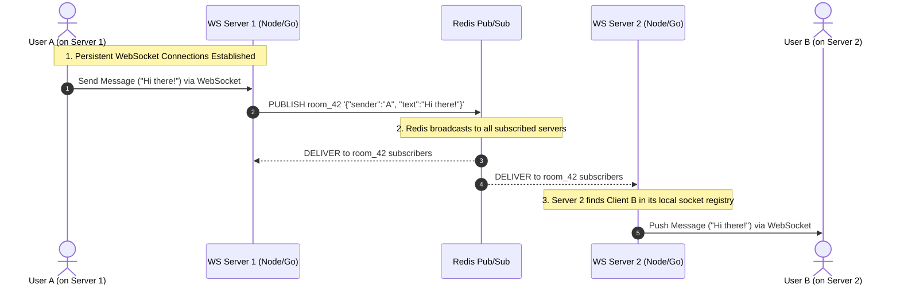

# Designing a Resilient Real-Time Chat System: WebSocket Orchestration and Pub/Sub Routing

## 1. 💡 The "Big Picture" (Plain English)

### What is this in simple terms?
Imagine a real-time chat system as a massive, global postal service operating across several multi-story apartment buildings. 

If you want to receive mail instantly, waiting by your mailbox every 5 minutes (which is **HTTP Polling**) is exhausting and slow. Instead, you install an open, two-way intercom system directly from your apartment to your building's lobby desk. This open intercom is a **WebSocket**. 

But what if you want to talk to someone in a *different* apartment building across town? Your building's lobby desk needs a way to instantly forward your message to the other building's lobby. This underground, super-fast connection between building lobbies is **Redis Pub/Sub**.

Together, WebSockets and Redis Pub/Sub allow millions of users to talk to each other instantly, no matter which server they are connected to, without melting your databases.

```
[ User A ] <====== (WebSocket) ======> [ WS Server 1 ]
                                             ║
                                      (Redis Pub/Sub)
                                             ║
[ User B ] <====== (WebSocket) ======> [ WS Server 2 ]
```

### Why should I care?
Standard web requests (HTTP) are **pull-based**: the client must ask, and the server answers. But chat, live sports tickers, and collaborative docs need **push-based** delivery: the server must send data to the client the millisecond it happens. 

If you try to build a real-time chat app by having 10,000 users ask your database *"Any new messages?"* every second, your database will crash, your cloud bills will skyrocket, and your app will feel laggy. This architecture solves that by maintaining persistent, lightweight connections and routing messages in-memory.

---

## 2. 🛠️ How it Works (Step-by-Step)

### The Step-by-Step Flow
1. **The Handshake:** The client sends an HTTP request upgrading the protocol to `ws://` (WebSocket). The server accepts, establishing a persistent TCP connection.
2. **The Session Registry:** The server registers this active connection in its local memory (an in-memory Map of user IDs to socket objects).
3. **The Redis Subscription:** The server subscribes to a specific Redis channel (e.g., `room_42`) associated with the chat room the user just joined.
4. **Publishing a Message:** When User A sends a message, it travels down their WebSocket to Server 1.
5. **The Broadcast:** Server 1 publishes the message to the Redis channel `room_42`. 
6. **The Fan-out:** Redis instantly forwards this message to *all* server instances subscribed to `room_42`.
7. **The Delivery:** Each server receives the message from Redis, looks up the connected users for that room in its local memory, and pushes the message down those active WebSockets.

### The Architecture Flow



### The Code: WebSocket Server with Redis Pub/Sub (Node.js)

Here is a clean, production-ready pattern illustrating how a WebSocket server handles connection state and integrates with Redis:

```javascript
const WebSocket = require('ws');
const Redis = require('ioredis');

// Initialize Redis clients (We need separate clients for Publishing and Subscribing)
const pubClient = new Redis();
const subClient = new Redis();

const wss = new WebSocket.Server({ port: 8080 });

// Local registry: Maps userId -> Active WebSocket connection
const activeConnections = new Map();

// 1. Subscribe to a global chat channel on startup
subClient.subscribe('global_chat', (err, count) => {
    if (err) console.error("Failed to subscribe to Redis:", err);
    console.log(`Subscribed to ${count} Redis channel(s).`);
});

// 2. Handle incoming messages from Redis (Fan-out)
subClient.on('message', (channel, message) => {
    const parsedData = JSON.parse(message);
    const { recipientId, payload } = parsedData;

    // Check if the recipient is connected to THIS specific server instance
    const targetSocket = activeConnections.get(recipientId);
    if (targetSocket && targetSocket.readyState === WebSocket.OPEN) {
        targetSocket.send(JSON.stringify(payload));
    }
});

// 3. Handle incoming WebSocket connections from clients
wss.on('connection', (ws, req) => {
    // Extract userId from query parameters (e.g., ws://localhost:8080?userId=123)
    const urlParams = new URLSearchParams(req.url.split('?')[1]);
    const userId = urlParams.get('userId');

    if (!userId) {
        ws.close(1008, "User ID required");
        return;
    }

    // Register connection locally
    activeConnections.set(userId, ws);
    console.log(`User ${userId} connected to this server instance.`);

    // Handle messages sent from the client
    ws.on('message', async (data) => {
        try {
            const parsed = JSON.parse(data);
            const { targetUserId, text } = parsed;

            const outgoingMessage = {
                recipientId: targetUserId,
                payload: { senderId: userId, text, timestamp: Date.now() }
            };

            // Publish message to Redis so ANY server instance hosting targetUserId can deliver it
            await pubClient.publish('global_chat', JSON.stringify(outgoingMessage));
        } catch (err) {
            ws.send(JSON.stringify({ error: "Invalid message format" }));
        }
    });

    // Clean up on disconnect
    ws.on('close', () => {
        activeConnections.delete(userId);
        console.log(`User ${userId} disconnected.`);
    });
});

console.log("WebSocket server running on port 8080");
```

---

## 3. 🧠 The "Deep Dive" (For the Interview)

### The Technical Magic: Under the Hood

#### 1. Connection State & RAM Overhead
WebSockets are **stateful**. HTTP is stateless. 
When a user connects via WebSocket, a TCP socket remains open. 
* **Operating System Level:** Each socket requires a File Descriptor (FD). In Linux, the default limit is often 1024, which must be tuned in `/etc/security/limits.conf` (e.g., setting `nofile` to `1,000,000`).
* **Memory Level:** Each active connection consumes memory (roughly 10KB to 50KB for the buffer and connection state depending on the language runtime). Scaling to 1,000,000 concurrent connections requires at least 10GB to 50GB of RAM purely for connection maintenance, regardless of application logic.

#### 2. Why Redis Pub/Sub Alone is "Dangerous" (The Durability Gap)
Redis Pub/Sub is **at-most-once** delivery. It is a "fire-and-forget" mechanism. If Server 2 disconnected from Redis for 3 seconds due to a network hiccup, any messages published during those 3 seconds are **permanently lost** for Server 2's clients.

To make this production-grade, we use a hybrid architecture:
1. **Write Path:** When a message arrives, save it to a persistent datastore (e.g., PostgreSQL, Cassandra, or MongoDB) *and* publish it to Redis.
2. **Sequence Numbers / ID Generation:** Generate a unique, incremental ID (snowflake or database-backed sequence) for every message.
3. **Reconnection Synchronization:** When a client reconnects after a disconnect, they send their `last_received_message_id`. The application queries the persistent database for any messages with `id > last_received_message_id` and "backfills" the client before piping live Redis Pub/Sub messages.

---

### Trade-offs: Choosing Your Infrastructure

| Architecture | Pros | Cons | Best Used For |
| :--- | :--- | :--- | :--- |
| **Redis Pub/Sub** | Ultra-low latency (sub-millisecond), extremely light on CPU/Memory. | No persistence. Messages are lost if subscriber is down. | Real-time chat dispatch, live cursors, ephemeral notifications. |
| **Redis Streams** | Persistent history, consumer groups, offsets, message acknowledgment. | Higher memory usage on Redis node; more complex client logic. | Financial tickers, reliable chat history sync, job queues. |
| **Apache Kafka** | Extreme throughput, durable log-retention, high partition toleration. | Heavy operation overhead, higher latency (not optimized for <10ms dispatch). | Analytics pipelines, audit logs, system-wide event sourcing. |

---

### Interviewer Probes (Tricky Questions & Killer Answers)

#### Probe 1: "How do you handle Load Balancing for stateful WebSockets? Can we use standard Round-Robin DNS?"
* **Why they ask this:** They want to see if you understand that WebSockets break stateless load-balancing rules.
* **Killer Answer:** 
  > "No, pure Round-Robin DNS isn't enough because WebSockets require a persistent, long-lived connection. If we need to deploy a new version of our server, we can't simply kill the instances, or we will drop millions of connections at once, causing a connection stampede (thundering herd problem).
  > 
  > Instead, we use a layer 7 load balancer (like NGINX or AWS ALB) configured with **Session Affinity (sticky sessions)** for the initial handshake, or we use a **consistent hashing** ring on the client routing layer. 
  > To deploy updates safely, we implement **graceful degradation**: we slowly disconnect clients in batches of 1-5% per minute, forcing them to reconnect to the new instances gradually without overloading our authentication and database layers."

#### Probe 2: "What happens to your Redis memory if 100,000 users join a single broadcast room?"
* **Why they ask this:** To test your understanding of Redis Pub/Sub memory footprints.
* **Killer Answer:**
  > "Actually, Redis Pub/Sub does not store messages in memory. Unlike Redis Lists or Sorted Sets, Pub/Sub allocates zero memory to hold messages; it pushes them immediately down the TCP sockets of the active subscribers. 
  > 
  > However, the bottleneck shifts to **Network I/O** and **CPU context-switching**. If 100,000 servers are subscribed to a channel, and we publish a 1KB message, Redis must copy that payload 100,000 times, generating 100MB of egress traffic for a single message. 
  > To solve this at scale, we transition from global channels to **Sharded Pub/Sub** (introduced in Redis 7.0), which hashes channel names to slot-owners in a Redis cluster, reducing cross-node replication traffic."

#### Probe 3: "How do you handle dead connections? What if a client goes into a subway tunnel?"
* **Why they ask this:** To verify your understanding of TCP half-open states.
* **Killer Answer:**
  > "A client entering a tunnel creates a 'half-open' connection. The OS thinks the TCP connection is active, but the client is physically gone. This leaks file descriptors and wastes memory.
  > 
  > To prevent this, we implement **Heartbeats (Ping/Pong)** at the application level. Every 30 seconds, the server sends a `PING` frame to the client. The client must respond with a `PONG` frame within a set window (e.g., 10 seconds). If the server doesn't receive the `PONG`, it explicitly calls `socket.terminate()` and frees up the memory and File Descriptor resources immediately."

---

## 4. ✅ Summary Cheat Sheet

### 3 Key Takeaways
1. **WebSockets bypass HTTP overhead:** By upgrading from HTTP to TCP (`ws://`), you open a continuous, bidirectional, low-latency pathway ideal for real-time operations.
2. **Redis Pub/Sub bridges stateless servers:** Because WebSockets are tied to a single physical server, Redis acts as the cross-server nervous system, allowing Server A to talk to Server B instantaneously.
3. **Always separate transport from state:** Redis Pub/Sub is built for speed, not reliability. Always back it up with a durable database (Postgres, Cassandra) to handle offline delivery and connection drops.

### 1 Golden Rule
> **"Design the WebSocket layer as an un-opinionated, stateless delivery pipe. Let the database handle state, and let Redis handle routing; your WebSockets will then scale infinitely."**