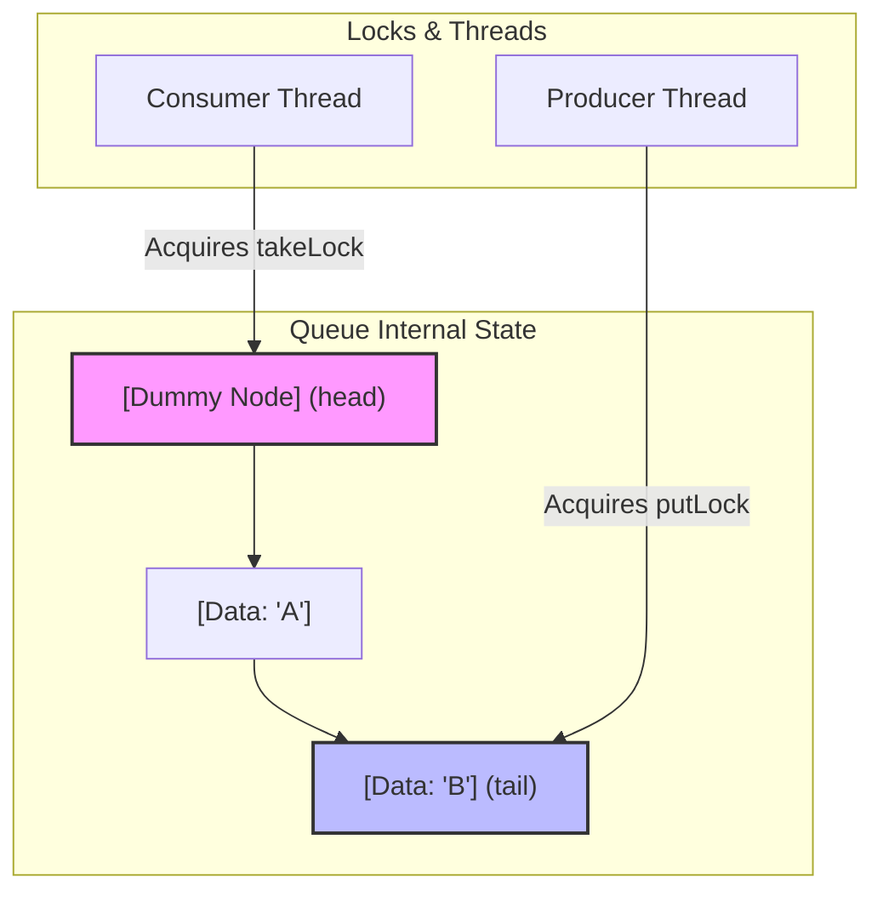

# The Two-Lock Queue: Customizing High-Throughput Bounded Queues

## 1. 💡 The "Big Picture" (Plain English)

### What is this in simple terms?
Imagine a popular bakery. If the bakery has only **one key** to access both the baking oven (where bread is put in) and the display counter (where customers take bread out), only one person can do anything at a time. If the baker is loading dough, the cashier must wait. If the cashier is serving a customer, the baker stands idle. 

A **Two-Lock Queue** solves this by splitting the keys. The baker gets an **Enqueue Lock** for the back door (the tail of the queue), and the cashier gets a **Dequeue Lock** for the front counter (the head of the queue). Now, bread can be baked and sold at the exact same time without anyone bumping into each other.

```
       [Enqueuer] ---> (Tail Lock) ---> [Tail Node]
                                             │
                                        (Linked Nodes)
                                             │
       [Dequeuer] <--- (Head Lock) <--- [Head Node]
```

### Why should I care?
In high-throughput, multi-threaded applications (like loggers, task schedulers, or message brokers), threads are constantly pushing and pulling data. 
* If you use a single-lock queue (like a synchronized `ArrayList` or a naive custom queue), your threads will fight for a single lock, causing a massive performance bottleneck.
* By implementing a custom **Two-Lock Queue** (the mechanism behind Java's `LinkedBlockingQueue`), you double your potential concurrency by allowing a producer and a consumer to access the queue simultaneously.

---

## 2. 🛠️ How it Works (Step-by-Step)

To make a two-lock queue work safely, we use a clever data structure trick: **The Dummy Node**. 

1. **Initialization**: We create a sentinel (dummy) node. Both the `head` and `tail` pointers point to this dummy node.
2. **Enqueue (Write)**:
   - Acquire the `putLock`.
   - Create a new node and link it to the current `tail.next`.
   - Move the `tail` pointer to the new node.
   - Release the `putLock`.
3. **Dequeue (Read)**:
   - Acquire the `takeLock`.
   - Read the data from the node *after* the dummy head (`head.next`).
   - Move the `head` pointer to this next node (which becomes the new dummy node).
   - Release the `takeLock`.

### Code Implementation

Here is a clean, production-grade custom implementation of a bounded Two-Lock Queue in Java.

```java
import java.util.concurrent.atomic.AtomicInteger;
import java.util.concurrent.locks.Condition;
import java.util.concurrent.locks.ReentrantLock;

public class CustomTwoLockQueue<E> {

    // Node definition
    private static class Node<E> {
        E item;
        Node<E> next;

        Node(E x) { this.item = x; }
    }

    private final int capacity;
    
    // Thread-safe size tracker bridging both locks
    private final AtomicInteger count = new AtomicInteger(0);

    // Head of the queue (always points to a dummy node)
    private transient Node<E> head;
    // Tail of the queue (points to the last node)
    private transient Node<E> tail;

    // Lock for enqueuing (writing)
    private final ReentrantLock putLock = new ReentrantLock();
    private final Condition notFull = putLock.newCondition();

    // Lock for dequeuing (reading)
    private final ReentrantLock takeLock = new ReentrantLock();
    private final Condition notEmpty = takeLock.newCondition();

    public CustomTwoLockQueue(int capacity) {
        if (capacity <= 0) throw new IllegalArgumentException();
        this.capacity = capacity;
        
        // Initialize with a dummy node to isolate head and tail operations
        Node<E> dummy = new Node<>(null);
        this.head = dummy;
        this.tail = dummy;
    }

    /**
     * Enqueues an element. Blocks if the queue is full.
     */
    public void put(E x) throws InterruptedException {
        if (x == null) throw new NullPointerException();
        
        int c = -1;
        Node<E> node = new Node<>(x);
        final ReentrantLock putLock = this.putLock;
        final AtomicInteger count = this.count;

        putLock.lockInterruptibly();
        try {
            // Wait while queue is full
            while (count.get() == capacity) {
                notFull.await();
            }
            
            // Append node to the tail
            tail.next = node;
            tail = node;
            
            // Increment count and get the PREVIOUS value
            c = count.getAndIncrement();
            
            // If there's still room, signal other waiting producers
            if (c + 1 < capacity) {
                notFull.signal();
            }
        } finally {
            putLock.unlock();
        }

        // If the queue was empty before, signal waiting consumers
        if (c == 0) {
            signalNotEmpty();
        }
    }

    /**
     * Dequeues an element. Blocks if the queue is empty.
     */
    public E take() throws InterruptedException {
        E x;
        int c = -1;
        final ReentrantLock takeLock = this.takeLock;
        final AtomicInteger count = this.count;

        takeLock.lockInterruptibly();
        try {
            // Wait while queue is empty
            while (count.get() == 0) {
                notEmpty.await();
            }

            // Extract the element from the first active node (head.next)
            Node<E> first = head.next;
            x = first.item;
            first.item = null; // Clear reference to help Garbage Collection
            head = first;      // The first node now becomes the new dummy head

            c = count.getAndDecrement();

            // If there are more elements, signal other waiting consumers
            if (c > 1) {
                notEmpty.signal();
            }
        } finally {
            takeLock.unlock();
        }

        // If the queue was full before, signal waiting producers
        if (c == capacity) {
            signalNotFull();
        }
        return x;
    }

    private void signalNotEmpty() {
        final ReentrantLock takeLock = this.takeLock;
        takeLock.lock();
        try {
            notEmpty.signal();
        } finally {
            takeLock.unlock();
        }
    }

    private void signalNotFull() {
        final ReentrantLock putLock = this.putLock;
        putLock.lock();
        try {
            notFull.signal();
        } finally {
            putLock.unlock();
        }
    }
}
```

### Visualizing the Dummy Node Separation



---

## 3. 🧠 The "Deep Dive" (For the Interview)

### The Technical Magic: Why is the Dummy Node Mandatory?
If you try to implement a Two-Lock Queue without a dummy node, you will run into a **lock-collision race condition** when the queue contains only 1 element (or is empty). 

Without a dummy node, the `head` and `tail` pointers point to the exact same node. If a producer wants to add an item and a consumer wants to remove an item simultaneously:
1. The producer needs to modify `tail.next`.
2. The consumer needs to modify `head.next` and nullify `head`.
3. Because `head == tail`, they are modifying the exact same object. 

To prevent data corruption, you would have to acquire **both** locks for single-element operations. This defeats the entire purpose of lock-splitting. 

By introducing a permanent **Dummy Node**:
* The `head` always points to the dummy node.
* The `tail` points to the last actual data node.
* When the queue is empty, `head == tail == dummy`.
* When a producer writes, it modifies `tail.next` (which is `dummy.next`). It only needs the `putLock`.
* When a consumer reads, it checks if `dummy.next` is null. It only needs the `takeLock`.
* **Result**: Complete isolation. No concurrency conflicts at size 0 or 1!

### Memory and CPU Trade-offs
* **Memory**: Slightly higher footprint. We allocate an extra `Node` object that holds no data (the dummy), and we use an `AtomicInteger` to track size.
* **CPU (Lock Contention)**: Dramatically reduced CPU context-switching under heavy load. Instead of $N$ threads fighting over 1 lock, they split into two queues of size $N/2$ fighting over distinct locks.
* **Performance Trap**: If your queue is mostly idle, a single-lock queue is actually faster because it avoids the overhead of managing two distinct locks and executing volatile atomic writes.

---

### Interviewer Probes: Tricky Questions

#### Q1: "In your code, why do you check `if (c == 0) signalNotEmpty()` outside the putLock block, using a nested lock block?"
**Answer:** 
"This is a performance optimization called **cascaded signaling**. 
If we signaled the consumer thread while holding the `putLock`, the consumer thread would wake up and immediately try to acquire the `takeLock`. This is perfectly fine. 
However, by checking `c == 0` (which tells us the queue just transitioned from empty to non-empty), we know we must wake up a sleeping consumer. To do this safely, we must acquire the `takeLock` to signal the `notEmpty` condition. We do this *outside* the `putLock` block to avoid holding both locks simultaneously, which could cause deadlock risks and unnecessary lock contention."

#### Q2: "Why can't we use a simple `volatile int count` instead of an `AtomicInteger` to track the size?"
**Answer:**
"A `volatile` variable only guarantees visibility; it does not guarantee atomicity for compound operations like incrementing (`count++` is actually a read-modify-write operation). 
Because `put()` (which increments) and `take()` (which decrements) run concurrently on completely different locks, a raw `volatile int` would suffer from **lost updates** (race conditions), corrupting the queue's size tracking. We must use `AtomicInteger.getAndIncrement()` which uses CPU-level CAS (Compare-And-Swap) instructions to guarantee thread-safe modifications without requiring us to acquire both locks."

---

## 4. ✅ Summary Cheat Sheet

### 3 Key Takeaways
1. **Lock Splitting**: Splitting a collection's locks into read-locks and write-locks (or head and tail locks) dramatically improves multi-threaded throughput.
2. **The Dummy Node Trick**: A sentinel/dummy node is essential in linked-list queues to decouple the `head` and `tail` references, preventing locks from overlapping when the queue is nearly empty.
3. **Atomic Bridging**: When state variables (like `size`) must be accessed by two independent locks, they must be managed using lock-free atomic structures (like `AtomicInteger`).

### 1 Golden Rule
> *To scale a data structure for concurrent performance, isolate the write-paths from the read-paths using distinct locks, and decouple their physical memory references with sentinel nodes.*