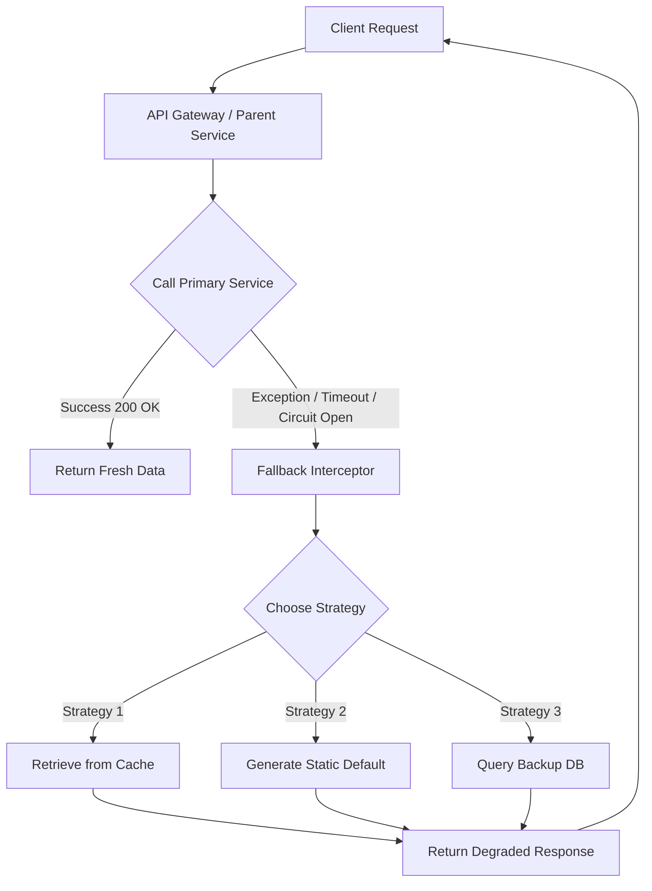

# Graceful Degradation: Designing Resilient Fallback Paths

## 1. 💡 The "Big Picture" (Plain English)

### What is this in simple terms?
When you build a distributed system, things *will* break. A microservice will crash, a database will lock up, or a third-party API will time out. 

Instead of letting a single failure crash your entire application or showing your users an ugly "500 Internal Server Error" page, **Graceful Degradation** is the art of triggering a "Plan B." You accept that you cannot deliver the perfect, 100% complete response, so you deliberately deliver a "good enough" alternative.

### A Real-World Analogy
Imagine you walk into a high-end restaurant. 
* **The Perfect Path:** You order a wood-fired truffle pizza. The specialized brick oven is working perfectly.
* **The Exception:** The brick oven suddenly breaks down.
* **Bad Error Handling:** The waiter screams, throws his hands in the air, and kicks you out of the restaurant (System Crash).
* **Graceful Degradation (Fallback):** The waiter says, *"Our brick oven is temporarily down, but our gas range is working perfectly. May I offer you our signature pasta instead?"* 

You didn't get your first choice, but you didn't leave hungry, and the restaurant didn't lose a customer.

### Why should I care?
In a monolithic system, if a database query fails, the app is simply broken. In a distributed system, if your *Personalized Product Recommendations* service goes down, there is absolutely no reason to block users from checking out their shopping carts. 

Implementing fallback strategies solves three critical problems today:
1. **Protects User Experience:** Users see generic content or cached data instead of spinning wheels and error codes.
2. **Prevents Cascading Failures:** It stops a failure in a non-essential service (like a "Like" counter) from locking up threads and bringing down core services (like "Checkout").
3. **Preserves Revenue:** Keeps the critical path of your business open even when the peripheral features are on fire.

---

## 2. 🛠️ How it Works (Step-by-Step)

When a service call fails, the fallback mechanism interceptor catches the exception (or detects a timeout) and routes the request through alternative logic.

### The 4 Standard Fallback Strategies:
1. **Static Fallback:** Return a hardcoded default (e.g., returning an empty list of recommendations, or a generic "Welcome!" instead of "Welcome, John!").
2. **Cached Fallback:** Return the last known good data from a fast local cache (e.g., Redis or local memory).
3. **Stubbed/Degraded Feature:** Disable the UI component entirely but keep the rest of the page interactive (e.g., hiding the "Reviews" section if the review service is dead).
4. **Dual-Path (Secondary Service):** Fail over to a completely different service or database (e.g., if Elasticsearch fails, fall back to a direct, throttled query on PostgreSQL).

### The Flow:


### Code Implementation (Python)
Here is a clean, production-grade example of a fallback pattern implementing both **Cached Fallback** and **Static Fallback** when retrieving a user's personalized homepage banner.

```python
import logging
import time
from typing import Dict, Any

# Configure Logging
logging.basicConfig(level=logging.INFO)
logger = logging.getLogger("FallbackPattern")

# Mock In-Memory Cache (Redis surrogate)
local_cache: Dict[str, Any] = {
    "user_123": {"banner_url": "/banners/summer_sale_cached.png", "text": "Summer Sale! (Cached)"}
}

class RecommendationServiceClient:
    def get_personalized_banner(self, user_id: str) -> Dict[str, Any]:
        # Simulate a network failure or timeout in the primary microservice
        raise ConnectionError("Recommendation Service is currently unreachable.")

class BannerService:
    def __init__(self):
        self.client = RecommendationServiceClient()
        self.static_fallback = {
            "banner_url": "/banners/generic_welcome.png",
            "text": "Welcome to our Store!"
        }

    def get_banner(self, user_id: str) -> Dict[str, Any]:
        try:
            # 1. Try the Primary Path
            logger.info(f"Attempting to fetch personalized banner for {user_id}...")
            return self.client.get_personalized_banner(user_id)
            
        except Exception as primary_error:
            # 2. Log the exception (crucial for observability, do not swallow silently!)
            logger.warning(f"Primary service failed: {primary_error}. Initiating fallback chain...")
            
            # 3. Fallback Level 1: Try Local Cache
            cached_data = local_cache.get(user_id)
            if cached_data:
                logger.info("Fallback Level 1 successful: Served cached data.")
                # We flag this so downstream systems know it's degraded if necessary
                cached_data["degraded"] = True 
                return cached_data
            
            # 4. Fallback Level 2: Static Default (The ultimate safety net)
            logger.info("Fallback Level 2 successful: Served generic static default.")
            return {**self.static_fallback, "degraded": True}

# --- Execution ---
if __name__ == "__main__":
    service = BannerService()
    
    # Test User with cached data available
    print("\n--- Request 1: User 123 (Has Cached Data) ---")
    result_1 = service.get_banner("user_123")
    print(f"Result: {result_1}")
    
    # Test User with NO cached data (Falls back to static default)
    print("\n--- Request 2: User 999 (No Cached Data) ---")
    result_2 = service.get_banner("user_999")
    print(f"Result: {result_2}")
```

---

## 3. 🧠 The "Deep Dive" (For the Interview)

To impress a senior interviewer, you must show you understand what happens under the hood when fallbacks are executing at scale.

### The Technical "Magic" & Thread Pool Isolation
When using resilience libraries (like Netflix Hystrix or Resilience4j), fallback execution is tightly bound to how threads are isolated.

If you use **Thread Pool Isolation (Bulkheading)**:
* Your primary service call runs on a dedicated thread pool. 
* If that pool is exhausted or throws an exception, the fallback logic executes **on the calling/parent thread** (or a separate administrative thread pool).
* *Why this matters:* If your fallback path is expensive (e.g., querying a heavy backup database), and it runs on the calling thread, you can easily starve your primary container threads (like Tomcat or Gunicorn), causing a complete system freeze. 

### The Trade-offs

| Strategy | Speed/Latency | Data Freshness | Risk/Resource Cost |
| :--- | :--- | :--- | :--- |
| **Static Default** | Extremely Fast ($<1\text{ms}$) | None (Static) | Low. No external calls. |
| **Cached Fallback** | Very Fast ($1\text{--}5\text{ms}$) | Medium (Stale) | Medium. Requires a cache cluster (Redis/Memcached) to stay up. |
| **Dual-Path (Alt DB)**| Slow ($50\text{--}200\text{ms}$) | High (Live) | High. Can overwhelm the backup DB with sudden failover traffic. |

---

### Interviewer Probes (Tricky Questions & Answers)

#### 🎙️ Probe 1: *"If a system is using a fallback, how do you prevent 'Silent Failures' where the system is broken but engineering has no idea because the website looks fine?"*
* **The Trap:** Answering "just log it" is not enough for a senior engineer.
* **The Pro Answer:** 
  > *"We must decouple the User Experience from our Observability. While the user gets a 200 OK with degraded data, the system must emit a metric (e.g., `fallback.activated.count` with tags for the target service). We set up alerts on this metric's rate-of-change. Additionally, we inject a custom header (e.g., `X-Degraded: True`) or a metadata field in our JSON response. This allows frontend monitoring tools (like Datadog RUM) to track degraded page-loads while ensuring our backend APM alerts on the anomaly."*

#### 🎙️ Probe 2: *"What is the 'Fallback Cascading Failure', and how do you design against it?"*
* **The Trap:** Thinking fallbacks are magic shields that can't fail.
* **The Pro Answer:** 
  > *"A Fallback Cascading Failure occurs when the fallback path itself fails under load. For instance, if our primary NoSQL DB fails, and our fallback is to hit our legacy Relational Database, the massive surge of redirected traffic will immediately crash the relational DB. 
  > To prevent this, we must enforce **Strict Rate Limiting** on the fallback path, apply **Shedding Load** concepts, or ensure the fallback is a simple 'read-only' static default that requires zero network I/O."*

#### 🎙️ Probe 3: *"How do you handle ThreadLocal context propagation (like security tokens or tracing IDs) when executing fallbacks on asynchronous thread pools?"*
* **The Trap:** Forgetting that asynchronous execution strips thread context.
* **The Pro Answer:** 
  > *"In Java/Spring or similar ecosystems, security contexts (like Spring Security's `SecurityContextHolder`) and tracing contexts (like OpenTelemetry MDC) are bound to the `ThreadLocal` of the request thread. If our resilience framework executes the fallback on a different thread pool, this context is lost. 
  > To solve this, we must configure custom **TaskDecorators** or thread-state copiers that intercept the thread handoff, copy the `ThreadLocal` map to the new thread, and clear it afterward to prevent memory leaks."*

---

## ✅ Summary Cheat Sheet

### 3 Key Takeaways
1. **Never Let a Fallback Fail Silently:** A successful fallback keeps the customer happy, but it must trigger an internal operational alert.
2. **Design a Fallback Hierarchy:** Always have a ultimate, bulletproof default (like a static JSON file or hardcoded string) at the bottom of your fallback chain that cannot fail.
3. **Keep Fallbacks Lightweight:** The fallback path should never consume more compute, network, or database resources than the primary path.

### 🌟 The Golden Rule
> **"An imperfect, stale, or generic response is almost always better than a raw error page or a spinning loading icon."**