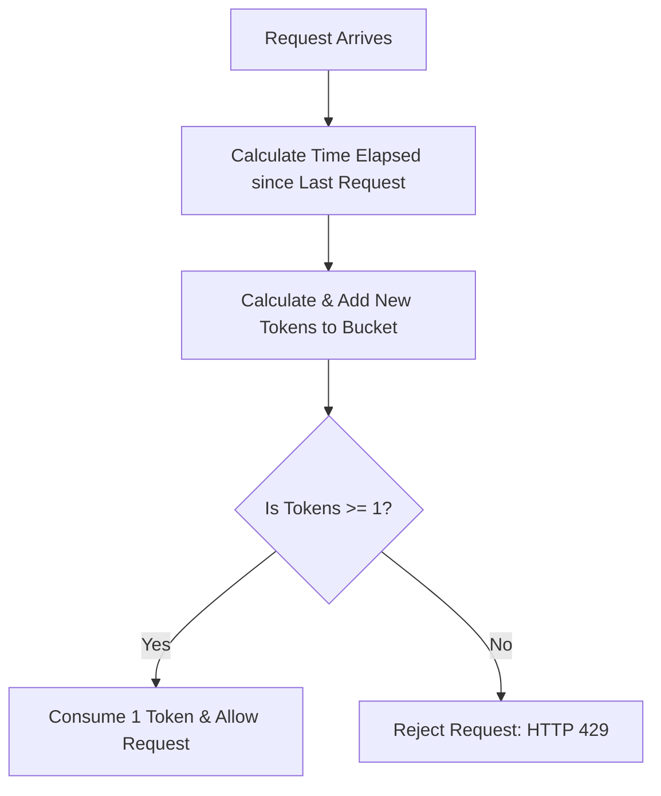
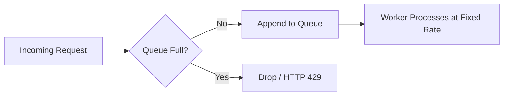

# Mastering Traffic Shaping: Token Bucket vs Leaky Bucket

## 1. 💡 The "Big Picture" (Plain English)

### What is this in simple terms?
Imagine your web server is a popular night club. If everyone tries to rush through the front door at the exact same moment, the club gets overcrowded, the staff panics, and the building collapses. 

A **Rate Limiter** is the bouncer standing at the door. It controls how many people (API requests) can enter the club per second, protecting your backend services from crashing under heavy traffic.

Two of the most famous strategies this bouncer uses are the **Token Bucket** and the **Leaky Bucket** algorithms.

---

### The Real-World Analogies

#### A. The Token Bucket (The "Amusement Park Pass" Approach)
Imagine a bucket filled with physical ride tokens. 
* The park manager drops a new token into the bucket every 10 seconds. 
* The bucket has a maximum capacity (say, 5 tokens). If the bucket is full, extra tokens overflow and are discarded.
* When a visitor (request) arrives, they must grab a token from the bucket to go on the ride.
* **Why it’s cool:** If a group of 5 friends arrives at the exact same millisecond, and the bucket is full, they can all grab a token and go on the ride together instantly (**bursty traffic** is allowed).

```
   Token Refill (+r tokens/sec)
        │
        ▼
   ┌───────────┐
   │ 🪙  🪙  🪙 │  ◄── Bucket (Capacity: C)
   │   🪙  🪙   │
   └─────┬─────┘
         │  Take token
         ▼
    [Request Allowed]
```

#### B. The Leaky Bucket (The "Drip Funnel" Approach)
Imagine a simple funnel. You can pour a whole bucket of water into it all at once, but the water only drips out of the small hole at the bottom at a constant, steady rate.
* If you pour too much water too quickly, the funnel fills to the brim. Any extra water you try to pour in just spills over the sides and is lost (requests are discarded).
* **Why it’s cool:** No matter how wildly or unevenly you pour water in, the output is always a smooth, predictable, drip-drip-drip (**smooth traffic rate**).

```
   Raw Bursty Traffic (Pouring water)
        │
        ▼
   \~~~~~~~~~~~/  ◄── Funnel (Capacity: C)
    \   H2O   /
     \  H2O  /
      \  ▲  /
       └──┬──┘
          │  Drip... Drip... (+r requests/sec)
          ▼
    [Steady Processing]
```

---

### Why should I care? What problem does it solve for me today?
Without a rate limiter, your system is vulnerable to:
1. **DDoS Attacks:** Malicious actors spamming your API to take down your service.
2. **Resource Starvation:** One rogue user writing a broken `while(true)` loop that floods your database, making the app slow for everyone else.
3. **Unexpected Cloud Bills:** If you use pay-as-you-go serverless databases (like AWS DynamoDB), a sudden traffic spike can cost you thousands of dollars overnight.

---

## 2. 🛠️ How it Works (Step-by-Step)

### A. Token Bucket (Lazy Refill Algorithm)
In production, we don't run a background thread that wakes up every second to add tokens—that wastes CPU cycles. Instead, we use **lazy refilling**: we calculate how many tokens *should* have been added since the last request arrived.

#### Step-by-Step Execution:
1. A request arrives at time $T_{now}$.
2. Calculate the time elapsed since the last request: $\Delta T = T_{now} - T_{last}$.
3. Calculate new tokens earned: $\Delta T \times \text{refill\_rate}$.
4. Update token count: $\text{tokens} = \min(\text{max\_capacity}, \text{tokens} + \text{new\_tokens})$.
5. Check if $\text{tokens} \ge 1$:
   - **If yes:** Decrement token count by 1, update $T_{last} = T_{now}$, and allow the request.
   - **If no:** Reject the request (HTTP 429 Too Many Requests).



#### Production-Ready Python Code (Token Bucket)

```python
import time
import threading

class TokenBucketRateLimiter:
    def __init__(self, capacity: int, refill_rate: float):
        """
        :param capacity: Maximum tokens the bucket can hold.
        :param refill_rate: How many tokens are added per second.
        """
        self.capacity = capacity
        self.refill_rate = refill_rate
        self.tokens = float(capacity)
        self.last_refill_time = time.time()
        self.lock = threading.Lock()  # Ensure thread safety for concurrent requests

    def allow_request(self) -> bool:
        with self.lock:
            now = time.time()
            elapsed = now - self.last_refill_time
            self.last_refill_time = now
            
            # Lazily add tokens based on time passed
            self.tokens = min(self.capacity, self.tokens + (elapsed * self.refill_rate))
            
            if self.tokens >= 1.0:
                self.tokens -= 1.0
                return True  # Request allowed
            
            return False  # Request blocked (Rate limited)

# Example Usage
limiter = TokenBucketRateLimiter(capacity=3, refill_rate=1.0) # Burst of 3, 1 per sec
for i in range(5):
    allowed = limiter.allow_request()
    print(f"Request {i+1}: {'✅ Allowed' if allowed else '❌ Blocked'}")
    time.sleep(0.2)
```

---

### B. Leaky Bucket (FIFO Queue Algorithm)
The leaky bucket uses a First-In, First-Out (FIFO) queue of a fixed size.

#### Step-by-Step Execution:
1. A request arrives.
2. Check if the queue is full:
   - **If not full:** Add the request to the tail of the queue.
   - **If full:** Reject the request immediately.
3. A background worker (consumer) pulls requests from the head of the queue at a **constant, fixed interval** and processes them.



---

## 3. 🧠 The "Deep Dive" (For the Interview)

### The Architectural & Concurrency Challenges

If you explain the basic algorithm in a System Design interview, the interviewer will immediately push you on **scale** and **concurrency**.

#### 1. The Concurrency Problem (Race Conditions)
In a multi-threaded application server, two concurrent threads might check the token count at the exact same microsecond, see `tokens = 1`, and both allow their requests—leaving you with `-1` tokens. 
* **Single-Server Solution:** Use mutex locks (like Python's `threading.Lock` or Java's `ReentrantLock`). However, locking degrades performance because threads have to wait in line.
* **Alternative Single-Server Solution:** In JVM-based applications, use atomic variables (`AtomicLong` or atomic reference updates) to perform non-blocking compare-and-swap (CAS) operations.

#### 2. Distributed Scale (The Redis Solution)
If you have 10 web servers behind a load balancer, local memory locking won't work. A user could hit Server A, get rate-limited, and then hit Server B to bypass it. You must store rate limit state in a centralized memory store like **Redis**.

To prevent the **Read-Modify-Write** race condition over the network, you should execute the Token Bucket logic inside a **Redis Lua Script**. Redis runs Lua scripts atomically, ensuring no other operations can run midway through checking and updating the token count.

Here is the concept of a Redis Lua script for Token Bucket:
```lua
local key = KEYS[1]
local capacity = tonumber(ARGV[1])
local refill_rate = tonumber(ARGV[2])
local now = tonumber(ARGV[3])
local requested = tonumber(ARGV[4])

-- Retrieve current bucket state
local data = redis.call('HMGET', key, 'tokens', 'last_updated')
local tokens = tonumber(data[1]) or capacity
local last_updated = tonumber(data[2]) or now

-- Calculate refilled tokens
local elapsed = math.max(0, now - last_updated)
tokens = math.min(capacity, tokens + (elapsed * refill_rate))

if tokens >= requested then
    tokens = tokens - requested
    redis.call('HMSET', key, 'tokens', tokens, 'last_updated', now)
    return 1 -- Allowed
else
    redis.call('HMSET', key, 'tokens', tokens, 'last_updated', now)
    return 0 -- Rejected
end
```

---

### Trade-offs: Token Bucket vs. Leaky Bucket

| Feature | Token Bucket | Leaky Bucket |
| :--- | :--- | :--- |
| **Handling Spikes** | Allows sudden **bursts** of traffic up to the bucket capacity. Excellent for APIs with natural variations in usage. | Forces a **rigid, constant output rate**. Completely eliminates traffic bursts. |
| **Implementation Complexity** | Simple to implement lazily (no background thread/timer needed). | Complex. Typically requires a queue buffer and a continuous background consumer thread. |
| **Memory Efficiency** | High. Only requires storing two numbers (`last_updated_timestamp` and `tokens_count`) per user. | Lower if holding actual requests in memory. Higher overhead because of queue structures. |
| **Downstream Protection** | Downstream systems must be able to handle sudden, permitted bursts. | Safest for downstream systems because traffic is completely smoothed out. |

---

### Interviewer Probe Questions (How they'll try to trip you up)

#### ❓ Probe 1: "If we use Token Bucket, what happens if our Redis instance goes down? Does our whole site crash?"
* **How to answer:** *"No. We must design for graceful degradation. If Redis fails or times out, we should fallback to a local in-memory rate limiter on each application node, or bypass rate limiting entirely while alerting the operations team. It's better to risk temporary system overload than to guarantee a 100% outage for all users due to a failed rate limiter."*

#### ❓ Probe 2: "In Leaky Bucket, if we have a sudden spike of 10,000 valid requests, what happens to the user experience of the 10,001st request versus the 50th request?"
* **How to answer:** *"Because Leaky Bucket uses a FIFO queue, the 50th request is accepted but must wait in the queue to be processed, experiencing high latency. The 10,001st request is dropped instantly with an HTTP 429. This is a key disadvantage of Leaky Bucket: it trades latency for stability, which can ruin the user experience of valid users during momentary traffic spikes."*

---

## 4. ✅ Summary Cheat Sheet

### 3 Key Takeaways
1. **Token Bucket is for Bursts:** It allows short-lived traffic spikes to be processed immediately, provided tokens are available in the bucket.
2. **Leaky Bucket is for Smoothness:** It treats incoming traffic like water in a funnel, ensuring the backend receives a perfectly steady, predictable flow of requests.
3. **Prefer Lazy Evaluations:** Do not run background timers to refill buckets. Calculate the token delta dynamically whenever a new request arrives to keep memory and CPU usage minimal.

---

### 💡 The Golden Rule
> **Use Token Bucket** by default for modern web APIs to support natural, bursty user behavior. **Use Leaky Bucket** only when your downstream systems (like database writers or legacy third-party payment APIs) are fragile and absolutely cannot handle any sudden fluctuations in load.