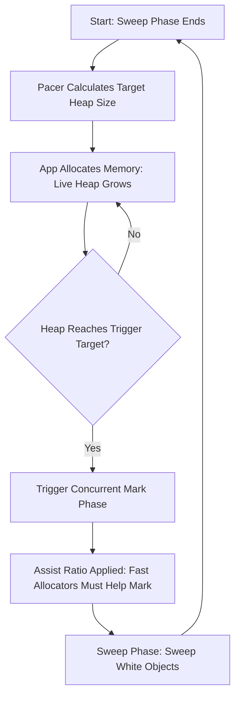

# GC Pacing and Memory Limits: Tuning the Tri-Color Collector

## 1. 💡 The "Big Picture" (Plain English)

### What is this in simple terms?
Imagine you run a busy microservice. Inside its engine, there is a dedicated cleaning crew (the Garbage Collector) tasked with sweeping away unused memory. 

**GC Pacing** is the algorithm that decides exactly *how fast* and *how often* this cleaning crew should sweep. If they sweep too frequently, they hog the CPU and slow down your app. If they wait too long, your application runs out of memory and crashes. The **Memory Limit** is a boundary wall we build around the application, telling the cleaning crew: *"Do whatever it takes to keep our footprint below this line, but don't panic-clean unless we are absolutely pushing up against it."*

### The Real-World Analogy
Think of a **busy restaurant kitchen**:
* **The Heap** is the counter space.
* **Your code** is the chefs making dishes and piling up dirty mixing bowls (allocating memory).
* **The GC Pacer** is the kitchen manager. 
* **`GOGC` (Pacing Ratio)** is a rule: *"When dirty bowls occupy double the space of active cooking ingredients, start washing them."*
* **`GOMEMLIMIT` (Memory Limit)** is the actual physical size of the counter. If the kitchen manager sees the bowls are about to spill over the edge of the counter, they order an emergency, rapid wash cycle (GC), ignoring the normal ratio rules, just to keep the kitchen from grinding to a halt.

```
┌──────────────────────────────────────────────┐
│  PHYSICAL COUNTER LIMIT (GOMEMLIMIT)         │ ───▶ Hard stop! (Prevents OOM crash)
├──────────────────────────────────────────────┤
│  ▲                                           │
│  │ Target dynamic trigger (set by GOGC)      │ ───▶ Starts cleaning here to be safe
│  ▼                                           │
├──────────────────────────────────────────────┤
│  Active Ingredients (Live Heap Memory)       │
└──────────────────────────────────────────────┘
```

### Why should I care?
In the cloud era, you pay for RAM and CPU. If your GC is poorly paced:
1. **Kubernetes OOM Kills:** Your container exceeds its limit, and Kubernetes violently kills it (`Exit Code 137`).
2. **CPU Thrashing:** Under high load, your app spends 80% of its time cleaning memory instead of serving users.
Tuning GC pacing and memory limits allows you to pack more applications onto cheaper cloud nodes safely.

---

## 2. 🛠️ How it Works (Step-by-Step)

Modern concurrent collectors (like Go's) use a **Tri-color Mark-Sweep** algorithm. The pacer dynamically calculates when to start this process.

### The Tri-color Coloring Book:
1. **White (Unvisited):** Candidates for garbage collection.
2. **Grey (In-Progress):** Visited, but their referenced objects haven't been scanned yet.
3. **Black (Live/Keep):** Visited, and all their referenced objects are also marked.

### The Step-by-Step Pacing Loop:



1. **The Target Formula:** At the end of a GC cycle, the pacer looks at the **Live Heap** (surviving memory) and calculates the next trigger target:
   $$\text{Target Heap} = \text{Live Heap} \times \left(1 + \frac{\text{GOGC}}{100}\right)$$
2. **Dynamic Pacing:** If your application allocates memory incredibly fast, the pacer speeds up the GC workers.
3. **Mark Assist:** If a single thread is allocating memory faster than the GC can scan it, the engine forces that specific thread to pause and help mark objects (**Mark Assist**). This prevents memory from running away.

### Code Example: Managing Limits Programmatically

In production, you don't want to hardcode environment variables. You want your runtime to adapt to its container boundaries dynamically. Here is how you tune these knobs programmatically:

```go
package main

import (
	"fmt"
	"runtime"
	"runtime/debug"
)

func main() {
	// 1. GOGC: Garbage Collection Target Percentage (Default is 100)
	// Setting GOGC to 100 means heap can grow 100% (double) before GC triggers.
	oldGOGC := debug.SetGCPercent(200) // Increase to 200% (Saves CPU, uses more RAM)
	fmt.Printf("Previous GOGC: %d%%, New GOGC: 200%%\n", oldGOGC)

	// 2. GOMEMLIMIT: Hard soft-limit on total runtime memory (Go 1.19+)
	// Suppose our Docker container has a 512MB limit. We set GOMEMLIMIT 
	// slightly lower (e.g., 450MB) to leave a buffer for OS overhead.
	const limitInBytes = 450 * 1024 * 1024 // 450 MiB
	oldLimit := debug.SetMemoryLimit(limitInBytes)
	fmt.Printf("Previous Memory Limit: %d bytes, New Limit: %d bytes\n", oldLimit, limitInBytes)

	// Run business logic...
	allocateLargeBuffer()
}

func allocateLargeBuffer() {
	// This will trigger concurrent GC elegantly if it nears 450MB,
	// ignoring GOGC target formulas if necessary to stay under the limit.
	var buffer [][]byte
	for i := 0; i < 10; i++ {
		slice := make([]byte, 40*1024*1024) // Allocate 40MB chunks
		buffer = append(buffer, slice)
	}
	_ = buffer // Keep references alive
}
```

---

## 3. 🧠 The "Deep Dive" (For the Interview)

### The Technical Magic: The Write Barrier
Because the Tri-color algorithm marks memory *concurrently* while your application threads are running, a race condition can occur:

* **The Problem:** The GC marks Object A **Black** (done). The app then updates a pointer inside A to point to a new/unvisited Object C (**White**), and removes the pointer from Object B (**Grey**) to C. The GC will never visit C because A is already marked Black. **Result: Live memory C gets collected/deleted!** This is called a corruption bugs.

```
Before Mutation:
  [Grey Object B] ───points to───▶ [White Object C]
  [Black Object A] ───points to───▶ Nil

App mutates pointers concurrently:
  [Grey Object B] ───points to───▶ Nil
  [Black Object A] ───points to───▶ [White Object C]

Without a Write Barrier, White Object C is now hidden from the GC and will be deleted!
```

* **The Solution:** **The Write Barrier**. During GC marking, the runtime activates a compiler-inserted hook. Whenever your code updates a pointer, the write barrier intercepts this and colors the target object (Object C) **Grey** immediately. This guarantees that no live references are missed.

### The GC Pacer Trade-offs
Tuning is a direct trade-off between **CPU overhead** and **Memory footprints**:

| Setting | Strategy | Pros | Cons |
| :--- | :--- | :--- | :--- |
| **High `GOGC` (e.g., 500)** | Run GC less often. | Minimal CPU overhead; high throughput. | High memory usage; prone to crash if container is small. |
| **Low `GOGC` (e.g., 50)** | Run GC very often. | Low memory footprint. | High CPU overhead; app latency increases due to constant context-switching/marking. |
| **Smart `GOMEMLIMIT`** | Let pacer dynamically scale. | Prevents OOM kills; maximizes resource usage. | CPU usage will spike ("thrash") if the app naturally needs more than the limit. |

---

### Interviewer Probes (Tricky Questions & How to Ace Them)

#### 🎙️ Probe 1: "We deployed our service to a Kubernetes cluster. Suddenly, under peak traffic, the container gets killed with Exit Code 137 (OOM). How do you debug and tune this?"
* **Answer:** "An OOM kill means the container exceeded its cgroup memory limit. In runtimes like Go before version 1.19, the GC only knew about `GOGC` (relative heap growth) but had no visibility into the cgroup limits. Under sudden load, the heap doubled before GC triggered, exceeding the cgroup limit.
To fix this, I would set `GOMEMLIMIT` to ~90% of our Kubernetes memory limit. This makes the GC pacer aware of the hard ceiling. If memory consumption nears this limit, the pacer will trigger aggressive garbage collections, ignoring the relative `GOGC` formula, prioritizing survival (latency penalty) over a fatal crash (OOM)."

#### 🎙️ Probe 2: "What is 'GC Thrashing' (Death Spiral) and how do modern runtimes protect themselves from it?"
* **Answer:** "GC Thrashing occurs when the application's *live* (indestructible) memory gets very close to the hard `GOMEMLIMIT`. Because the engine is desperate to stay under the limit, it triggers GC continuously. The app spends 100% of its CPU time scanning and sweeping, making zero progress on actual business logic.
Modern runtimes protect against this by capping GC CPU utilization. For example, Go's runtime caps GC CPU usage at **50% of the total system CPU**. If the pacer calculates that staying under the limit would require more than 50% CPU, it allows the memory limit to be exceeded temporarily, choosing to let the system crash elegantly or let the OS swap rather than rendering the container completely unresponsive."

---

## 4. ✅ Summary Cheat Sheet

### 3 Key Takeaways
1. **Pacing is Dynamic:** The runtime doesn't just run GC on a fixed schedule. It continuously measures allocation speeds to trigger collections at the optimal CPU/RAM intersection.
2. **Tri-Color + Write Barrier:** Concurrent GC is made safe by intercepting pointer writes dynamically to ensure newly assigned references aren't swept away.
3. **Double Knob Strategy:** Use `GOGC` to control *frequency/latency* and `GOMEMLIMIT` to guard *safety* against OOMs.

### 👑 The Golden Rule
> **"Tune GOMEMLIMIT to match your environment's physical limits, and let GOGC manage your CPU appetite."**