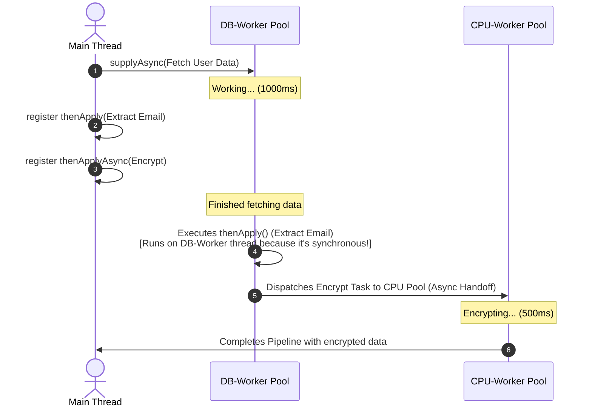

# CompletableFuture Pipeline Mechanics: Thread Hand-offs, Memory Barriers, and Async Stage Propagation

---

## 1. 💡 The "Big Picture" (Plain English)

### What is this in simple terms?
Think of a `CompletableFuture` pipeline as a **digital assembly line**. Instead of waiting for one worker to finish their job before you give them the next task, you build a blueprint of the entire production line upfront. You say: *"When Step A is done, automatically pass the output to Step B. Once Step B is done, pass it to Step C."* 

This allows your application to execute complex, multi-step operations without blocking your main threads (like your Web Server's request handlers) while waiting for databases, APIs, or disk reads.

### The Real-World Analogy: The Gourmet Pizza Kitchen
Imagine a busy restaurant kitchen:
* **The Synchronous Way (Thread-per-request):** One chef prepares the dough, waits 10 minutes for it to rise (doing nothing but staring at it), spreads the sauce, waits 15 minutes for it to bake, and then plates it. The chef is completely blocked during the waiting periods.
* **The CompletableFuture Way:** 
  * **Chef A** rolls the dough and puts it in the proofer. Chef A is now free to roll another dough.
  * *When* the dough rises, whoever is free (let's say **Chef B**) takes it, spreads the sauce, and puts it in the oven.
  * *When* the oven timer rings, **Chef C** pulls it out and plates it. 

The pizza moves from station to station based on **completion events**.

### Why should I care? What problem does it solve for me today?
Without understanding how stages hand off work to different threads:
1. **You will cause Thread Starvation:** You might accidentally block a crucial server thread (like Netty's EventLoop or Tomcat's worker threads) because you didn't realize your callback was running on it.
2. **You will suffer Silent Failures:** Exceptions in asynchronous pipelines don't crash your application; they vanish into the void, leaving your system hanging indefinitely.
3. **You will write slow code:** You will blindly use `.join()` or `.get()` too early, converting your beautiful asynchronous code back into slow, synchronous code.

---

## 2. 🛠️ How it Works (Step-by-Step)

Let's look at how a pipeline handles execution under the hood.

### The Flow of Execution
1. **Stage 1 (Async Trigger):** A task is submitted to a thread pool (e.g., fetching user data from a database).
2. **Stage 2 (The Callback registration):** We attach a transformation step (e.g., extracting the user's email).
3. **The Pivot Decision:** 
   * If Stage 1 is **already finished** when we attach Stage 2, the **calling thread** (the one registering the callback) runs Stage 2 immediately.
   * If Stage 1 is **still running**, the **thread completing Stage 1** will run Stage 2.
   * If we use `thenApplyAsync`, a **thread pool** is forced to run Stage 2, regardless of who finished first.

### Clean, Well-Commented Code Example

```java
import java.util.concurrent.CompletableFuture;
import java.util.concurrent.ExecutorService;
import java.util.concurrent.Executors;

public class PipelineDemo {

    public static void main(String[] args) {
        // 1. Create dedicated thread pools for resource isolation (Bulkheading)
        ExecutorService dbExecutor = Executors.newFixedThreadPool(2, r -> new Thread(r, "DB-Worker"));
        ExecutorService cpuExecutor = Executors.newFixedThreadPool(2, r -> new Thread(r, "CPU-Worker"));

        System.out.println("[" + Thread.currentThread().getName() + "] Starting pipeline...");

        // 2. Start the async pipeline
        CompletableFuture<String> pipeline = CompletableFuture.supplyAsync(() -> {
            // Simulated slow DB query
            log("Fetching user raw data from DB...");
            sleep(1000); 
            return "user_id_42,John Doe,john@example.com";
        }, dbExecutor)
        // 3. Transform the data (Using thenApply - synchronous handoff)
        .thenApply(rawData -> {
            log("Extracting email (thenApply)...");
            return rawData.split(",")[2];
        })
        // 4. Heavy task (Using thenApplyAsync - forced handoff to CPU pool)
        .thenApplyAsync(email -> {
            log("Encrypting email (thenApplyAsync)...");
            return encrypt(email);
        }, cpuExecutor)
        // 5. Exception handling boundary
        .exceptionally(ex -> {
            log("Error occurred: " + ex.getMessage());
            return "fallback@example.com";
        });

        // 6. Block main thread just to see the final output
        String encryptedEmail = pipeline.join();
        System.out.println("[" + Thread.currentThread().getName() + "] Final Result: " + encryptedEmail);

        dbExecutor.shutdown();
        cpuExecutor.shutdown();
    }

    private static String encrypt(String input) {
        sleep(500); // Simulate crypto workload
        return "ENCRYPTED[" + input + "]";
    }

    private static void log(String message) {
        System.out.printf("[%s] %s%n", Thread.currentThread().getName(), message);
    }

    private static void sleep(long ms) {
        try { Thread.sleep(ms); } catch (InterruptedException e) { Thread.currentThread().interrupt(); }
    }
}
```

### Pipeline Flow Diagram



---

## 3. 🧠 The "Deep Dive" (For the Interview)

To survive a senior-level interview, you must understand the exact execution rules, the data structures used by `CompletableFuture`, and how memory visibility is achieved.

### 1. The Under-the-Hood Data Structure: Stack of Completes (`Completion` Nodes)
Every `CompletableFuture` object keeps a pointer to a stack of dependent actions (called `Completion` objects). 

```
CompletableFuture (State: PENDING, Result: null)
   └── stack -> [ Completion Node (thenApplyAsync) ] 
                     └── next -> [ Completion Node (exceptionally) ]
```

When you chain methods like `.thenApply()` or `.thenAccept()`, you are adding a new `Completion` node to this stack. 
* If the future is **already completed** (the result field is set), the engine executes your callback immediately in your current thread.
* If the future is **not completed**, the node is safely pushed onto the stack using a lock-free CAS (Compare-And-Swap) loop.
* When the producer thread finally completes the future, it loops through this stack and executes/dispatches each node.

### 2. The Non-Obvious Memory Barrier (Happens-Before)
How does Java guarantee that the thread running Step B can see the memory writes made by the thread running Step A without using `synchronized` blocks?

`CompletableFuture` relies heavily on `volatile` writes and reads. Writing to the internal `result` field of a `CompletableFuture` is a **volatile write**. Reading that result is a **volatile read**. 

According to the **Java Memory Model (JMM)**:
> *A write to a volatile variable happens-before every subsequent read of that same volatile variable.*

Therefore, all memory operations performed *before* calling `completableFuture.complete(value)` are guaranteed to be visible to the thread that picks up the task to execute the next stage in the pipeline.

### 3. Starvation and the Common Pool Danger
If you do not specify an explicit Executor to `supplyAsync` or `thenApplyAsync`, Java defaults to using:
```java
ForkJoinPool.commonPool()
```
The common pool is shared across the entire JVM. If you use it to run blocking I/O tasks (like calling an external API), you can easily exhaust all threads in the common pool. This will freeze parallel streams, other CompletableFutures, and system-level operations.

---

### Interviewer Probes (Tricky Questions & Answers)

#### **Q1: Look at this code. Which thread executes the map user function?**
```java
CompletableFuture<User> future = service.getUserAsync(); // returns pending future
future.thenApply(user -> {
    return clean(user); 
});
```
**Answer:** It depends on timing! 
* **Scenario A:** If `service.getUserAsync()` completes *before* the `.thenApply` line is executed, the **current main thread** will execute `clean(user)` inline.
* **Scenario B:** If `service.getUserAsync()` is slow and still pending when `.thenApply` is called, the **background thread** that completes the user retrieval will execute `clean(user)`.
* *Follow-up fix:* If we want to guarantee it never runs on our caller/UI thread, we must use `.thenApplyAsync(user -> clean(user), executor)`.

---

#### **Q2: Why does this code print "Main finished" but never prints "Step 2 completed"?**
```java
CompletableFuture.supplyAsync(() -> {
    throw new RuntimeException("DB Connection Failed");
})
.thenAccept(result -> System.out.println("Step 2 completed: " + result));
```
**Answer:** Because `CompletableFuture` pipelines propagate exceptions down the chain until an exception handler is reached. If an exception occurs, all intermediate consumer stages (like `thenAccept` or `thenApply`) are skipped. Since there is no `.exceptionally()` or `.handle()` block at the end, the exception is swallowed silently within the future instance. To observe the failure, you would need to call `.join()`, which would throw a `CompletionException`.

---

#### **Q3: What is the difference between `handle()` and `exceptionally()`?**
* **`exceptionally(Function<Throwable, T> fn)`**: Act like a `catch` block. It is invoked **only** if an exception was thrown upstream. It returns a fallback value of the same type.
* **`handle(BiFunction<T, Throwable, U> fn)`**: Act like a `finally` block with access to the outcome. It is **always** invoked, regardless of whether there was a success or a failure. It receives both the result and the exception (one of them will be `null`). This allows you to transform the result type or construct custom error responses cleanly.

---

## 4. ✅ Summary Cheat Sheet

### 3 Key Takeaways
1. **Thread Control:** `thenApply` runs on whatever thread is convenient (often the thread that completed the previous stage). `thenApplyAsync` always hands the task off to a thread pool executor.
2. **Never use the Common Pool for I/O:** Always define and supply a custom, size-limited thread pool (`ExecutorService`) for network operations to prevent application hangs.
3. **Always handle Exceptions:** Every pipeline needs to terminate with a recovery stage (like `.exceptionally()`) or have its final future monitored, or exceptions will be lost.

### 1 "Golden Rule"
> **"Never call `.join()` or `.get()` inside intermediate steps of your pipeline. Keep the pipeline asynchronous from start to finish, and resolve the value only at the edge of your application."**