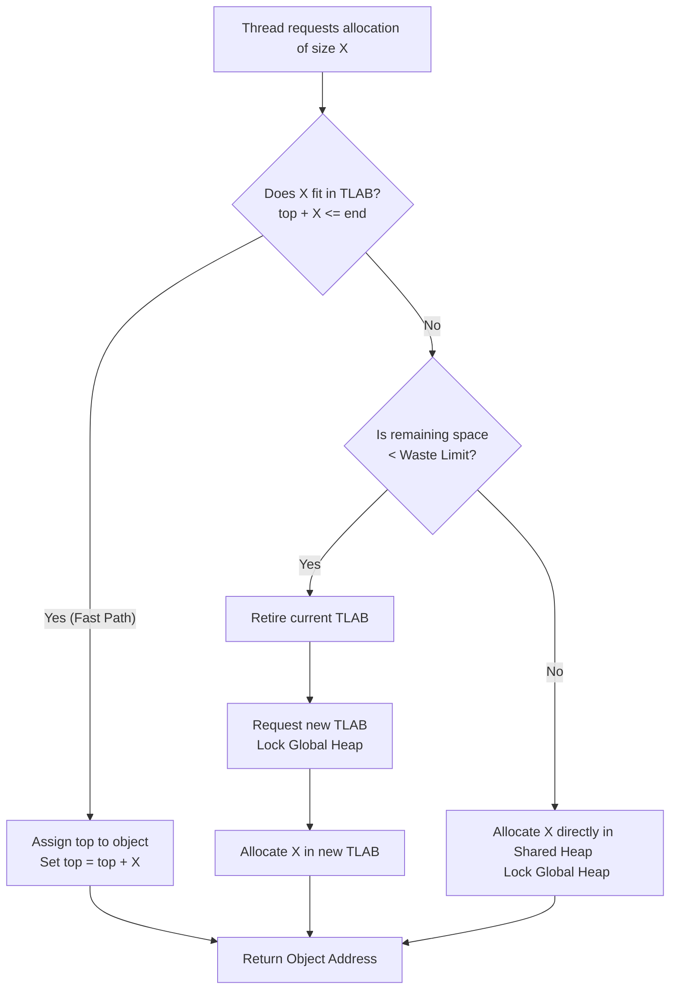

# Thread-Local Allocation Buffers (TLABs): Eliminating Allocation Bottlenecks

1. 💡 The "Big Picture" (Plain English)
---------------------------------------

### What is this in simple terms?
A **Thread-Local Allocation Buffer (TLAB)** is a private stash of memory dedicated to a single thread inside a shared application heap. Instead of all threads fighting over the same giant pile of memory when creating new objects, each thread gets its own exclusive "workspace" to allocate objects rapidly and without interference.

### A Real-World Analogy
Imagine a massive, high-end restaurant kitchen with 20 chefs (threads) preparing dishes. 
* **Without TLABs (Shared Allocation):** There is only one central spice rack (the global heap). Every time a chef needs a pinch of salt, they must walk to the spice rack, grab a padlock to lock it, take the salt, unlock it, and walk back. The kitchen grinds to a halt because chefs are constantly standing in line waiting for the lock.
* **With TLABs:** At the start of the shift, the head chef hands each chef their own personal, small box of salt and spices (a TLAB) at their individual prep station. Chefs can grab salt instantly without waiting for anyone else. They only go to the central pantry when their personal box runs completely dry.

```
NO TLAB (Lock Contention):
[Thread 1] ───┐
[Thread 2] ───┼─► [ LOCK ] ──► [ Global Heap Allocation ]
[Thread 3] ───┘

WITH TLAB (Lock-Free Fast Path):
[Thread 1] ──► [ TLAB 1 (No Locks) ] ──► Object Created!
[Thread 2] ──► [ TLAB 2 (No Locks) ] ──► Object Created!
[Thread 3] ──► [ TLAB 3 (No Locks) ] ──► Object Created!
```

### Why should I care?
In modern multi-threaded applications, object allocation is one of the most frequent operations. Without TLABs, threads would spend more time waiting for memory allocation locks than doing actual work. By enabling TLABs, memory allocation becomes almost free—reducing it to just a few CPU cycles (comparable to stack allocation). 

---

2. 🛠️ How it Works (Step-by-Step)
----------------------------------

### The Life Cycle of a TLAB Allocation
1. **Initialization:** When a thread starts, the JVM/Runtime allocates a small chunk of memory from the Eden space (in the young generation heap) to serve as that thread's TLAB. This allocation *does* require a lock, but it happens rarely.
2. **The Fast Path (Lock-Free):** The thread wants to allocate a new object. It checks if the object fits in its private TLAB.
   * If it fits, the runtime performs a **"Bump-the-Pointer"** operation. It moves the allocation pointer forward by the size of the object and returns the memory. No locks, no synchronization, blazingly fast.
3. **The Slow Path (Refill/Retire):** If the object does *not* fit in the remaining space of the TLAB, the thread has a choice based on the size of the object and the remaining TLAB space:
   * **Case A (Object is small, but TLAB is nearly full):** The thread *retires* the current TLAB (returns the unused sliver back to the heap) and requests a brand-new TLAB from the global heap (synchronized operation). The object is then allocated in the new TLAB.
   * **Case B (Object is huge):** Retiring the TLAB would waste too much memory. Instead, the thread bypasses its TLAB entirely and allocates the object directly in the shared heap (Eden or Tenured space) using synchronization.

### Conceptual Implementation (C++ / JVM-style Pseudo-code)

```cpp
// A simplified representation of how a runtime manages memory allocation with TLABs
struct TLAB {
    char* start;   // Start of the TLAB memory block
    char* top;     // Current allocation pointer (bumps forward)
    char* end;     // End of the TLAB memory block
};

class ThreadLocalAllocator {
private:
    TLAB tlab;
    size_t waste_limit = 1024; // Maximum bytes we are willing to waste to allocate a new TLAB

public:
    void* allocate(size_t size) {
        // Step 1: Align object size for hardware performance
        size = align(size);

        // Step 2: Try Fast-Path (Inside TLAB)
        if (tlab.top + size <= tlab.end) {
            void* obj_address = tlab.top;
            tlab.top += size; // "Bump-the-pointer"
            return obj_address;
        }

        // Step 3: Fast-Path failed. Handle Slow-Path
        return allocate_slow_path(size);
    }

private:
    void* allocate_slow_path(size_t size) {
        size_t remaining_space = tlab.end - tlab.top;

        // If the remaining space is small, retire TLAB and get a new one
        if (remaining_space < waste_limit) {
            retire_current_tlab();
            refill_tlab(); // Synchronized call to global heap
            
            // Retry allocation in the brand-new TLAB
            if (tlab.top + size <= tlab.end) {
                void* obj_address = tlab.top;
                tlab.top += size;
                return obj_address;
            }
        }

        // If the object is too large, allocate directly in the shared Heap (Synchronized)
        return allocate_in_global_heap_with_lock(size);
    }
};
```

### Allocation Flowchart



---

3. 🧠 The "Deep Dive" (For the Interview)
------------------------------------------

### The Internal Mechanics & Tuning Parameters
Under the hood, modern JVMs (like OpenJDK HotSpot) tune TLABs dynamically. 
* **Dynamic Resizing:** TLAB sizes are not static. The JVM monitors the allocation rate of each thread. If a thread allocates aggressively, its next TLAB will be sized larger to prevent frequent, costly "slow path" refills. If a thread is mostly idle, its TLAB size shrinks to avoid wasting memory.
* **The Waste Limit (`-XX:TLABWasteTargetPercent`):** This parameter (defaulting to 1% of the Eden space) determines how much memory a thread is allowed to discard when retiring a TLAB. If the remaining space is less than this threshold, it is retired. If it is greater, the thread leaves the TLAB intact and forces a direct allocation into the shared heap.

### The Architectural Trade-Offs

| Advantage | Trade-Off / Cost |
| :--- | :--- |
| **Extreme Throughput:** Allocation reduces to a pointer addition, making multi-threaded execution scaling near-linear. | **Memory Fragmentation:** Retiring TLABs leaves unallocated "holes" of memory. If a TLAB has 100 bytes left but the thread needs 101 bytes, those 100 bytes are wasted (zeroed out as a dummy array) during retirement. |
| **Excellent CPU Cache Locality:** Since a thread allocates objects contiguously inside its own TLAB, the memory addresses are closely packed. This maximizes L1/L2 CPU cache hits. | **Slightly Higher Footprint:** Every active thread reserves a chunk of Eden. In systems with thousands of platform threads, this can artificially exhaust the Young Generation quickly. |

---

### Interviewer Probes (Tricky Questions & Outsmarting Them)

#### Probe 1: "If TLABs are thread-local, does that mean objects allocated inside a TLAB can only be read by the thread that created them? Is it like thread-local variables?"
* **How to answer:** *No, absolutely not.* This is a common point of confusion. A TLAB is thread-local **only for allocation**, not for lifecycle or access. Once the pointer is bumped and the object is initialized, it is a standard heap object. Any thread with a reference to that object can read or write to it. The TLAB is just a reservation mechanism during the birth of the object.

#### Probe 2: "What happens to the unused memory in a TLAB when it gets retired? How does the Garbage Collector handle these 'holes'?"
* **How to answer:** This is where the magic of "filler objects" comes in. The GC must be able to parse the heap linearly. If there is a random gap of unused memory at the end of a retired TLAB, the JVM's parser would crash because it expects valid object headers. 
To solve this, when a TLAB is retired, the runtime writes a **dummy/filler object** (usually an `int[]` or a raw raw-byte array) into the remaining gap. To the GC, this looks like a normal dead object, which it safely sweeps away during the next minor GC cycle.

#### Probe 3: "We are seeing high lock contention on memory allocation in our highly concurrent application, despite TLABs being on. What is likely happening, and how do we tune it?"
* **How to answer:** This points to **frequent TLAB refills** or **excessive direct heap allocations**. 
1. If the thread allocation rate is incredibly volatile, the JVM's adaptive TLAB sizing might be struggling. We can try disabling adaptive sizing with `-XX:-UseAdaptiveSizePolicy` or sizing them statically.
2. The objects being allocated might be larger than the TLAB size or the waste limit. This forces threads to fallback to the slow-path (locking the global heap). We can inspect this using JDK Flight Recorder (JFR) by looking at `jdk.ObjectAllocationOutsideTLAB` and `jdk.ObjectAllocationInNewTLAB` events. 
3. To tune this, we can increase the TLAB size using `-XX:TLABSize` or adjust the waste limit via `-XX:TLABWasteTargetPercent` to ensure objects fit inside the fast path.

---

4. ✅ Summary Cheat Sheet
--------------------------

### 3 Key Takeaways
1. **Zero Contention:** TLABs allow threads to allocate memory independently in parallel, bypassing global locks using simple "pointer-bumping" inside dedicated buffers.
2. **Dynamic Adaptation:** Modern runtime environments dynamically scale individual TLAB sizes based on each thread's historical allocation velocity.
3. **The Filler Object Solution:** Gaps left by retired TLABs are stuffed with dummy arrays so that the GC can scan the heap linearly without choking on unaligned garbage.

### 1 "Golden Rule"
> **Minimize "Slow Path" Allocations:** Keep your short-lived objects small and your allocation patterns steady; if objects consistently outsize your TLABs, your threads will drop back to global heap locks, ruining your parallel performance.