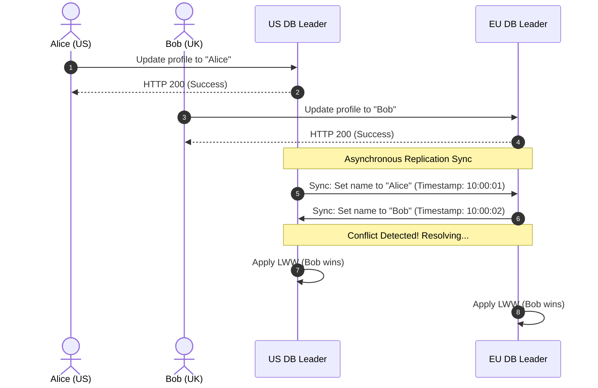

# Multi-Leader Replication: Mastering Write Conflict Resolution

## 1. 💡 The "Big Picture" (Plain English)

### What is this in simple terms?
Imagine you have a single diary. If only you write in it, there are no conflicts. But if you and a friend both have copies of the same diary and write in them at the exact same time, eventually you need to merge them. 

**Multi-Leader Replication** (often called Active-Active replication) is a database setup where you have multiple "leader" database servers spread across the world. Each of these leaders can accept writes (new data or updates) from users locally, and they later sync up with each other. 

The core challenge isn't saving the data—it's what happens when two users change the *same* piece of data on different leaders at the exact same time. We call this a **Write Conflict**.

---

### The Real-World Analogy
Think of **Git** and branching:
* You clone a repository (this is your local "leader").
* Your teammate clones the same repository (their local "leader").
* You both edit line 42 of `index.js` at the same time on your laptops.
* When you both try to push your changes to the central server, Git screams: **"MERGE CONFLICT!"**

In Git, a human resolves the conflict. In a high-throughput global database (like Amazon or Netflix), a human can't sit there resolving conflicts millions of times a second. The database must resolve these conflicts **automatically and programmatically**.

---

### Why should I care?
If you are building a global app (e.g., a collaborative document editor like Figma, a multi-region e-commerce platform, or a mobile app that works offline), you cannot route every single write request to a single database server in Virginia. Doing so would make the app painfully slow for users in Tokyo or London (due to the speed of light limits on network packets). 

Multi-leader replication allows users to write to the nearest local database with **sub-millisecond latency**. But you must know how to handle the inevitable conflicts, or your users will suffer from silent data corruption (e.g., items disappearing from their shopping carts).

---

## 2. 🛠️ How it Works (Step-by-Step)

Let's look at how a write conflict occurs and how a system resolves it using a simple strategy.

### The Conflict Lifecycle
1. **Local Write:** User A (in New York) updates their profile name to "Alice" on the US Leader.
2. **Concurrent Local Write:** User B (in London) updates the same profile name to "Bob" on the EU Leader at almost the exact same millisecond.
3. **Local Acknowledgment:** Both databases immediately tell the users "Success!" to keep latency low.
4. **Asynchronous Replication:** The US Leader sends a message to the EU Leader: *"Hey, update this record to Alice."* At the same time, the EU Leader sends a message to the US Leader: *"Hey, update this record to Bob."*
5. **Conflict Detection:** Both leaders realize they have two different values ("Alice" and "Bob") for the same record.
6. **Conflict Resolution:** The system applies a pre-configured rule (e.g., Last-Write-Wins) to ensure both databases eventually converge on the exact same value.

---

### The Architecture Flow



---

### Code Blueprint: Resolving Conflicts Programmatically
Here is a production-grade concept of a **Last-Write-Wins (LWW) Register** written in clean, commented Python. This demonstrates how databases evaluate which write to keep based on metadata.

```python
import time
from typing import Any, Tuple

class LWWRegister:
    """
    A Last-Write-Wins Register. 
    A common CRDT (Conflict-free Replicated Data Type) used to resolve 
    conflicts in distributed databases like Apache Cassandra.
    """
    def __init__(self, value: Any = None, timestamp: float = 0.0, node_id: str = ""):
        self.value = value
        # We use a physical timestamp (epoch time)
        self.timestamp = timestamp
        # Node ID acts as a tie-breaker if timestamps are identical
        self.node_id = node_id

    def write(self, value: Any, node_id: str) -> None:
        """Simulates a local write on a node."""
        self.value = value
        self.timestamp = time.time()
        self.node_id = node_id

    def merge(self, incoming: 'LWWRegister') -> None:
        """
        Merges an incoming replicated register with the local register.
        Rule: The write with the higher timestamp wins.
        If timestamps are equal, the write with the lexicographically greater Node ID wins.
        """
        if incoming.timestamp > self.timestamp:
            # Incoming write is newer
            self._update(incoming.value, incoming.timestamp, incoming.node_id)
        elif incoming.timestamp == self.timestamp:
            # Tie-breaker using Node ID
            if incoming.node_id > self.node_id:
                self._update(incoming.value, incoming.timestamp, incoming.node_id)
        # If incoming.timestamp < self.timestamp, we ignore it (local write wins)

    def _update(self, value: Any, timestamp: float, node_id: str):
        self.value = value
        self.timestamp = timestamp
        self.node_id = node_id

# --- Verification of the Flow ---
if __name__ == "__main__":
    # 1. Initialize Register on two separate nodes
    us_node = LWWRegister(value="Initial Name", timestamp=100.0, node_id="US-East")
    eu_node = LWWRegister(value="Initial Name", timestamp=100.0, node_id="EU-West")

    # 2. Simultaneous updates occur
    # US Node gets written to slightly earlier
    us_node.write("Alice", node_id="US-East") 
    time.sleep(0.01) # Small delay
    # EU Node gets written to slightly later
    eu_node.write("Bob", node_id="EU-West")

    print(f"Before Sync - US Value: '{us_node.value}', EU Value: '{eu_node.value}'")

    # 3. Replication sync triggers merge on both sides
    us_incoming_copy = LWWRegister(us_node.value, us_node.timestamp, us_node.node_id)
    eu_incoming_copy = LWWRegister(eu_node.value, eu_node.timestamp, eu_node.node_id)

    us_node.merge(eu_incoming_copy) # US merges EU's changes
    eu_node.merge(us_incoming_copy) # EU merges US's changes

    # 4. Both databases have converged on the same value!
    print(f"After Sync  - US Value: '{us_node.value}', EU Value: '{eu_node.value}'")
    assert us_node.value == eu_node.value == "Bob", "Database state has diverged!"
```

---

## 3. 🧠 The "Deep Dive" (For the Interview)

To stand out as a senior engineer, you must demonstrate deep knowledge of the mathematical and physical limitations of distributed systems.

### 1. Conflict-Free Replicated Data Types (CRDTs)
If you want to avoid arbitrary data loss (which Last-Write-Wins causes by silently discarding the "losing" write), you use CRDTs. These are specialized data structures designed so that concurrent updates can be merged in any order without conflicts.

For a data structure to be a state-based CRDT, its merge operation ($\sqcup$) must be a **semilattice**, meaning it satisfies three mathematical properties:
1. **Commutative ($A \sqcup B = B \sqcup A$):** Order of arrival does not matter.
2. **Associative ($(A \sqcup B) \sqcup C = A \sqcup (B \sqcup C)$):** Grouping of network packets does not matter.
3. **Idempotent ($A \sqcup A = A$):** Duplicate delivery of network messages does not change the state.

*Example:* A **PN-Counter** (Positive-Negative Counter). Instead of storing a single integer `total = 5`, the database tracks two sets: `P = {node1: 10}` (increments) and `N = {node2: 5}` (decrements). To get the final value, you simply compute $\sum P - \sum N$. Merging these sets is highly commutative, associative, and idempotent.

---

### 2. Version Vectors vs. Physical Clocks
How do we know if write A happened *before* write B, or if they happened *concurrently*?

*   **Physical Clocks (NTP):** Computers use NTP (Network Time Protocol) to sync their internal clocks. However, physical clocks drift due to thermal dynamics and network jitter. **Never rely on physical timestamps for absolute ordering in a distributed system.** A clock on Node A could easily be 100ms ahead of Node B, causing Node B to silently discard a genuinely newer update.
*   **Version Vectors (Logical Clocks):** Instead of wall-clock time, each database node maintains a counter vector: $V = [v_1, v_2, ..., v_n]$. When a node mutates data, it increments its own counter in the vector. By comparing the vectors of two writes, the database can mathematically prove whether one write casually preceded the other, or if they are concurrent.

$$\text{If } V_A \ge V_B \text{ for all elements, then A is a descendant of B (no conflict).}$$
$$\text{If neither is greater, they are concurrent (conflict detected!).}$$

---

### The Architecture Trade-offs

| Strategy | Write Latency | Read Latency | Data Integrity | Operational Complexity |
| :--- | :--- | :--- | :--- | :--- |
| **Single-Leader** | High (must route to one master) | Low (read from local replica) | High (No write conflicts) | Low |
| **Multi-Leader (LWW)** | Ultra-Low (write to local master) | Low | Low (Deletes data silently) | Medium |
| **Multi-Leader (CRDTs/Vectors)** | Ultra-Low | Medium (must resolve vector paths) | High (No data lost) | High |

---

### 💬 Interviewer Probes (How to Ace Them)

#### Probe 1: "Last-Write-Wins sounds easy. What are the silent dangers of using it in a global multi-leader database?"
*   **Your Answer:** "The primary danger is **clock skew**. Since databases rely on physical clocks (NTP) to determine the 'last' write, a drifted clock on one node can falsely claim its older write is 'newer', silently overwriting and deleting valid updates. Additionally, if two updates happen within the same millisecond, LWW must fall back to arbitrary tie-breakers (like sorting string IDs), resulting in non-deterministic data loss that is impossible to recover."

#### Probe 2: "If we can't use clocks, how can we design a multi-leader system where users can delete items from their shopping carts concurrently?"
*   **Your Answer:** "A simple 'delete' operation in a multi-leader setup can cause a silent resurrection of the deleted item if a replicate message arrives out of order. To solve this, we must use an **Observed-Remove Set (OR-Set)** CRDT. Instead of deleting the item immediately, we write a **Tombstone** (a marker indicating the item has been deleted, combined with a unique UUID). When merging states, tombstones override older additions, ensuring that deleted items stay deleted regardless of network delays."

---

## 4. ✅ Summary Cheat Sheet

### 3 Key Takeaways
1. **Multi-Leader Replication** eliminates high cross-region network latency by allowing writes to occur locally at multiple edge nodes.
2. **Physical clocks lie.** Do not rely on system time to order events. Use **Version Vectors** to detect real logical concurrency.
3. **Resolve conflicts intelligently.** Use **LWW** only when simple overwrite behavior is acceptable. Use **CRDTs** when you must guarantee zero data loss during automated merging.

### 🌟 The Golden Rule
> **"Design for eventual consistency: In a multi-leader system, conflict resolution must be commutative, associative, and idempotent. If your merge logic doesn't satisfy these three properties, your data will eventually diverge."**