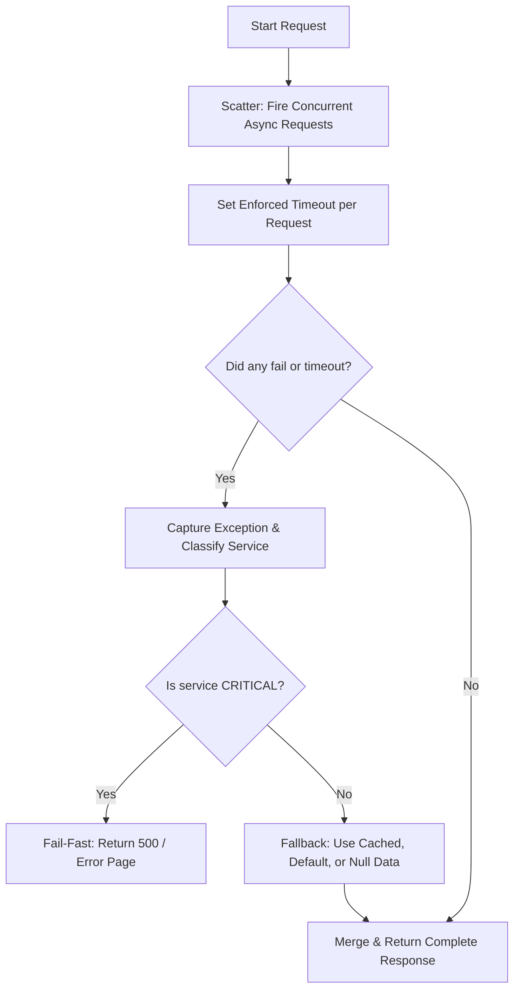

# Handling Partial Failures in Scatter-Gather Architectures

## 1. 💡 The "Big Picture" (Plain English)

### What is this in simple terms?
In a microservices architecture, a single user request often requires data from multiple downstream services. Instead of calling them one after another (which is slow), we use the **Scatter-Gather pattern**: we *scatter* (fire) requests to all services in parallel, wait for them to finish, and then *gather* (aggregate) the results into a single response. 

But what happens when one of those services crashes, throws an exception, or takes too long to respond? If we aren't careful, one slow or broken service will crash the entire request. Handling partial failures is the strategy of gracefully managing these isolated downstream failures so that the user still gets a fast, highly functional response, even if some minor details are missing.

### A Real-World Analogy
Imagine you sit down at a high-end restaurant and order a 3-course combo meal: a steak (main), truffle fries (side), and a chocolate soufflé (dessert). 

```
               [ You (The Client) ]
                        │
                        ▼
             [ Waiter (Orchestrator) ]
             ┌──────────┼──────────┐
             ▼          ▼          ▼
         [Chef A]    [Chef B]   [Chef C]
         (Steak)     (Fries)    (Dessert)
         (Success)  (Timeout)   (Burned!)
```

*   **Fail-Fast (Bad):** The pastry chef burns the soufflé. The waiter decides that since the full order cannot be completed, they will throw away your steak and fries, run to your table, and scream that the kitchen has failed. You leave starving and angry.
*   **Partial Success (Good):** The pastry chef burns the soufflé. The waiter brings out your perfectly cooked steak and hot fries. They apologize, explain that dessert is unavailable today, deduct the soufflé from your bill, and offer you a complimentary coffee instead. You leave satisfied with a good meal, despite the minor hiccup.

### Why should I care?
In a system with dozens of microservices, the probability of at least one service failing increases exponentially. If your homepage requires data from the *User Profile*, *Recent Orders*, and *Product Recommendations* services, a failure in the recommendation engine shouldn't prevent users from logging in or viewing their orders. 

By implementing partial failure strategies, you ensure **high availability** and prevent minor errors from cascading into system-wide outages.

---

## 2. 🛠️ How it Works (Step-by-Step)

Handling partial failures involves five sequential phases:



### Step 1: Fan-out (Scatter)
The orchestrator triggers asynchronous, non-blocking calls to all target services simultaneously.

### Step 2: Bounded Waiting (Timeouts)
Every individual request is protected by a strict, non-negotiable timeout. If a service does not reply within, say, 200ms, the task is aborted.

### Step 3: Exception Interception
Instead of letting exceptions bubble up to the main orchestrating thread, we catch and wrap exceptions at the task/future level.

### Step 4: Critical vs. Non-Critical Classification
The orchestrator checks the origin of the failure:
*   **Critical Services** (e.g., Auth, Cart): If these fail, the entire transaction is invalid. Trigger an immediate error response.
*   **Non-Critical Services** (e.g., Recommendations, Ads): If these fail, we can safely ignore them or use alternative data.

### Step 5: Merge & Graceful Degradation (Gather)
Construct the final response payload, filling in the blanks left by failed services with static defaults, cached values, or empty fields.

---

### Code Implementation (Python / `asyncio`)

Here is a clean, production-grade example of a Gateway orchestrating a scatter-gather operation with built-in partial failure handling.

```python
import asyncio
import logging
from typing import Dict, Any, Optional

logging.basicConfig(level=logging.INFO)
logger = logging.getLogger("Gateway")

# Mock downstream services with simulated behaviors
async def get_user_profile(user_id: str) -> Dict[str, Any]:
    await asyncio.sleep(0.05)  # Fast success
    return {"user_id": user_id, "name": "Alice"}

async def get_orders(user_id: str) -> Dict[str, Any]:
    await asyncio.sleep(0.1)   # Success
    return {"orders": [{"id": "101", "total": 99.99}]}

async def get_recommendations(user_id: str) -> Dict[str, Any]:
    await asyncio.sleep(0.5)   # Oh no! This is too slow (Simulated Timeout)
    return {"items": ["item1", "item2"]}

async def get_ads(user_id: str) -> Dict[str, Any]:
    # Simulated crash / internal exception
    raise RuntimeError("Ad Auction engine is down!")


async def handle_task_with_fallback(
    task_name: str, 
    coro, 
    timeout: float, 
    fallback_value: Any
) -> Any:
    """
    Wraps an async task, enforcing a timeout and swallowing exceptions 
    by returning a fallback value.
    """
    try:
        # Enforce strict execution boundary
        return await asyncio.wait_for(coro, timeout=timeout)
    except asyncio.TimeoutError:
        logger.warning(f"Task '{task_name}' timed out after {timeout}s.")
        return fallback_value
    except Exception as e:
        logger.error(f"Task '{task_name}' failed with exception: {str(e)}")
        return fallback_value


async def get_homepage_dashboard(user_id: str) -> Dict[str, Any]:
    # Define timeouts per service based on their SLAs
    PROFILE_TIMEOUT = 0.2
    ORDERS_TIMEOUT = 0.3
    REC_TIMEOUT = 0.15  # Strict timeout for non-critical service
    ADS_TIMEOUT = 0.1

    # 1. Scatter (Execute tasks in parallel)
    # Critical tasks: If these fail, the whole dashboard fails.
    profile_task = asyncio.create_task(get_user_profile(user_id))
    orders_task = asyncio.create_task(get_orders(user_id))

    # Non-critical tasks: Wrapped in resilient wrapper with safe fallbacks
    rec_task = handle_task_with_fallback(
        task_name="recommendations",
        coro=get_recommendations(user_id),
        timeout=REC_TIMEOUT,
        fallback_value={"items": []} # Safe fallback: empty recommendations
    )
    
    ads_task = handle_task_with_fallback(
        task_name="ads",
        coro=get_ads(user_id),
        timeout=ADS_TIMEOUT,
        fallback_value={"ads": []}  # Safe fallback: no ads
    )

    # Gather critical paths first
    try:
        profile, orders = await asyncio.gather(
            asyncio.wait_for(profile_task, timeout=PROFILE_TIMEOUT),
            asyncio.wait_for(orders_task, timeout=ORDERS_TIMEOUT)
        )
    except Exception as e:
        # A critical service failed. We cannot fulfill this request.
        logger.critical(f"Critical service failed. Aborting request. Error: {e}")
        raise RuntimeError("Core dashboard services are unavailable.") from e

    # Gather non-critical paths (exceptions already handled internally)
    recs, ads = await asyncio.gather(rec_task, ads_task)

    # 2. Gather (Aggregate results)
    return {
        "user": profile,
        "orders": orders,
        "recommendations": recs,
        "advertisements": ads,
        "status": "PARTIAL_SUCCESS" if (not recs.get("items") or not ads.get("ads")) else "SUCCESS"
    }

# Run the simulation
if __name__ == "__main__":
    result = asyncio.run(get_homepage_dashboard("user_999"))
    print("\n--- Final Aggregated Response JSON ---")
    import json
    print(json.dumps(result, indent=2))
```

---

## 3. 🧠 The "Deep Dive" (For the Interview)

### The Technical "Magic" Under the Hood
To execute this efficiently without degrading the orchestrator itself, you must understand the interaction between **event loops (or thread pools)** and **asynchronous non-blocking I/O**.

1.  **Thread Pool Saturation vs. Event-Driven Concurrency**: 
    If you use a synchronous framework (like Spring Boot with standard Tomcat threads), fanning out requests requires pulling threads from a thread pool. If a downstream service slows down, your orchestrator's threads will block, waiting for timeouts. Under heavy load, this leads to **Thread Pool Starvation**, causing the orchestrator to crash or refuse new connections. 
    *Solutions:* Use non-blocking I/O (like Project Reactor in Java, `asyncio` in Python, or Node.js) where a single operating system thread manages thousands of concurrent downstream connections via system multiplexing APIs like `epoll` or `kqueue`.
2.  **Context and Task Cancellation**:
    If a critical task fails *early*, or the client closes the connection, the orchestrator should not waste resources waiting for the remaining non-critical tasks to finish. In modern systems, we use structured concurrency (such as Go's `context.Context` or C#'s `CancellationToken`). When the parent context is cancelled, cancellation signals are propagated down the network stack to abort pending HTTP requests immediately, freeing socket buffers and downstream processing power.

### How to Represent Partial Failures in API Contracts
How does the UI layer know something went wrong?

*   **HTTP 207 Multi-Status:** An RFC-compliant way to represent mixed success/failure statuses for individual resource elements.
*   **GraphQL Error Fields:** The gold standard for partial failures. GraphQL natively supports returning partial data alongside an `errors` array, showing exactly which resolvers failed and why.
*   **Response Metadata Flag:** Adding a top-level execution status block in your JSON (e.g., `_metadata: { "status": "PARTIAL_CONTENT", "failed_services": ["ads"] }`).

### Trade-offs & Engineering Decisions

| Strategy | Pros | Cons |
| :--- | :--- | :--- |
| **Fail-Fast** | Clean code; zero data inconsistency; trivial client-side implementation. | Terrible user experience; poor system availability; highly fragile. |
| **Fail-Silent (Null/Empty Fallbacks)** | Highly resilient UI; isolating failures yields high availability metrics. | Clients must handle missing/empty payloads elegantly; hard to debug silent failures. |
| **Stale Cache Fallback** | Superior UX (users see real, though slightly outdated, data). | Cache overhead; potential to show heavily outdated/inconsistent data. |

---

### Interviewer Probes (Tricky Questions & Winning Answers)

#### **Q1: "If a non-critical downstream service times out, how do we prevent our orchestrator from repeatedly waiting for it and degrading our global p99 latency?"**
> **Answer:** We combine two patterns: **Strict Client-Side Timeouts** and **Dynamic Circuit Breakers**. First, we never use default timeouts; our timeouts must be set based on the downstream service's p99.5 latency SLA. Second, if a service starts timing out continuously, our Circuit Breaker (like Resilience4j or Envoy's breaker) trips. Once tripped, the orchestrator bypasses the actual network call entirely and immediately injects the fallback value. This protects our system's latency profile and gives the failing service room to recover.

#### **Q2: "Your critical task failed, so you threw an exception. But what happens to the socket connections of the other 3 non-critical tasks that were running in parallel? Do they just hang?"**
> **Answer:** In a naive implementation, yes, they continue executing in the background, wasting network and CPU resources. In a resilient architecture, we use **Cooperative Task Cancellation**. When the critical task fails, the orchestrator catches the failure and calls `.cancel()` on the remaining active futures/promises. In Go, this is done by cancelling the request `Context`. This triggers the runtime to abort the TCP socket connections immediately, sending a TCP RST or FIN packet to downstream services to reclaim resources.

#### **Q3: "If you're returning a `200 OK` with partial data (e.g., empty ads), how do you prevent your monitoring tools (like Datadog or Prometheus) from thinking everything is 100% healthy?"**
> **Answer:** We separate **Transport Status** from **Business Metrics**. While the HTTP status is `200` to deliver the UI payload, we publish custom application metrics to our monitoring agents. We emit a counter metric like `service.scatter_gather.partial_success` with tags identifying the failed dependencies (e.g., `failed_dependency:ads`). We also ensure that internal errors are logged with appropriate correlation IDs, so our log aggregators track downstream failures despite the successful edge delivery.

---

## ✅ Summary Cheat Sheet

### 3 Key Takeaways
1.  **Isolate Execution Boundaries**: Always wrap concurrent downstream calls in try/catch blocks *at the task level* to prevent a single downstream error from terminating the parent thread.
2.  **Enforce Hard Timeouts**: Never rely on default network timeouts (which can be up to 60 seconds). Set timeouts aggressively based on target service SLAs.
3.  **Differentiate Core vs. Context**: Classify dependencies upfront. Critical services trigger a fail-fast strategy; non-critical services yield a graceful degradation strategy.

### 💡 The Golden Rule
> **"Some data is infinitely better than no data."** 
> *Design your gateway so that your core system remains functional and responsive even if the peripheral world is burning around it.*