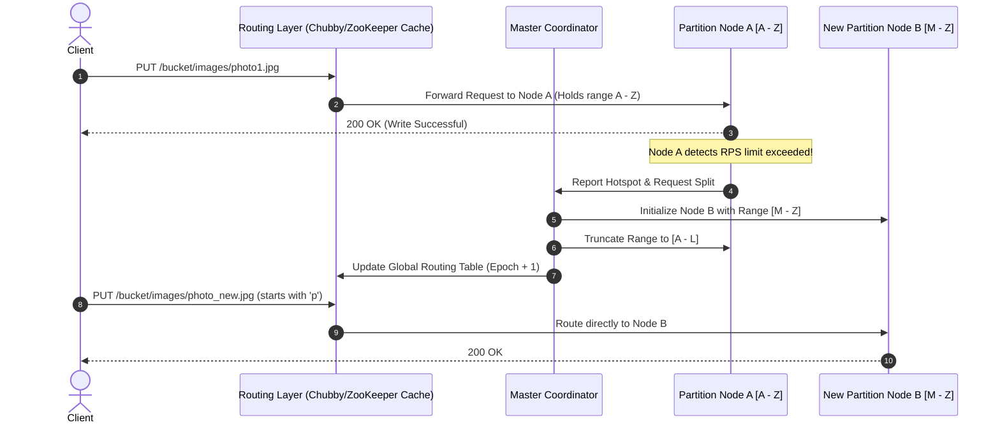

# Scale-Out Prefix Partitioning and Hotspot Management

## 1. 💡 The "Big Picture" (Plain English)

### What is this in simple terms?
Imagine you run a massive, worldwide parcel delivery warehouse. Instead of putting packages in random piles, you organize them alphabetically by the customer’s last name. Under normal circumstances, this works perfectly. 

But what happens if a global celebrity named "Smith" suddenly holds a massive giveaway? Overnight, millions of packages arrive, all addressed to "Smith." The worker managing the "S" aisle is crushed under the weight of requests, while workers in the "A," "M," and "Z" aisles are sitting idle. 

In system design, this is called a **hotspot**. 

**Prefix Partitioning** is the art of dynamically splitting the overloaded "S" aisle into smaller, manageable sections (e.g., "Smi," "Smo," "Smu") and assigning new workers to those sections on the fly without interrupting the warehouse operations.

```
[ All Keys (A-Z) ] ──( Overloaded "S" )──► [ Split Dynamically ] ──► [ S - Smi ] (Worker 1)
                                                                 └── [ Smj - Sz ] (Worker 2)
```

### Why should I care?
When designing an enterprise-grade object storage system (like AWS S3), you cannot rely on a single database server to store the metadata (the list of file names, sizes, and locations) for billions of files. You must distribute this metadata across a cluster of database machines. 

If your users upload thousands of files per second using sequential names (like `/logs/2023-10-27-01-file.log`, `/logs/2023-10-27-02-file.log`), those files will all map to the same metadata partition. Without dynamic prefix partitioning and hotspot mitigation:
* Your storage cluster will experience **unbalanced load**.
* Your write throughput will drop to zero due to locking and resource exhaustion on a single metadata node.
* Your users will receive painful `503 Slow Down` errors.

---

## 2. 🛠️ How it Works (Step-by-Step)

### The Life of a Key-Range Split
When files are written, they are lexicographically sorted (alphabetically ordered). Here is how the storage cluster manages this under the hood:

1. **Initial State**: A single metadata partition (let's call it Partition A) owns the entire key range from `""` (empty string) to `"\xFF"` (highest possible byte).
2. **The Surge**: An application begins writing 10,000 files per second under the prefix `/user-uploads/avatars/`.
3. **Threshold Breached**: The partition monitor detects that Partition A has exceeded its performance limits (e.g., 3,500 PUT/POST/DELETE requests per second).
4. **The Split Decision**: The control plane identifies the split point—usually the median key within the high-traffic range (e.g., `/user-uploads/avatars/m`).
5. **Aisle Creation (The Split)**: Partition A splits into Partition A1 (`""` to `/user-uploads/avatars/m`) and Partition A2 (`/user-uploads/avatars/m\x00` to `\xFF`).
6. **Routing Update**: The global router's cache is updated, directing traffic for newer uploads to the newly assigned partition nodes.

### Code Blueprint: Dynamic Partition Router

Below is a clean, production-grade conceptual Python implementation of how a Prefix Router monitors request frequencies and dynamically splits key ranges when thresholds are breached.

```python
import time
from typing import Dict, List, Tuple, Optional

class Partition:
    def __init__(self, start_key: str, end_key: str):
        self.start_key = start_key
        self.end_key = end_key
        self.keys: List[str] = []
        self.request_count = 0
        self.last_reset = time.time()

    def contains(self, key: str) -> bool:
        return self.start_key <= key <= self.end_key

    def record_request(self):
        # Reset counters every second to measure RPS (Requests Per Second)
        now = time.time()
        if now - self.last_reset > 1.0:
            self.request_count = 0
            self.last_reset = now
        self.request_count += 1

    def is_hot(self, threshold: int) -> bool:
        return self.request_count > threshold

    def find_split_point(self) -> str:
        """Finds the median key to ensure a balanced split."""
        if not self.keys:
            return self.start_key + "m" # Fallback dummy split
        sorted_keys = sorted(self.keys)
        median_index = len(sorted_keys) // 2
        return sorted_keys[median_index]


class ScaleOutRouter:
    def __init__(self, rps_threshold: int = 100):
        self.rps_threshold = rps_threshold
        # Start with a single partition handling all keys
        self.partitions: List[Partition] = [Partition("", "\xFF")]

    def get_partition(self, key: str) -> Partition:
        for partition in self.partitions:
            if partition.contains(key):
                return partition
        raise ValueError("Key outside of valid ranges")

    def write_key(self, key: str) -> None:
        partition = self.get_partition(key)
        partition.keys.append(key)
        partition.record_request()

        # Check if partition has become a hotspot
        if partition.is_hot(self.rps_threshold):
            self._split_partition(partition)

    def _split_partition(self, old_partition: Partition) -> None:
        split_point = old_partition.find_split_point()
        
        # Prevent splitting if split point matches boundary
        if split_point == old_partition.start_key or split_point == old_partition.end_key:
            return

        print(f"🔥 Hotspot detected on range [{old_partition.start_key} - {old_partition.end_key}]!")
        print(f"⚡ Splitting partition at key: '{split_point}'")

        # Create two new child partitions
        child_one = Partition(old_partition.start_key, split_point)
        child_two = Partition(split_point + "\x00", old_partition.end_key)

        # Distribute existing keys to the new child partitions
        for k in old_partition.keys:
            if child_one.contains(k):
                child_one.keys.append(k)
            else:
                child_two.keys.append(k)

        # Update the active partition list
        idx = self.partitions.index(old_partition)
        self.partitions[idx:idx+1] = [child_one, child_two]


# --- Demonstration ---
if __name__ == "__main__":
    router = ScaleOutRouter(rps_threshold=5)
    
    # Simulate a steady stream of writes to a single prefix
    hot_prefix = "/bucket/images/avatar_"
    for i in range(12):
        key = f"{hot_prefix}{i:03d}"
        router.write_key(key)
        time.sleep(0.1)  # Simulate delay

    print("\nFinal Partition Map:")
    for i, p in enumerate(router.partitions):
        print(f" Partition {i}: Range ['{p.start_key}' to '{p.end_key}'] holding {len(p.keys)} keys")
```

### System Architecture Flow



---

## 3. 🧠 The "Deep Dive" (For the Interview)

This is where we separate the juniors from the seniors. When designing a petabyte-scale metadata storage engine, the devil is in the details of **consistency, distribution, and storage engine physics**.

### Lexicographical Sorting vs. Consistent Hashing
In typical distributed key-value stores (like DynamoDB or Cassandra), **Consistent Hashing** is used to distribute keys evenly across nodes. This naturally prevents hotspots because sequential keys like `file_1`, `file_2`, and `file_3` hash to entirely different servers.

**So why does S3 use Lexicographical (range-based) Partitioning?**
* **The List Requirement**: Object storage systems must support directory-like listings (e.g., `ListObjectsV2(prefix="/images/2023/")`).
* If keys were hashed, a list operation would require querying **every single node** in the entire cluster and sorting the merged results in memory (a highly inefficient fan-out scatter-gather operation).
* By keeping keys sorted lexicographically, a prefix list operation is a highly efficient sequential scan on a single partition (or a contiguous set of partitions).

### The Trade-off: The Sequential Write Bottleneck
Because keys are kept in alphabetical order, if an application names its files using an auto-incrementing integer or a timestamp prefix (e.g., `2023-10-27-12-00-00-file.png`), **every single write** will hit the exact same partition (the very end of the range). 

```
Partition 1 [0000 - 4999]  ---> Idle
Partition 2 [5000 - 9999]  ---> Idle
Partition 3 [10000 - 15000] ---> 🔥 Melting (All new writes hit this range)
```

To resolve this, systems rely on **Dynamic Partition Splitting**. However, splitting takes time (minutes). For flash-crowd events, S3 engineers used to advise users to prepend a 3-to-4 character hex-hash to the front of their keys (e.g., `4a2d-images/file.png`) to pre-shard the namespace across multiple partitions. Modern storage fabrics do this automatically, but understanding this legacy limitation is a major green flag for interviewers.

### The Dynamic Split Protocol: Avoiding Split-Brain & Stale Routing
When a partition splits, how do we guarantee consistency without locking the database?

1. **Epoch-Based Routing Tables**: The routing table contains a version number (Epoch). When a split occurs, the Master increases the Epoch.
2. **Soft Routing Failures**: If a client or router tries to write to Node A with an outdated routing map, Node A detects that the written key is outside its newly truncated boundary.
3. **Optimistic Error Handling**: Node A rejects the request with a specialized internal code (e.g., `StaleEpoch`). The Router intercepts this, fetches the new routing map from the metadata catalog, and transparently retries the request against Node B.

---

### Interviewer Probes (How they'll try to trick you)

#### 🎙️ Probe 1: "During a partition split, what happens to writes that occur *during* the migration window? Do we lose writes or block the client?"
* **The Trap**: Answering that we put a global lock on the partition and freeze writes. This violates high-availability constraints.
* **The Senior Answer**: "No, we do not block. We use an **append-only log migration model**. When Partition A splits, it creates a read-only snapshot of its metadata. Writes are buffered or dual-written to a temporary transaction log. Once the new partition Node B has caught up to the snapshot state, it replays the buffered transaction log. The active routing pointer is swapped atomically using a distributed consensus protocol (like Paxos or Raft), resulting in zero downtime and sub-millisecond switchover times."

#### 🎙️ Probe 2: "What if we have a read-hotspot rather than a write-hotspot? Splitting a partition won't help if millions of users are reading the *exact same* single file."
* **The Trap**: Confusing storage partition splitting with content distribution.
* **The Senior Answer**: "Partition splitting only scales metadata and write IOPS. For a read-hotspot on a single object, splitting the metadata range does not help because the asset itself lives on a single storage node. To mitigate this, we employ two layers of defense:
  1. **CDN Caching (CloudFront/Edge)**: Offload GET traffic entirely from the origin.
  2. **Storage-Node Replica Sharding**: If a read request bypasses the CDN, the storage layer dynamically spawns temporary read-replicas of the high-demand object block and load-balances read requests across those replicas using consistent hashing."

---

## 4. ✅ Summary Cheat Sheet

### 3 Key Takeaways
1. **Alphabetical Over Hashing**: Scalable object storage metadata relies on lexicographical (range-based) partitioning to ensure fast file-listing operations, unlike traditional distributed databases that use consistent hashing.
2. **Dynamic Splitting is Key**: To prevent sequential write patterns from melting single metadata nodes, the storage orchestrator monitors requests-per-second (RPS) per partition and splits high-traffic ranges dynamically.
3. **The Metadata/Data Separation**: Partition splitting scales metadata lookups, but CDN caching and block replication scale read paths for highly accessed static files.

### 🌟 The Golden Rule
> **"To list files efficiently, keep them alphabetical; to write them at scale, split them dynamically; and to read them instantly, cache them at the edge."**