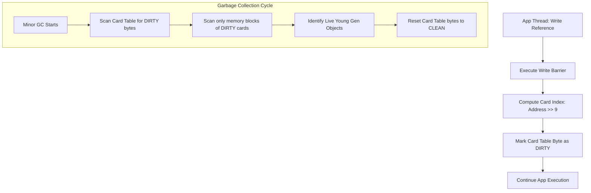

# Card Tables & Remembered Sets (RSets): Tuning Cross-Generational References

## 1. 💡 The "Big Picture" (Plain English)

### What is this in simple terms?
Imagine you are cleaning your bedroom (the **Young Generation**). It’s small, messy, and you clean it often because things change quickly. 

Now, imagine the rest of your massive house (the **Old Generation**) is filled with heavy furniture and storage boxes that rarely move. 

During your quick bedroom clean-up, you want to throw away trash. But wait! What if some item in your bedroom is currently being held or used by a giant machine sitting in the basement (the Old Generation)? If you throw it away, the machine will break. 

To make sure you don't accidentally throw away bedroom items still needed by the basement, you *could* walk through the entire house, examining every single room and box. But that would take hours, completely defeating the purpose of a "quick" bedroom clean-up.

Instead, you place a **sticky note** on the basement door whenever someone connects a machine in the basement to something in your bedroom. When cleaning your bedroom, you only look at the doors with sticky notes. 

In virtual machines (like the JVM), the **Card Table** is that grid of sticky notes, and the **Remembered Set (RSet)** is the log of what those notes point to.

```
+-------------------------------------------------------------+
|                     THE ENTIRE HEAP                         |
|                                                             |
|  +--------------------+      +---------------------------+  |
|  |   YOUNG GEN        |      |       OLD GEN             |  |
|  |                    |      |  [Card] [Card] [Dirty]    |  |
|  |  [Object A] <----------ref-- [Object B]               |  |
|  +--------------------+      +---------------------------+  |
+-------------------------------------------------------------+
                                       ^
                                       |
                       Card marked "Dirty" in Card Table
```

### Why should I care?
If your system didn't have Card Tables, every single minor garbage collection (which should take milliseconds) would have to scan the entire Old Generation heap (which could be hundreds of gigabytes). Your application would suffer from massive, unpredictable latency spikes. 

Understanding this mechanism allows you to tune high-throughput, write-heavy systems where "write barriers" and card-table scanning can become your silent CPU bottlenecks.

---

## 2. 🛠️ How it Works (Step-by-Step)

The JVM divides the Old Generation memory into small, fixed-size memory zones called **Cards** (typically $512$ bytes each). 

The **Card Table** is simply a byte array where each byte represents one Card in the heap.

Here is the exact step-by-step lifecycle of how a cross-generational reference is tracked and cleaned:

1. **The Reference Update (The Mutator Event):**
   An application thread updates a reference field of an object living in the Old Generation so that it now points to an object in the Young Generation.
2. **The Write Barrier (The Interception):**
   Before the reference is actually written in memory, the JIT-compiled code intercepts the write. It calculates which $512$-byte "Card" contains the Old Generation object.
3. **Dirtying the Card (The Marking):**
   The byte in the Card Table corresponding to that Card is flagged as `0x01` (meaning **"Dirty"**).
4. **Minor GC Execution (The Scan):**
   When a minor GC occurs, the GC garbage collector ignores $99\%$ of the Old Generation. It *only* scans the memory cards marked as "Dirty" in the Card Table to find the root references pointing to the Young Generation.
5. **The Clean-Up (Reset):**
   After the GC identifies live objects and moves them, it clears the dirty flags in the Card Table back to `0x00` (clean).

### The Code: Under the Hood of a Write Barrier

Here is a conceptual look at what the JIT compiler generates when your application executes a simple assignment:

```java
// What you write in your application code:
oldGenObject.youngGenField = youngGenObject;
```

```cpp
// What the JIT compiler / VM actually executes under the hood (C++ style pseudocode):
void write_barrier(oop* field_address, oop new_value) {
    // 1. Perform the actual memory write
    *field_address = new_value; 
    
    // 2. Locate where in memory this write happened
    size_t address = (size_t)field_address;
    
    // 3. Right-shift the address to find the corresponding Card index.
    // Shifting by 9 is equivalent to dividing by 512 (2^9 = 512).
    size_t card_index = address >> 9; 
    
    // 4. Mark this specific card byte as "Dirty" (0 translates to dirty in some GCs, 1 in others)
    BYTE_MAP_BASE[card_index] = DIRTY_CARD_VAL; 
}
```

### Architectural Flow of a Write Barrier



---

## 3. 🧠 The "Deep Dive" (For the Interview)

### The Technical Magic (Internals)
The division of heap memory into $512$-byte chunks is a carefully chosen hardware compromise. 

If cards were smaller (e.g., $64$ bytes), the Card Table array would be massive, hogging valuable cache space. If cards were larger (e.g., $4096$ bytes), the GC would waste time scanning too much clean memory inside a "dirty" card (a problem known as **pointless scanning**).

#### Card Tables vs. Remembered Sets (RSets)
While generational collectors like Parallel GC or CMS use simple Card Tables, region-based collectors like **G1 (Garbage-First)** use a more complex, two-layered structure:
* **Card Table:** A global structure representing the state of all memory cards.
* **Remembered Set (RSet):** Points to the actual locations containing cross-region references. G1 allocates one RSet *per region*. An RSet is a "points-into" table: it tells Region B who is pointing to it from Region A. This allows G1 to collect any individual region independently without scanning the rest of the heap.

```
[ Region A (Old Gen) ] ---> contains Card #42 ---> points to ---> [ Region B (Young Gen) ]
                                                                     ^
                                                                     |
                                                       Region B's RSet records: "Region A, Card #42"
```

### The Trade-offs

#### 1. Mutator Latency vs. GC Pause Time
* **The Benefit:** Minor GCs remain lightning-fast and scale with the number of *live young objects*, rather than the total size of the Old Generation.
* **The Cost:** Every single object reference update in your application code pays a CPU tax (the write barrier). This adds extra CPU instructions to what should be a simple memory store.

#### 2. Memory Footprint
The Card Table itself requires memory. Since $1$ byte of the Card Table represents $512$ bytes of heap, the overhead is fixed at roughly **$0.2\%$ of the total heap size** (e.g., $40\text{ MB}$ for a $20\text{ GB}$ heap). In G1, RSets can consume up to **$5\%$ to $10\%$** of the total heap space to maintain highly granular reference tracking.

---

### Interviewer Probes (The Tricky Questions)

#### Probe 1: "What is 'False Sharing' in Card Tables, and how does the JVM mitigate it?"
* **The Trap:** The interviewer wants to see if you understand hardware CPU caches and how JVM internals interact with multi-threaded hardware.
* **The Explanation:** 
  Modern CPUs load memory in $64$-byte cache lines. Because $1$ byte of the Card Table represents $512$ bytes of heap, a single $64$-byte CPU cache line contains $64$ card table entries, representing $32\text{ KB}$ of contiguous heap.
  If Thread A (running on Core 1) updates an object in Card 1, and Thread B (running on Core 2) updates an object in Card 2, both threads will attempt to write to the *same* CPU cache line of the Card Table. This triggers a **cache invalidation storm** (False Sharing), forcing the CPU cores to constantly sync their caches, which degrades performance.
* **The Solution:** 
  You can tune this in the JVM using the flag `-XX:+UseCondCardMark`. This flag introduces a conditional check *before* writing to the card table:
  ```cpp
  if (BYTE_MAP_BASE[card_index] != DIRTY_CARD_VAL) {
      BYTE_MAP_BASE[card_index] = DIRTY_CARD_VAL;
  }
  ```
  This prevents unnecessary writes to the Card Table if the card is already dirty, saving the CPU cache line from bouncing between cores.

#### Probe 2: "If your application has highly write-intensive workloads (e.g., loading a massive in-memory database), what GC overhead do you expect to see?"
* **The Explanation:** 
  With massive write throughput, the mutator threads are constantly executing write barriers, dirtying card table entries. This results in:
  1. **High CPU consumption** due to the write barrier execution.
  2. **Longer GC pauses** because the garbage collector has to scan a very high percentage of dirty cards during Young Gen collection, turning a "quick clean" into a near-full heap scan.
* **The Tuning Strategy:** 
  You can increase the size of the Young Generation (to lessen the frequency of minor collections) or adjust G1 RSet updating threads using `-XX:G1ConcRefinementThreads` to process cards concurrently while the application is running, preventing GC pause spikes.

---

## 4. ✅ Summary Cheat Sheet

### 3 Key Takeaways
1. **The Card Table** is a compact byte array (1 byte per 512 bytes of heap) used to track where Old-to-Young generation references exist.
2. **Write Barriers** are JIT-injected code snippets that intercept object reference changes to flag ("dirty") these card zones in real-time.
3. **Region-based GCs (like G1)** expand on this by using **Remembered Sets (RSets)** on a per-region level, allowing any memory region to be collected independently.

### 1 "Golden Rule"
> **The write barrier is a tax on writes to buy cheap reads.** If your application is highly write-intensive and GC pause times are spiking, look closely at Card Table dirtying rates and turn on `-XX:+UseCondCardMark` to prevent CPU cache thrashing.