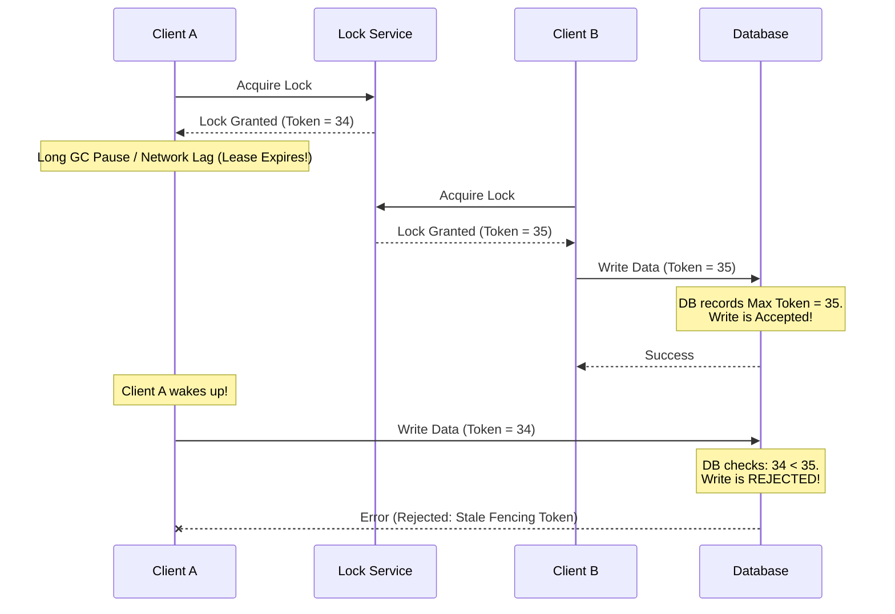

# The Fencing Token Pattern: Handling Distributed Lock and Lease Expiration Exceptions

## 1. 💡 The "Big Picture" (Plain English)

### What is this in simple terms?
Imagine you are building a system where only one server at a time is allowed to update a critical database file. To prevent other servers from stepping on its toes, you use a **Distributed Lock** (like Redis or ZooKeeper). 

But what happens when the network lags, or a server freezes for 10 seconds due to garbage collection? Its lock expires (throws a timeout exception), and another server grabs the lock. When the frozen server suddenly "wakes up," it doesn't realize it has lost its lock. It happily writes its data anyway, corrupting your database.

The **Fencing Token Pattern** is the ultimate safety guard for this scenario. It ensures that even if a server tries to write to a resource after its lock has expired, the database will identify it as a "stale" request and reject it.

---

### A Real-World Analogy
Think of a hotel with a digital check-in system. 

1. **Guest A** checks into Room 101. The front desk issues a keycard with **Version 1**.
2. Guest A goes to their room but gets stuck in the elevator for 2 hours. 
3. Because Guest A didn't show up, the front desk assumes they canceled, cancels their booking, and rents the room to **Guest B**.
4. Guest B gets a keycard with **Version 2**. Guest B enters the room and unpacks.
5. Suddenly, Guest A escapes the elevator, runs to Room 101, and swipes their Version 1 card.

If the door lock only checked *if* the card belonged to Guest A, Guest A would walk in and cause chaos. However, because the door lock is smart, it checks the **Version Number**. Since Version 2 has already been registered, the door rejects the Version 1 card. Guest A is **fenced out**.

---

### Why should I care? What problem does it solve for me today?
If you are using distributed locks (e.g., Redlock, Curator) to protect shared resources like databases, file storage, or third-party APIs, **locks will eventually fail due to network hiccups or JVM pauses**. 

Without Fencing Tokens, you face silent data corruption—the hardest kind of bug to debug. This pattern guarantees safety and consistency even when your infrastructure experiences unexpected latency spikes and lock-expiration exceptions.

---

## 2. 🛠️ How it Works (Step-by-Step)

Here is how a fencing token secures your writes when a lease/lock expires:

1. **Acquire Lock:** Client A requests a lock from the Lock Service.
2. **Receive Token:** The Lock Service grants the lock along with a **Fencing Token** (a strictly increasing number, e.g., `34`).
3. **The Exception/Pause:** Client A pauses (due to a GC pause or network partition). Its lease expires.
4. **New Lock Granted:** Client B requests the lock. The Lock Service grants it with token `35`.
5. **Successful Write:** Client B writes to the Database, passing token `35`. The Database stores `35` as the *highest seen token* and accepts the write.
6. **The Late Write:** Client A wakes up, unaware its lock expired, and tries to write to the Database with token `34`.
7. **Fenced Out:** The Database checks: `34 < 35`. It rejects Client A's write, preventing data corruption.



### Code Implementation (Python)

Here is a clean, well-commented implementation showing how a Storage/Database Engine validates fencing tokens.

```python
import time
from dataclasses import dataclass
from typing import Dict, Any, Tuple

@dataclass
class Lock:
    client_id: str
    token: int
    expires_at: float

class DistributedLockService:
    """Simulates a Lock Service (like ZooKeeper or etcd) generating monotonic tokens."""
    def __init__(self):
        self._current_token = 0
        self._active_lock: Lock = None

    def acquire_lock(self, client_id: str, lease_duration: float = 2.0) -> Tuple[bool, int]:
        self._current_token += 1
        expires_at = time.time() + lease_duration
        self._active_lock = Lock(client_id, self._current_token, expires_at)
        return True, self._current_token

    def is_lock_valid(self, client_id: str, token: int) -> bool:
        if not self._active_lock:
            return False
        # Check if lock was taken by someone else or expired
        if self._active_lock.client_id != client_id or self._active_lock.token != token:
            return False
        if time.time() > self._active_lock.expires_at:
            return False # Lock expired!
        return True


class FencedDatabase:
    """A database that enforces the Fencing Token Pattern to prevent stale writes."""
    def __init__(self):
        self._data: Dict[str, Any] = {}
        self._highest_seen_token = 0

    def write(self, key: str, value: Any, token: int) -> bool:
        # Core Fencing Logic
        if token < self._highest_seen_token:
            print(f"[REJECTED] Write '{key}={value}' with Token {token} denied. Current DB Token threshold is {self._highest_seen_token}.")
            return False
        
        # Accept write and update the high-water mark
        self._highest_seen_token = token
        self._data[key] = value
        print(f"[ACCEPTED] Write '{key}={value}' with Token {token} succeeded!")
        return True


# --- Simulation of the Failure Scenario ---

db = FencedDatabase()
lock_service = DistributedLockService()

# 1. Client A gets lock with token 1
success, token_A = lock_service.acquire_lock("Client-A")
print(f"Client A acquired lock with Token: {token_A}")

# 2. Client A goes to sleep (simulating a GC Pause / Network Partition)
print("Client A enters a long GC pause...")
time.sleep(3.0)  # Exceeds the 2.0s lease duration

# 3. Client B comes in, sees Client A's lock expired, and grabs a new lock
success, token_B = lock_service.acquire_lock("Client-B")
print(f"Client B acquired lock with Token: {token_B}")

# 4. Client B writes successfully
db.write("user_profile", "Data from Client B", token_B)

# 5. Client A wakes up from GC pause and tries to write with its stale token
print("Client A wakes up and attempts to write...")
db.write("user_profile", "Data from Client A (Stale)", token_A)
```

---

## 3. 🧠 The "Deep Dive" (For the Interview)

### The Technical Magic: How it Works Internally
Under the hood, this pattern leverages **Monitonic Logical Clocks** and **Stateful Gatekeeping**. 

1. **The Lock Service (Consensus Engine):** Services like ZooKeeper (using `zxid` or sequential znodes) or etcd (using `revision` numbers) act as the source of truth. They use a consensus protocol (Raft/Paxos) to guarantee that every time a lock is acquired, the accompanying token is **linearly and strictly increasing** ($T_{new} > T_{old}$).
2. **The Target Storage (State Store):** The storage engine must maintain metadata containing the highest fencing token it has ever successfully processed. This is typically implemented via an **atomic Compare-And-Swap (CAS)** operation at the database row level or file header level:
   $$\text{Accept write if: } T_{\text{request}} \ge T_{\text{stored}}$$

---

### The Trade-offs

| Pros | Cons / Challenges |
| :--- | :--- |
| **Guarantees Linearizability:** Eliminates the risk of split-brain writes and silent data corruption completely. | **Requires DB Cooperation:** Your target database/file system must be modified to store and validate these tokens. |
| **Resilient to Network Partition:** Works even if the network is completely split or nodes experience arbitrary pauses. | **Increased Metadata Size:** Every record or table protected by this strategy must track the last-seen token. |

---

### Interviewer Probes (Tricky Questions & Winning Answers)

#### Probe 1: "Why can't we just use high-resolution system timestamps (NTP/Epoch milliseconds) as our fencing tokens instead of monotonic counters?"
*   **The Trap:** It sounds easy because system clocks are built-in.
*   **The Winning Answer:** 
    > "Using physical timestamps is highly dangerous in distributed systems because of **Clock Drift**. Physical clocks rely on NTP synchronization, which can cause time to jump backward or drift up to hundreds of milliseconds. If the clock on Client B's server drifts backward, it might generate a timestamp *older* than Client A's, causing the database to reject a valid write. Monotonic logical counters (like Raft terms or ZooKeeper transaction IDs) do not rely on physical time and are guaranteed to only increase, ensuring perfect ordering."

#### Probe 2: "What if the third-party API or legacy SQL database we are writing to does not support storing or validating fencing tokens?"
*   **The Trap:** Getting stuck on the database requirement.
*   **The Winning Answer:**
    > "If the storage engine cannot store the token, we can introduce a **Stateful Gatekeeper Proxy** or use **Optimistic Concurrency Control (OCC)**. For legacy SQL databases, we can add a `fencing_token` column to our schema. Before writing, we execute a single atomic transaction:
    > `UPDATE table SET value = x, last_token = :new_token WHERE id = :id AND last_token < :new_token;`
    > If the row count returned is `0`, we throw a `StaleTokenException` and abort."

#### Probe 3: "How does this pattern compare to Optimistic Locking (MVCC)?"
*   **The Trap:** Thinking they are exactly the same thing.
*   **The Winning Answer:**
    > "While similar, they solve different problems. **Optimistic Locking (MVCC)** checks if the data has changed since we last read it (e.g., `WHERE version = :read_version`). It protects against concurrent user edits. **Fencing Tokens**, on the other hand, validate the *identity and authority* of the writer. It ensures that the client performing the write still has the valid administrative right (the lock) to do so, protecting against system failures, network partitions, and process freezes."

---

## 4. ✅ Summary Cheat Sheet

### 3 Key Takeaways
1.  **Locks Are Not Absolute:** In a distributed system, a client can never know for certain if it still holds a lock at the exact moment it performs a write (due to GC pauses, CPU scheduling, or network delay).
2.  **Tokens Must Be Monotonic:** Fencing tokens must be strictly increasing, logical numbers generated by a consensus-backed coordinator (like etcd, ZooKeeper, or Consul).
3.  **Validation is Server-Side:** The database or resource being modified *must* actively validate the token and reject stale ones. A client-side check is not enough.

### 1 "Golden Rule" to Remember
> **"Never trust a client that says it has a lock; make it prove it with a newer token at the database door."**