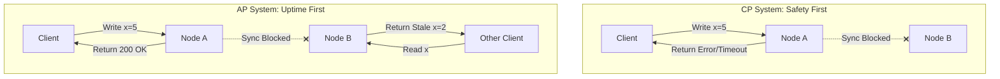

# Designing Under Duress: Engineering the Trade-offs of CP vs. AP in Distributed Systems

---

### 💡 The "Big Picture" (Plain English)

#### What is this in simple terms?
Imagine you run a global distributed database. Instead of one giant computer, you have dozens of servers (nodes) scattered across the globe, all trying to keep their data in sync. 

The **CAP Theorem** is a fundamental law of physics for these systems. It states that in the event of a **Network Partition (P)**—where some of your servers suddenly lose the ability to talk to each other—you can only guarantee one of two things:
1. **Consistency (C):** Every node returns the exact same, most recent data, even if it means some nodes must throw an error because they aren't sure they have the latest update.
2. **Availability (A):** Every healthy node returns a response immediately, even if that response contains stale or outdated data.

Because hardware fails and networks cut out, **Partition Tolerance (P) is non-negotiable.** Therefore, when a partition occurs, your architecture must make a hard choice: **Be CP or AP.**

```
               [ Network Partition (P) Occurs ]
                              |
             +----------------+----------------+
             |                                 |
     [ Choose CP ]                      [ Choose AP ]
  "Don't lie to me."                 "Don't keep me waiting."
  -> Block/Error if unsure.          -> Answer immediately.
  -> Prioritizes Correctness.        -> Prioritizes Uptime.
```

#### A Real-World Analogy
Imagine a two-branch medical clinic (one in New York, one in London) sharing an appointment ledger.
* **Under Normal Conditions:** When a patient books an appointment in New York, the receptionist calls London to sync the calendar. 
* **The Network Partition:** The transatlantic phone line goes dead. London and New York can no longer communicate.
* **The Dilemma:** A patient walks into the New York clinic and asks to book the last available surgery slot.
  * **The CP Approach (Consistency-focused):** The New York receptionist says, *"I cannot book this for you right now. I can't reach London to confirm if they just booked it. I must protect our system from double-booking."* (The system is **unavailable** for bookings, but remains perfectly **consistent**).
  * **The AP Approach (Availability-focused):** The New York receptionist says, *"Sure, I'll book that for you!"* (The system is highly **available**, but you risk a double-booking conflict if London booked the same slot at the same time—**inconsistency**).

#### Why should I care?
If you get this choice wrong, your system will fail in production:
* If you design a **banking ledger** as an **AP** system, a network hiccup could allow a user to withdraw the same $100 from two different ATMs simultaneously (Double Spending).
* If you design a **social media feed** as a **CP** system, a minor network issue between data centers will cause millions of users to see "500 Internal Server Error" instead of their friends' posts.

---

### 🛠️ How it Works (Step-by-Step)

Let's look at how a cluster behaves during a network partition.

#### The Walkthrough
1. **The Partition:** Node A and Node B lose their connection.
2. **The Write:** A client sends a write request (`Set Balance = $50`) to Node A.
3. **The CP Execution Path:** Node A attempts to replicate this change to Node B. Because it cannot reach Node B, it times out. To preserve consistency, Node A rejects the write and returns an error to the client.
4. **The AP Execution Path:** Node A accepts the write, updates its local state to `$50`, and returns a success response to the client. Node B still holds the old balance of `$100`. The system is temporarily inconsistent.

#### System State Flow



#### Code Simulation: The Decision Engine of a Node
Here is a simplified Python model demonstrating how a database node handles write operations under CP vs. AP configurations during a network partition.

```python
class DatabaseNode:
    def __init__(self, node_id, mode="CP"):
        self.node_id = node_id
        self.mode = mode  # "CP" or "AP"
        self.data = {}
        self.peers = []
        self.network_connected = True

    def simulate_partition(self):
        self.network_connected = False
        print(f"[Network] Node {self.node_id} is now isolated!")

    def write(self, key, value):
        if self.mode == "CP":
            # CP Mode: Must ensure all peers can be reached to guarantee consistency
            if not self.network_connected:
                raise RuntimeError(f"[CP Error] Node {self.node_id}: Write rejected. Cannot reach network.")
            
            # Simulate replication to peers
            for peer in self.peers:
                if not peer.network_connected:
                    raise RuntimeError(f"[CP Error] Node {self.node_id}: Replication failed to isolated peer {peer.node_id}.")
            
            self.data[key] = value
            return "[CP OK] Write committed and replicated."

        elif self.mode == "AP":
            # AP Mode: Accept write locally to maintain availability
            self.data[key] = value
            if not self.network_connected:
                return f"[AP OK] Write accepted locally on Node {self.node_id}. (Out of sync with peers!)"
            return "[AP OK] Write replicated to all healthy peers."

# --- Dry Run ---
node_a = DatabaseNode("A", mode="CP")
node_b = DatabaseNode("B", mode="CP")
node_a.peers.append(node_b)

# 1. Normal State
print(node_a.write("balance", 100))

# 2. Partition Occurs
node_a.simulate_partition()

# 3. Test CP Behavior
try:
    node_a.write("balance", 200)
except RuntimeError as e:
    print(e)  # Output: [CP Error] Node A: Write rejected.

# 4. Test AP Behavior
node_a.mode = "AP"
print(node_a.write("balance", 200))  # Output: [AP OK] Write accepted locally...
```

---

### 🧠 The "Deep Dive" (For the Interview)

To stand out to a senior engineer or systems interviewer, you must go beyond the acronyms. You need to explain the *how* and the *why*.

#### 1. How CP Systems Enforce Consistency: Distributed Consensus
CP systems cannot just "guess" if they are on the correct side of a partition. They use mathematically proven consensus algorithms like **Raft** or **Paxos** to maintain a strict state machine.

* **The Quorum Rule ($Q$):** To perform a write or read, a node must communicate with a majority (quorum) of the cluster.
$$\text{Quorum Size} = \lfloor N/2 \rfloor + 1$$
* **During a Partition:** If a 5-node cluster splits into a 3-node group and a 2-node group:
  * The 3-node group has a majority ($3 > 5/2$) and can elect a leader and continue accepting writes.
  * The 2-node group cannot achieve quorum. If a write comes to this side, it is rejected. **The system sacrifices availability to prevent a split-brain scenario.**

#### 2. How AP Systems Resolve Inconsistencies: Conflict Resolution
AP systems don't just abandon consistency forever; they settle for **Eventual Consistency**. They accept writes on any isolated node and resolve the conflicts once the network heals using:
* **CRDTs (Conflict-free Replicated Data Types):** Data structures designed to merge automatically without conflicts (e.g., LWW-Element-Set or Grow-Only Counters).
* **Vector Clocks:** Logical clocks that track the causal history of updates to detect which update happened first, or if they concurrent conflicts.
* **Last-Write-Wins (LWW):** Uses physical system timestamps to drop the older write. *Warning:* This is highly prone to data loss due to clock drift across servers.

#### PACELC: The Senior Developer's CAP Extension
In real life, partitions are rare. What happens during normal operations? Enter **PACELC**:
$$\mathbf{P} \text{artition} \rightarrow (\mathbf{A} \text{ vs } \mathbf{C}) \quad \mathbf{E} \text{lse} \rightarrow (\mathbf{L} \text{atency} \text{ vs } \mathbf{C} \text{onsistency})$$

It reads: If there is a **P**artition, how do you choose between **A**vailability and **C**onsistency? **E**lse (when everything is running fine), how do you trade off **L**atency against **C**onsistency?
* **MongoDB (PC/EC):** In a partition, it chooses Consistency. Else, it chooses Consistency (it routes reads to the primary node, adding latency but ensuring fresh data).
* **Cassandra (PA/EL):** In a partition, it chooses Availability. Else, it chooses Latency (it reads from the closest replica, sacrificing instant consistency for speed).

---

#### 🙋‍♂️ Interviewer Probes (And How to Handle Them)

##### Probe 1: "Is a 'CA' system possible? Why do we always see systems labeled only as CP or AP?"
* **The Trap:** Candidates often say "Yes, when there are no partitions."
* **The Killer Answer:** 
> "No, a CA system is a physical impossibility over an IP network. Network partitions are not an architectural 'option' we can disable; they are a physical reality of distributed infrastructure (due to severed fibers, switch failures, or VM garbage collection pauses). Since 'P' is guaranteed to happen eventually, we must design our system to behave as either CP or AP *when* it does. You cannot choose 'CA' because you cannot choose 'No Partitions'."

##### Probe 2: "If we choose an AP database like Cassandra, how do we handle a scenario where we absolutely need strong consistency for a specific operation?"
* **The Trap:** Saying "You can't, you must switch databases."
* **The Killer Answer:** 
> "Most modern AP databases allow you to configure consistency dynamically on a per-query level. In Cassandra, for instance, we can override the default AP behavior by setting the read/write consistency level to `QUORUM` or `ALL`. If we write with `QUORUM` and read with `QUORUM` ($R + W > N$), we achieve strong consistency. However, doing so temporarily turns that specific operation into a CP flow, increasing latency and risking errors if a partition is present."

---

### ✅ Summary Cheat Sheet

#### 3 Key Takeaways
1. **The CAP Theorem is a trade-off under duress:** It only forces a choice between Consistency (C) and Availability (A) **when a network partition (P) occurs**. Under normal operations, the trade-off is Latency vs. Consistency (PACELC).
2. **CP (Consistency/Partition Tolerance):** Prioritizes data integrity. If nodes cannot sync, the system returns an error. Best for transactional data (e.g., PostgreSQL with synchronous replication, Etcd, Consul).
3. **AP (Availability/Partition Tolerance):** Prioritizes uptime and low latency. Nodes return whatever data they have, even if stale, and resolve conflicts later. Best for high-throughput, non-critical data (e.g., DynamoDB, Cassandra).

#### 1 "Golden Rule" to Remember
> **"If a network split occurs: A CP system will preserve truth at the expense of uptime; an AP system will preserve uptime at the expense of truth."**