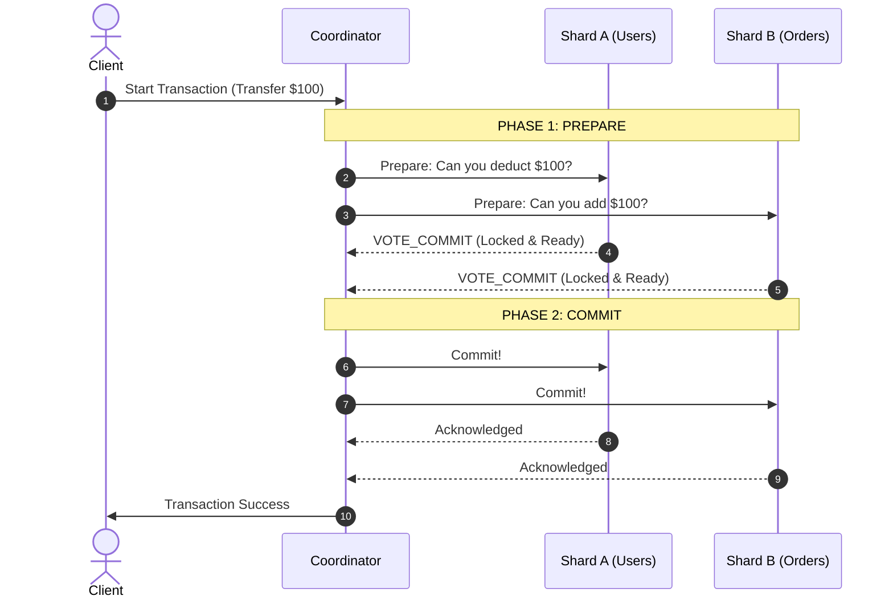

# Cross-Shard Distributed Transactions: Two-Phase Commit (2PC) vs. The Saga Pattern

---

### 1. 💡 The "Big Picture" (Plain English)

#### What is this in simple terms?
When your database grows so massive that you split it across multiple servers (sharding), a major problem arises: **How do you update data on two different servers at the exact same time safely?** 

In a single database, this is easy. The database handles it using built-in transactions (ACID). But when your "Users" table is on Server A and your "Orders" table is on Server B, they cannot easily talk to each other to guarantee that either *both* updates succeed, or *both* fail. This is the challenge of **Cross-Shard Distributed Transactions**.

#### The Real-World Analogy
Imagine booking a vacation package:
1. You book a **flight ticket** on airline-server.com.
2. You book a **hotel room** on hotel-server.com.

If the airline charges your card but the hotel system crashes and fails to reserve your room, you are in trouble. You have a flight but nowhere to sleep. 
* To fix this, you need a coordinator (like Expedia) that ensures **both** bookings are secured before charging you, or **refunds/cancels** the flight booking if the hotel booking fails.

#### Why should I care?
If you scale your database horizontally via sharding, you will eventually hit this "sharding tax." If you don't implement distributed transaction strategies correctly, your system will suffer from **data corruption, double-spending, orphan records, or massive performance bottlenecks**. Knowing how to orchestrate these transactions is what separates a mid-level engineer from a principal system architect.

---

### 2. 🛠️ How it Works (Step-by-Step)

We will look at the two industry-standard ways to solve this: **Two-Phase Commit (2PC)** (atomic but slow) and **The Saga Pattern** (eventual consistency but highly scalable).

#### Deep Dive 1: Two-Phase Commit (2PC)
2PC uses a central coordinator node to manage the transaction across shards.



#### Deep Dive 2: The Saga Pattern (Orchestrated)
Instead of locking resources across shards, a Saga executes local transactions sequentially. If one step fails, it runs **compensating transactions** (rollback steps) in reverse order.

Here is how you implement an Orchestrated Saga in Python:

```python
import uuid
import time

class BankSagaOrchestrator:
    def __init__(self, shard_a, shard_b):
        self.shard_a = shard_a  # Holds Debit Account
        self.shard_b = shard_b  # Holds Credit Account

    def execute_transfer(self, from_acc: str, to_acc: str, amount: float) -> bool:
        tx_id = str(uuid.uuid4())
        print(f"[Saga {tx_id}] Starting transfer of ${amount}...")

        # Step 1: Debit Shard A
        step1_success = self.shard_a.debit(tx_id, from_acc, amount)
        if not step1_success:
            print(f"[Saga {tx_id}] Step 1 failed. Aborting transaction.")
            return False

        # Step 2: Credit Shard B
        step2_success = self.shard_b.credit(tx_id, to_acc, amount)
        if not step2_success:
            print(f"[Saga {tx_id}] Step 2 failed! Executing compensating transactions...")
            # COMPENSATION: Refund Shard A
            self.shard_a.compensate_debit(tx_id, from_acc, amount)
            return False

        print(f"[Saga {tx_id}] Transaction completed successfully!")
        return True

# Mock Shard implementations to demonstrate compensation
class Shard:
    def __init__(self, name):
        self.name = name
        self.balances = {"acc_1": 500.0, "acc_2": 100.0}

    def debit(self, tx_id, acc, amount) -> bool:
        if self.balances.get(acc, 0) >= amount:
            self.balances[acc] -= amount
            print(f"  [{self.name}] Debited ${amount} from {acc}. Balance: {self.balances[acc]}")
            return True
        print(f"  [{self.name}] Debit failed: Insufficient funds in {acc}.")
        return False

    def credit(self, tx_id, acc, amount) -> bool:
        # Simulate a database failure on Shard B
        if acc == "corrupt_acc":
            print(f"  [{self.name}] Database write error on account {acc}!")
            return False
        self.balances[acc] = self.balances.get(acc, 0.0) + amount
        print(f"  [{self.name}] Credited ${amount} to {acc}. Balance: {self.balances[acc]}")
        return True

    def compensate_debit(self, tx_id, acc, amount):
        self.balances[acc] += amount
        print(f"  [{self.name} COMPENSATION] Refunded ${amount} to {acc}. Rollback balance: {self.balances[acc]}")

# --- Execution ---
shard_user = Shard("Shard-A-Users")
shard_order = Shard("Shard-B-Orders")
saga = BankSagaOrchestrator(shard_user, shard_order)

# Scenario: Failed credit triggers compensation rollback
saga.execute_transfer("acc_1", "corrupt_acc", 100.0)
```

---

### 3. 🧠 The "Deep Dive" (For the Interview)

#### Two-Phase Commit (2PC) Internals & The "Blocking" Problem
Under the hood, 2PC forces participants to use **Two-Phase Locking (2PL)**. 
1. During Phase 1 (Prepare), each shard acquires exclusive locks on the target rows and writes to its local **Write-Ahead Log (WAL)**. 
2. These locks **must be held** until Phase 2 (Commit/Abort) finishes over the network.

**The Catastrophic Trade-off:** 2PC is a *blocking* protocol. If the Coordinator crashes mid-transaction after shards vote "Yes" but before sending the "Commit" command, those shards are left in limbo. They *cannot* release their database locks because they do not know the global decision. Any other incoming queries waiting for those rows will block, leading to **thread pool exhaustion** and taking your entire database offline.

#### Saga Pattern Internals & Lack of Isolation
The Saga pattern trades ACID consistency for high throughput (BASE: Basically Available, Soft state, Eventual consistency). 
* **The Catch:** Sagas lack **Isolation (the 'I' in ACID)**. Since Step 1 commits to Shard A immediately before Step 2 completes, another parallel transaction can read that intermediate, unconfirmed state. This is known as a **Dirty Read**.

To handle the lack of isolation in Sagas, you must implement application-level strategies:
* **Semantic Locks:** Use a state field (e.g., `PENDING_OUTBOUND`) on the row so other transactions know not to trust that value yet.
* **Pessimistic Updates:** Check and alter balances only in the final phase of the workflow.

| Feature | Two-Phase Commit (2PC) | Saga Pattern |
| :--- | :--- | :--- |
| **Consistency** | Strong Consistency (ACID) | Eventual Consistency (BASE) |
| **Throughput** | Low (Blocking locks hold up threads) | High (Non-blocking local transactions) |
| **Complexity** | Low (Handled by DB engine/middleware) | High (Requires writing rollback logic) |
| **Recovery** | Coordinator-driven replay | Programmatic Compensation |

---

#### 🙋‍♂️ Interviewer Probes (How they'll try to trick you)

> **Interviewer:** *"If a node in a 2PC setup recovers after a network partition, how does it know whether to Commit or Abort the pending transaction?"*

**Your Answer:** "It must read its local Write-Ahead Log (WAL). If it logged a `VOTE_COMMIT` but has no record of a global `COMMIT` or `ABORT`, it cannot make the decision on its own. It must query the coordinator or peer shards to learn the transaction's fate. If the coordinator is unreachable, the node must continue holding its locks to guarantee consistency, even if it degrades performance."

> **Interviewer:** *"What happens if a compensating action in a Saga pattern fails? For instance, what if refunding the credit card fails because the gateway is down?"*

**Your Answer:** "Compensating actions *cannot* fail. In a production Saga, compensating actions must be **idempotent** (can be retried safely multiple times) and backward-compatible. If a compensation fails due to system downtime, the orchestrator must retry it with exponential backoff. If it fails due to a logical error (e.g., an account was deleted), the transaction must be routed to a **Dead Letter Queue (DLQ)** for manual intervention or run via an automated background reconciliation engine."

---

### 4. ✅ Summary Cheat Sheet

#### 3 Key Takeaways
1. **Sharding breaks ACID:** Standard database transactions do not work across physical machine boundaries without specialized coordination protocols.
2. **2PC guarantees correctness but kills scale:** It locks resources over the network. If your network has high latency or a node fails, your system locks up.
3. **Sagas trade consistency for performance:** They utilize local database transactions and application-level compensating workflows to roll back state when steps fail.

#### 1 "Golden Rule"
> **"Prefer eventual consistency (Sagas) for user-facing, high-volume microservices; reserve two-phase commit (2PC) only for low-latency, strictly consistent internal systems where data correctness outweighs availability."**