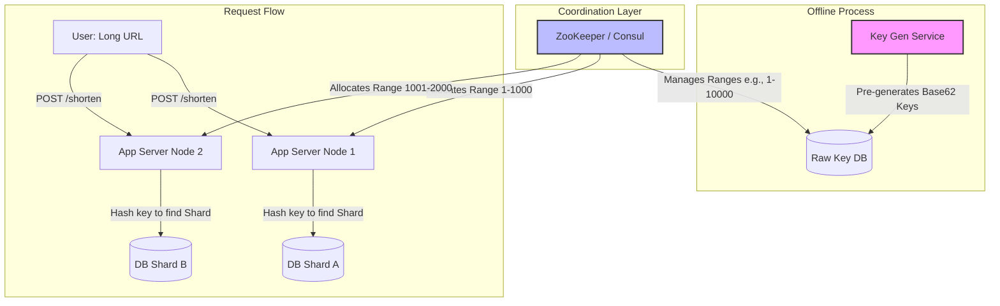

# Zero-Collision URL Shortening: Pre-Generated Tokens and Partitioned Write Paths

## 1. 💡 The "Big Picture" (Plain English)

### What is this in simple terms?
Imagine you run a massive cloakroom at a busy music festival. Thousands of guests arrive per second, hand you their bulky coats (the **Long URLs**), and expect a tiny numbered plastic tag (the **Short URL**) in return. 

If your staff has to search a massive master ledger every single time to find a free number that isn't already taken, the line will stall, and the system will crash. 

Instead, you use a **Key Generation Service (KGS)**. 
Before the gates even open, a dedicated worker prints millions of unique plastic tags, sorts them into boxes, and stacks them in the back. When a booth clerk needs tags, they grab a box of 1,000 tags (a **Range**). When a guest arrives, the clerk instantly hands them a tag from their box without talking to anyone else. No lookup, no double-booking, absolute speed.

### Why should you care today?
In high-throughput distributed systems, **coordination is the enemy of scalability**. If multiple database nodes have to talk to each other to agree on whether an ID is unique during a live user request, your write latency spikes. 

By separating **ID generation** (offline/background) from **ID usage** (online/hot path), and combining it with smart database partitioning (**sharding**), we can build a URL shortener capable of handling millions of writes per second with sub-millisecond database coordination.

---

## 2. 🛠️ How it Works (Step-by-Step)

The architecture splits into three distinct phases: **Pre-generation**, **Coordination & Range Allocation**, and **Write Path Sharding**.



### The Step-by-Step Execution:
1. **Pre-generation**: A background worker generates unique 64-bit sequential integers and converts them to Base62 strings (e.g., `101532` becomes `eG7`). These are saved into a central "Key DB".
2. **Range Allocation**: When an App Server spins up, it contacts a coordinator (like ZooKeeper) to lease a range of unique keys (e.g., keys `100,000` to `110,000`).
3. **In-Memory Vending**: The App Server stores this range in memory. When a write request comes in, it pulls the next available key from local memory instantly (0 coordination overhead).
4. **Sharding & Writing**: The App Server takes the chosen key, hashes it to determine which database shard should store the mapping (e.g., `hash("eG7") % ShardCount`), and writes the pair `{"eG7": "https://superlongurl.com"}` directly to that shard.

### Code Snippet: The Thread-Safe In-Memory Range Allocator
This Python snippet simulates how an individual App Server vends keys concurrently from its assigned memory block without lock contention.

```python
import threading

class KeyRange:
    def __init__(self, start_id: int, end_id: int):
        self.current = start_id
        self.end = end_id
        self._lock = threading.Lock()

    def next_key_id(self) -> int:
        with self._lock:
            if self.current > self.end:
                raise IndexError("Range exhausted! Fetch new block from Coordinator.")
            allocated_id = self.current
            self.current += 1
            return allocated_id

# Base62 Encoding Helper
BASE62_ALPHABET = "0123456789abcdefghijklmnopqrstuvwxyzABCDEFGHIJKLMNOPQRSTUVWXYZ"

def encode_base62(num: int) -> str:
    if num == 0:
        return BASE62_ALPHABET[0]
    arr = []
    base = len(BASE62_ALPHABET)
    while num:
        num, rem = divmod(num, base)
        arr.append(BASE62_ALPHABET[rem])
    arr.reverse()
    return ''.join(arr)

# --- Simulate App Server Behavior ---
# Node receives range [100001 to 200000] from ZooKeeper
local_cache = KeyRange(100001, 200000)

def handle_shorten_request(long_url: str) -> str:
    try:
        raw_id = local_cache.next_key_id()
        short_key = encode_base62(raw_id)
        # In production: Shard and write to Database here
        # db_shard = get_shard_by_key(short_key)
        # db_shard.save(short_key, long_url)
        return f"http://short.ly/{short_key}"
    except IndexError:
        # Trigger asynchronous range renewal
        return "System Busy: Renewing Range"

# Example run
print(handle_shorten_request("https://github.com/system-design"))
# Output: http://short.ly/q19
```

---

## 3. 🧠 The "Deep Dive" (For the Interview)

### The Technical Magic (Coordination & Sharding Mechanics)

#### 1. How ZooKeeper Manages the Token Ranges
We avoid database roundtrips by using ZooKeeper to manage ranges. ZK stores a persistent node representing the high-water mark of allocated keys (e.g., `/keys/high_water_mark = 5000000`).
* When an App Server starts, it issues an atomic Compare-And-Swap (CAS) update to ZooKeeper:
  $$\text{New Mark} = \text{Current Mark} + \text{Range Size (10,000)}$$
* If successful, the App Server owns the exclusive rights to the range `[Current Mark + 1, New Mark]`. 

#### 2. Base62 Entropy & Storage Math
A standard interview constraint: "We must support 100 Billion URLs over 5 years."
* **Base62 Character Set**: `[a-z, A-Z, 0-9]` (total 62 characters).
* **Length Calculation**: 
  $$62^6 \approx 56.8 \text{ Billion combinations}$$
  $$62^7 \approx 3.52 \text{ Trillion combinations}$$
* To comfortably fit 100 Billion with head-room, we select a **7-character** string.
* A 64-bit integer fits easily within this range and can be represented compactly in indexed database columns.

#### 3. Database Sharding: Why Consistent Hashing Rules
We cannot use a single SQL database because of I/O limits. We shard our databases horizontally.

```
                  ┌───────────────┐
                  │  App Server   │
                  └───────┬───────┘
                          │
             Calculate: MD5(short_key)
                          │
        ┌─────────────────┼─────────────────┐
        ▼                 ▼                 ▼
 ┌─────────────┐   ┌─────────────┐   ┌─────────────┐
 │   Shard 0   │   │   Shard 1   │   │   Shard 2   │
 │   [0 - 3F]  │   │  [40 - 7F]  │   │  [80 - FF]  │
 └─────────────┘   └─────────────┘   └─────────────┘
```

* **The Strategy**: Partition by the hash of the `short_key` rather than the `long_url`. 
* **Why?**: Reads (redirection requests) target the `short_key`. By partitioning on `hash(short_key)`, read requests can bypass a global coordinator and route directly to the single shard containing that key.

---

### Trade-offs: What's the Catch?

* **Key Wastage on Crash**: If an App Server holding the range `100,001 to 110,000` crashes after using only 5 keys, the remaining 9,995 keys are **lost forever** (since the high-water mark has already moved forward). 
  * *Trade-off Justification*: At $3.5$ Trillion combinations, losing a few million keys due to server restarts is completely negligible.
* **Consistent Hashing Rebalancing Overhead**: If we add more database shards to handle growth, we must move keys between nodes.
  * *Trade-off Justification*: Using Consistent Hashing minimizes key migration to only $\frac{1}{N}$ of the keys (where $N$ is the total shard count).

---

### Interviewer Probes (Tricky Questions & Winning Answers)

#### 🎙️ Probe 1: "If you pre-generate keys, what happens if two App Servers assign the same short URL to different users?"
* **Answer**: "That is impossible in this design because of **strict range isolation**. ZooKeeper acts as our single source of truth for range allocation. Because ZooKeeper handles requests sequentially and updates the high-water mark atomically, two servers can never lease overlapping ranges. Once a range is leased to Server A, Server B can only lease starting from the next index."

#### 🎙️ Probe 2: "What if a specific short URL goes viral? Your database sharding strategy means one shard will get hammered. How do you handle this hot-spot?"
* **Answer**: "We decouple our read path from our write path. While writes must land on the specific shard allocated to that key, reads should hit an **LRU Cache (e.g., Redis cluster)** sitting in front of our database shards. For viral URLs, the cache hit rate will approach 99.99%, completely shielding the database shard from the read spike. We can also leverage CDN-level caching for highly active redirects."

#### 🎙️ Probe 3: "Why not just use a distributed UUID generator (like Snowflake) instead of a KGS?"
* **Answer**: "While a Snowflake ID generator doesn't need a coordinator, a standard UUID/Snowflake ID is 64 to 128 bits. Representing that as a readable short URL requires 10 to 22 characters. A KGS allows us to start sequentially at ID `1`, resulting in ultra-short 1-to-3 character URLs for our early users, slowly growing to a maximum of 7 characters. It keeps the URL genuinely 'short' and keeps indexing footprints in the database small."

---

## 4. ✅ Summary Cheat Sheet

### 3 Key Takeaways
1. **Coordination-Free Hot Path**: By allocating key ranges to App Servers in blocks, we completely remove lock contention during write operations.
2. **Deterministic Sharding**: Partitioning databases by hashing the `short_key` ensures that lookups (redirects) can locate their destination database in $O(1)$ routing time.
3. **Accept Loss for Speed**: Losing unused keys on server crashes is a completely acceptable trade-off when using a Base62 space of $3.5+$ Trillion combinations.

### 💡 The Golden Rule
> **"Never negotiate locks while the user is waiting. Pre-allocate ranges, cache locally, and write independently."**