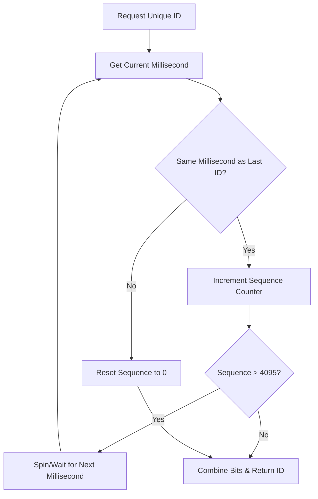

# Architectural Blueprint: Designing a Highly Concurrent Distributed ID Generator (Snowflake ID)

---

## 1. 💡 The "Big Picture" (Plain English)

### What is this in simple terms?
Imagine you are building a massive application like Twitter or Instagram. Every time someone posts a tweet or uploads a photo, the system must assign it a completely unique identification number (ID). 

If you have only one server, this is easy: you just count upwards ($1, 2, 3, 4\dots$). But when you have thousands of servers spread across the globe handling millions of requests per second, they cannot all talk to a single "counter" database. Doing so would create a massive bottleneck, slowing your entire system to a crawl.

A **Distributed ID Generator (Snowflake ID)** is a pattern that allows thousands of independent servers to generate globally unique, chronological IDs at scale, **completely locally, without talking to each other.**

### The Real-World Analogy
Imagine a global shipping company with sorting hubs in Tokyo, London, and New York. 

If every hub had to call the head office in Memphis to get a unique tracking number for every single package, the phone lines would crash immediately. 

Instead, the head office gives each hub a unique identifier:
*   Tokyo is `Hub 01`
*   London is `Hub 02`
*   New York is `Hub 03`

Each hub then creates tracking numbers by combining:
`[Current Time] + [Their Hub ID] + [A Local Package Counter]`

Because Tokyo and London have different Hub IDs, they can print packages at the exact same millisecond without ever generating the same tracking number. 

### Why should I care?
If you rely on traditional database auto-incrementing IDs (`AUTO_INCREMENT` in MySQL), your system will fail to scale horizontally. 
By generating Snowflake IDs:
1.  **You eliminate single points of failure:** If your database goes down, your ID generation doesn't stop.
2.  **Your database runs faster:** Since IDs are ordered by time, database indexes (B-Trees) perform highly optimized sequential writes.
3.  **You scale instantly:** You can add 100 new application servers, and they will immediately start generating unique IDs with zero configuration overhead.

---

## 2. 🛠️ How it Works (Step-by-Step)

A Snowflake ID is a **64-bit integer** (a standard `long` in most programming languages). Instead of treating it as a random number, we slice it into distinct bit-segments that store specific information:

```
+--------------------------------------------------------------------------+
| 1 bit |  41 bits (Timestamp)   | 10 bits (Worker ID) | 12 bits (Sequence)|
+--------------------------------------------------------------------------+
  ^       ^                        ^                     ^
  |       |                        |                     +-- Increments for 
  |       |                        |                         clashes in the
  |       |                        +-- Identifies the        same millisecond
  |       +-- Milliseconds since       machine/node          (0 to 4095)
  |           custom epoch
  +-- Unused (always 0 to 
      keep ID positive)
```

### The Step-by-Step Process:
1.  **Read the Clock:** The system gets the current timestamp in milliseconds.
2.  **Check for Clashes:** If this request is in the exact same millisecond as the previous request, it increments the **Sequence counter**. If the sequence overflows (reaches 4095), the generator pauses and waits for the next millisecond.
3.  **Reset if Time Moves On:** If the current timestamp is greater than the last recorded timestamp, the sequence counter resets to `0`.
4.  **Pack the Bits:** The generator uses lightning-fast CPU bitwise operations to shift and merge the timestamp, Worker ID, and Sequence into a single 64-bit number.

### System Flow


### Clean, Well-Commented Implementation (Java)

Here is a thread-safe, high-performance implementation of a Snowflake ID Generator:

```java
public class SnowflakeIdGenerator {

    // Epoch start point (e.g., 2024-01-01T00:00:00Z in milliseconds)
    private final long customEpoch = 1704067200000L; 

    // Bit lengths of ID segments
    private final long workerIdBits = 10L;
    private final long sequenceBits = 12L;

    // Bitmasks to prevent values from overflowing their allocated bits
    private final long maxWorkerId = -1L ^ (-1L << workerIdBits); // 1023
    private final long sequenceMask = -1L ^ (-1L << sequenceBits); // 4095

    // Bitwise shift offsets
    private final long workerIdShift = sequenceBits; // Shift left by 12
    private final long timestampLeftShift = sequenceBits + workerIdBits; // Shift left by 22

    private final long workerId;
    private long lastTimestamp = -1L;
    private long sequence = 0L;

    public SnowflakeIdGenerator(long workerId) {
        if (workerId < 0 || workerId > maxWorkerId) {
            throw new IllegalArgumentException("Worker ID must be between 0 and " + maxWorkerId);
        }
        this.workerId = workerId;
    }

    // Synchronized to guarantee thread safety inside a single JVM instance
    public synchronized synchronized long nextId() {
        long currentTimestamp = System.currentTimeMillis();

        if (currentTimestamp < lastTimestamp) {
            // Guard against system clock drifting backwards (NTP synchronization issue)
            throw new RuntimeException("Clock drifted backwards! Rejecting requests for " 
                + (lastTimestamp - currentTimestamp) + "ms");
        }

        if (currentTimestamp == lastTimestamp) {
            // Same millisecond: increment sequence. Mask ensures it wraps at 4095.
            sequence = (sequence + 1) & sequenceMask;
            if (sequence == 0) {
                // Sequence overflow: wait until the next millisecond
                currentTimestamp = blockUntilNextMillis(lastTimestamp);
            }
        } else {
            // New millisecond: reset sequence
            sequence = 0L;
        }

        lastTimestamp = currentTimestamp;

        // Perform bit-shifting to construct the 64-bit ID
        return ((currentTimestamp - customEpoch) << timestampLeftShift) 
                | (workerId << workerIdShift) 
                | sequence;
    }

    private long blockUntilNextMillis(long lastTimestamp) {
        long timestamp = System.currentTimeMillis();
        while (timestamp <= lastTimestamp) {
            timestamp = System.currentTimeMillis();
        }
        return timestamp;
    }
}
```

---

## 3. 🧠 The "Deep Dive" (For the Interview)

### The Technical "Magic"

To stand out in a senior system design interview, you must dive deeply into the hardware-level optimizations of this pattern:

#### 1. Why Bitwise Operations Matter
Instead of appending strings or doing complex math, Snowflake uses bitwise shifts (`<<`) and logical ORs (`|`). 

These operations compile directly to single-cycle CPU instructions. This allows a single machine to generate **up to 4,096,000 unique IDs per second** without GC (Garbage Collection) pauses or memory overhead.

#### 2. The Custom Epoch Offset
A standard 64-bit Unix timestamp measures time from January 1, 1970. 

If we used that raw value, we would waste precious bits storing decades of elapsed time before our system was even built. By subtracting a custom epoch (e.g., your company's launch date), we ensure that the 41 timestamp bits can last for **approximately 69 years** from your epoch date.

#### 3. Thread Synchronization vs. Lock Contention
In high-throughput JVM environments, using a coarse `synchronized` keyword block can lead to CPU core parking and thread contention. 

To optimize this for extremely high-concurrency systems, you can implement lock-free non-blocking algorithms using Java's `AtomicLong` and a spin-lock strategy, or isolate generators on separate request threads via thread-local workers.

---

### Trade-offs & Limitations

*   **Pro: Naturally Sortable.** Because the timestamp makes up the most significant bits of the ID, sorting these IDs chronologically is incredibly fast.
*   **Con: Clock Synchronization Vulnerability.** If a server's clock is synchronized using NTP (Network Time Protocol) and drifts backward even by a few milliseconds, the generator can produce duplicate IDs.
*   **Con: ID Predictability.** Because IDs are sequential, competitors can scrape your system (e.g., looking at order IDs) and calculate your volume of transactions or rate of growth.

---

### Interviewer Probes (Tricky Scenarios)

#### Probe 1: "How do you allocate the 10-bit Worker ID dynamically in a modern auto-scaling cloud environment (Kubernetes)?"
*   **Bad Answer:** "Hardcode them or set them in config files." (This fails immediately when nodes auto-scale or crash).
*   **Senior Answer:** "We use a coordination service like **Apache ZooKeeper**, **Consul**, or **Redis** to register workers dynamically. When a new container boots up, it asks the coordinator for an available worker ID slot (from `0` to `1023`). It leases that worker ID, holds it via a heartbeat, and releases it back to the pool upon container termination."

#### Probe 2: "What concrete steps would you take to mitigate a 50ms clock drift backward?"
*   **Senior Answer:** 
    1.  **Short drift (under 10ms):** Implement a busy-wait spin-loop inside `nextId()` to wait for the clock to catch up.
    2.  **Medium drift (10ms - 100ms):** Maintain a historical buffer of generated sequences. If the clock drifts, lookup the sequence from the last recorded millisecond, increment it, and continue generating safely.
    3.  **Fatal drift (over 100ms):** Instantly trip a circuit breaker, take the instance out of rotation, trigger an on-call alert, and let load-balancers route traffic to other healthy, synchronized nodes.

---

## 4. ✅ Summary Cheat Sheet

### 3 Key Takeaways
1.  **No Coordination Needed:** Nodes generate IDs completely independently; zero network roundtrips means infinite horizontal scalability.
2.  **Time-ordered Efficiency:** Storing the timestamp in the leading bits ensures IDs are chronological, keeping database B-tree indexing operations incredibly fast.
3.  **High Density:** A single 64-bit integer contains everything needed: epoch-offset time, the unique machine instance ID, and a collision-resolving counter.

### 👑 The Golden Rule
> **"Protect the clock at all costs."** 
> A Snowflake ID generator is only as reliable as its server's system clock. Clock drift is the single point of failure; you must write explicit mitigation logic to prevent duplicate IDs when NTP corrections occur.