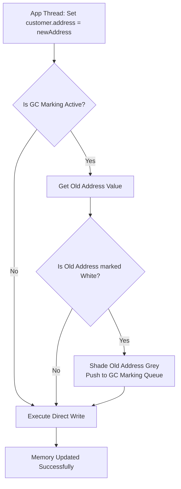

# GC Barriers: Tuning Read and Write Barriers in Concurrent Garbage Collectors

1.  **Stop-The-World (STW) pauses are unacceptable** for modern, high-throughput, low-latency applications. 
2.  To eliminate these pauses, the Garbage Collector must run **concurrently**—marking and moving objects in memory while your application threads (mutators) are actively modifying them.
3.  But how does the GC keep track of memory safely while the ground is moving beneath its feet? 

The secret lies in **GC Barriers**.

---

## 1. 💡 The "Big Picture" (Plain English)

### What is a GC Barrier in Simple Terms?
A GC Barrier is **not** a wall. It is a tiny, compiler-injected "hook" or "middleware" that intercepts memory operations. 

Whenever your application code tries to **read** a pointer (object reference) or **write** a pointer, the runtime silently runs a few extra CPU instructions first. This allows the Garbage Collector to coordinate with your active threads without pausing the entire application.

### The Library Analogy
Imagine a massive library. The Head Librarian (the GC) wants to inventory and reorganize all the books. 

*   **In an old-school library (STW GC):** The librarian locks the front doors. No guests can enter or move books. The librarian does the inventory in peace. It’s accurate, but the guests are furious.
*   **In a modern library (Concurrent GC with Barriers):** The library stays open. Guests are moving books around. To prevent chaos, the librarian places an assistant at every shelf:
    *   **Write Barrier:** Whenever a guest tries to move a book to a different shelf, the assistant notes down the change: *"Book A is now on Shelf 5."*
    *   **Read Barrier:** Whenever a guest reaches for a book, the assistant checks: *"Wait, that book is scheduled to be restored. Let me grab the newly bound copy for you instead of the old, dusty one."*

### Why Should I Care?
If you are running high-performance applications (using runtimes like the JVM with ZGC/Shenandoah, Go, or .NET Core), your code is littered with these silent checks. 

Tuning and understanding barriers is the difference between achieving **sub-millisecond pause times** and suffering from mysterious **throughput drops** where your CPU is pinned at 100% even though your business logic is simple.

---

## 2. 🛠️ How it Works (Step-by-Step)

Let's look at how a **Write Barrier** operates. Write barriers are used during concurrent marking to ensure the GC doesn't miss an object when application threads change references.

### The Tri-Color Color Scheme (Quick Context)
*   **White:** Unvisited objects (candidates for collection).
*   **Grey:** Visited, but their child references haven't been scanned yet.
*   **Black:** Visited, and all their child references have been scanned (safe).

### Step-by-Step Flow of a Write Barrier (SATB - Snapshot At The Beginning)
1. **The Application Attempts a Write:** An application thread wants to overwrite a pointer: `current_object.field = new_object`.
2. **The Barrier Intercepts:** Before the write happens, the write barrier checks the color of the *old value* currently held in that field.
3. **The GC is Notified:** If the old value was White (unvisited), the barrier marks it Grey. This ensures that the GC will scan it later, preventing it from being accidentally deleted (swept).
4. **The Write Completes:** The thread is allowed to write the `new_object` pointer.

### Code Visualized
Here is what the compiler actually generates under the hood when you write a simple line of code.

```cpp
// --- Your Original Clean Code ---
void updateCustomerAddress(Customer* customer, Address* newAddress) {
    customer->address = newAddress; // Simple assignment
}

// --- What the Compiler Actually Emits (With Write Barrier) ---
void updateCustomerAddress_WithBarrier(Customer* customer, Address* newAddress) {
    // 1. Fetch the OLD value before overwriting it
    Address* oldAddress = customer->address; 
    
    // 2. The Write Barrier Hook
    if (GC::is_marking_phase_active()) {
        if (oldAddress != nullptr && GC::is_marked_white(oldAddress)) {
            // Shade it grey so the concurrent collector doesn't lose it
            GC::shade_grey(oldAddress); 
        }
    }
    
    // 3. Perform the actual write
    customer->address = newAddress; 
}
```

### The Flow of Concurrent Marking with Write Barriers



---

## 3. 🧠 The "Deep Dive" (For the Interview)

### The Technical Magic: Read Barriers (Load Barriers) vs. Write Barriers
While Write Barriers are common, **Read Barriers** (used by ultra-low latency collectors like Java's ZGC) are highly sophisticated.

#### Colored Pointers and Self-Healing
ZGC stores metadata about an object inside the **pointer itself** (using the upper unused bits of a 64-bit reference address). This is called *Colored Pointers*.

When your application code reads a reference (e.g., `Address addr = customer.address;`), a **Read/Load Barrier** executes:
1. **Check Bit Status:** It inspects the colored bits of the pointer.
2. **The Fast Path:** If the bits indicate the pointer is "good" (pointing to the correct, relocated memory address), it returns the pointer immediately. This takes less than a nanosecond.
3. **The Slow Path (Self-Healing):** If the pointer is "bad" (points to an old location because the object was relocated during concurrent compaction):
    * The read barrier queries the GC relocation table.
    * It locates the object's new address.
    * **Crucial Step:** It updates (`self-heals`) the reference field in `customer.address` so that subsequent reads bypass the slow path.
    * It returns the new address.

```
Pointer Bit Layout (64-bit):
+-------------------+-------------+-----------------------------------------------+
|   Unused Bits     | Color Bits  |               Actual Address                  |
|    (16 bits)      |  (4 bits)   |                 (44 bits)                     |
+-------------------+-------------+-----------------------------------------------+
                     |-> Marked0/Marked1 (Liveness status)
                     |-> Remapped (Is the pointer updated?)
```

### Trade-offs & Tuning Targets

| Metric | Write Barriers (e.g., G1 GC) | Read Barriers (e.g., ZGC) |
| :--- | :--- | :--- |
| **Throughput Overhead** | Low (Writes are much less frequent than reads in typical code). | Moderate (Reads happen constantly; 2-4% CPU overhead). |
| **Pause Time (Latency)** | Low-ish (Few milliseconds; depends on queue processing). | **Consistent Sub-millisecond** (Compaction is fully concurrent). |
| **Footprint / Memory** | Low. | Higher (Requires virtual memory multi-mapping trick). |

---

### Interviewer Probes (How to Ace the Tricky Questions)

#### Probe 1: "If write barriers are so cheap, why can't we use them for everything? Why did ZGC introduce the overhead of Read Barriers?"
* **Answer:** Write barriers only track *mutations* (writes). If you want to move (compact) an object in memory concurrently while application threads are reading it, write barriers cannot help you. Without a read barrier, an application thread could read a pointer to an old memory location *while the GC is copying it*, leading to silent data corruption. Read barriers guarantee that the application thread always sees the latest, relocated copy of an object, enabling fully concurrent compaction.

#### Probe 2: "Explain the 'SATB' (Snapshot-at-the-Beginning) vs 'Incremental Update' write barrier strategies. What is the fundamental difference in what they track?"
* **Answer:** 
    * **SATB (used by G1):** Preserves a logical snapshot of the object graph at the moment marking started. If an application thread tries to overwrite an existing reference, the write barrier catches the *old* value and marks it. It focuses on **pre-write** state.
    * **Incremental Update (used by CMS):** Focuses on **post-write** state. If an application thread writes a reference to a white object into a black object, it turns the black object grey (or registers the new reference). 
    * *Tuning implications:* SATB can result in more "floating garbage" (objects kept alive during this cycle even if they became unreachable later), but it is generally easier to reason about and scale concurrently.

#### Probe 3: "How does the JIT compiler optimize these barriers? They must add a lot of instruction bloat."
* **Answer:** The JIT compiler uses several aggressive optimizations:
    * **Barrier Elision:** If the JIT compiler can prove (via Escape Analysis) that an object is thread-confined or newly allocated within the local scope, it strips away the write/read barriers entirely.
    * **Loop Unrolling / Peeling:** If a pointer is read repeatedly inside a tight loop, the JIT pulls the read barrier outside the loop, performing the check once rather than on every iteration.

---

## 4. ✅ Summary Cheat Sheet

### 3 Key Takeaways
1. **GC Barriers are compiler-injected hooks** on memory reads/writes that allow Garbage Collectors to run concurrently alongside application threads.
2. **Write Barriers** are cheap and protect the *marking* phase of GC by ensuring no live objects are missed during concurrent reference changes.
3. **Read Barriers (Load Barriers)** are used by ultra-low latency collectors to support *concurrent compaction* (moving objects safely without STW pauses) using "colored pointer" checks and automatic "self-healing."

### 👑 The Golden Rule
> **"There is no free lunch in memory management: to eliminate Stop-The-World latency, you must pay a tax in instruction overhead (CPU cycles) and memory throughput via GC Barriers."**