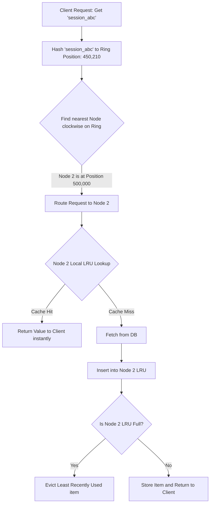

# Architectural Blueprint: Engineering a Fault-Tolerant Distributed Cache with Consistent Hashing and Local LRU Eviction

## 1. 💡 The "Big Picture" (Plain English)

### What is this in simple terms?
Imagine you run a massive global logistics company with billions of packages. If you kept the tracking records for all packages in a single, giant filing cabinet, two things would happen:
1. The cabinet would quickly run out of physical space.
2. A massive queue of employees would form, waiting to access it, grinding your operations to a halt.

To solve this, you build a network of smaller filing offices (Nodes) across the world. 
* **Consistent Hashing** is the intelligent routing protocol that instantly tells your courier exactly which office holds the file for a specific package, without having to search through every building.
* **LRU (Least Recently Used) Eviction** is the space-management system used *inside* each individual office. Since each office has limited desk space, when a new file arrives and the desk is full, the clerk throws away the file that hasn't been looked at for the longest time.

```
                  [ Incoming Request: Key "user_101" ]
                                  │
                                  ▼
                     ┌─────────────────────────┐
                     │ Consistent Hash Ring    │ ---> "Which server has this?"
                     └────────────┬────────────┘
                                  │
                         (Routes to Node B)
                                  │
                                  ▼
                     ┌─────────────────────────┐
                     │      Cache Node B       │
                     │  ┌───────────────────┐  │
                     │  │ Local LRU Cache   │  │ ---> "Is it on my desk?"
                     │  └───────────────────┘  │      If Yes: Fast Return.
                     └─────────────────────────┘      If No: Fetch from DB & Evict oldest.
```

### Why should I care?
In high-throughput systems (like Netflix, Uber, or Amazon), database systems cannot keep up with millions of read requests per second. A distributed cache acts as a high-speed shield. 

By combining **Consistent Hashing** and **LRU**, you get a cache tier that can scale horizontally (by adding more servers on the fly without breaking the system) and operate at sub-millisecond speeds, while self-cleaning its own memory so it never crashes due to Out-Of-Memory (OOM) errors.

---

## 2. 🛠️ How it Works (Step-by-Step)

The architecture operates in a unified, three-phase workflow:

1. **The Hash Ring Setup**: We map both our physical cache servers (nodes) and our data keys onto a conceptual circular ring from $0$ to $2^{32} - 1$ using a hash function (like MD5 or MurmurHash).
2. **Server Lookup**: To find where a key lives, we hash the key and walk clockwise along the ring. The first server we encounter is the owner of that key.
3. **Local Cache Operations**: Once routed to that server, the node uses its local memory engine (LRU) to retrieve the value. If the server is full, it evicts the least recently accessed record to make space.

### The Flow Visualized



### Clean, Object-Oriented Implementation

Here is a fully functional, highly readable Python implementation showcasing the integration of both systems.

```python
import hashlib
import bisect
from collections import OrderedDict

class LRUCache:
    """
    A Local Least Recently Used (LRU) cache.
    Uses OrderedDict to achieve O(1) lookups and O(1) evictions.
    """
    def __init__(self, capacity: int):
        self.capacity = capacity
        self.cache = OrderedDict()

    def get(self, key: str) -> str:
        if key not in self.cache:
            return None
        # Move key to the end to mark it as most recently used
        self.cache.move_to_end(key)
        return self.cache[key]

    def put(self, key: str, value: str) -> str:
        if key in self.cache:
            self.cache.move_to_end(key)
        self.cache[key] = value
        
        # Check capacity limit
        if len(self.cache) > self.capacity:
            # popitem(last=False) removes the first (oldest/least recently used) item
            evicted_key, _ = self.cache.popitem(last=False)
            return evicted_key
        return None


class DistributedCacheSystem:
    """
    Distributed Cache coordinator using Consistent Hashing with Virtual Nodes.
    """
    def __init__(self, replicas: int = 3, node_capacity: int = 2):
        self.replicas = replicas  # Number of virtual nodes per physical node
        self.ring = []            # Sorted list of virtual node hash keys
        self.ring_map = {}        # Hash key -> Physical Node String
        self.nodes = {}           # Physical Node String -> LRUCache Instance
        self.node_capacity = node_capacity

    def _hash(self, key: str) -> int:
        """Returns a 32-bit integer hash representing position on the ring."""
        return int(hashlib.md5(key.encode('utf-8')).hexdigest(), 16) & 0xFFFFFFFF

    def add_node(self, node: str):
        """Adds a physical node and its virtual replicas to the hash ring."""
        self.nodes[node] = LRUCache(self.node_capacity)
        for i in range(self.replicas):
            vnode_key = f"{node}-vnode-{i}"
            vnode_hash = self._hash(vnode_key)
            bisect.insort(self.ring, vnode_hash)
            self.ring_map[vnode_hash] = node
        print(f"Added node [{node}] with {self.replicas} virtual nodes.")

    def remove_node(self, node: str):
        """Removes a physical node and cleans up its virtual nodes from the ring."""
        if node in self.nodes:
            del self.nodes[node]
            for i in range(self.replicas):
                vnode_key = f"{node}-vnode-{i}"
                vnode_hash = self._hash(vnode_key)
                self.ring.remove(vnode_hash)
                del self.ring_map[vnode_hash]
            print(f"Removed node [{node}].")

    def _get_node(self, key: str) -> str:
        """Finds the correct physical node on the ring clockwise from hash(key)."""
        if not self.ring:
            return None
        
        key_hash = self._hash(key)
        # Binary search clockwise
        idx = bisect.bisect_right(self.ring, key_hash)
        
        # If hash is greater than all nodes, wrap around to index 0
        if idx == len(self.ring):
            idx = 0
            
        target_vnode_hash = self.ring[idx]
        return self.ring_map[target_vnode_hash]

    def get(self, key: str) -> str:
        target_node = self._get_node(key)
        if not target_node:
            return None
        val = self.nodes[target_node].get(key)
        print(f"GET key '{key}' from [{target_node}]: {val}")
        return val

    def put(self, key: str, value: str):
        target_node = self._get_node(key)
        if not target_node:
            return
        evicted = self.nodes[target_node].put(key, value)
        print(f"PUT key '{key}' onto [{target_node}].", end="")
        if evicted:
            print(f" (Evicted '{evicted}' due to local capacity constraints)")
        else:
            print()

# --- Execution Demo ---
if __name__ == "__main__":
    # Create system: Each node holds at most 2 items
    cache_system = DistributedCacheSystem(replicas=3, node_capacity=2)
    
    # Spin up 3 physical servers
    cache_system.add_node("SERVER_A")
    cache_system.add_node("SERVER_B")
    cache_system.add_node("SERVER_C")
    print("-" * 60)

    # Insert data
    cache_system.put("user_1", "Alice")
    cache_system.put("user_2", "Bob")
    cache_system.put("user_3", "Charlie")
    cache_system.put("user_4", "David")
    cache_system.put("user_5", "Eve")
    print("-" * 60)

    # Read data back
    cache_system.get("user_1")
    cache_system.get("user_3")
```

---

## 3. 🧠 The "Deep Dive" (For the Interview)

This is where interviewers separate junior developers from senior system designers. Let’s look at the core architectural mechanisms.

### Why Virtual Nodes (VNodes)?
In basic consistent hashing, physical nodes are mapped directly to the ring. This results in **unbalanced loads**. If Server A maps to position 100 and Server B maps to position 50,000, Server B handles $99\%$ of the keys. 

By mapping each physical node to $M$ "Virtual Nodes" (e.g., `SERVER_A-0`, `SERVER_A-1`), we scatter points across the ring uniformly.
* **The Math**: If you have $N$ nodes and $V$ virtual nodes, the variance of the load distribution decreases rapidly as $V$ increases (typically $\sim 1/\sqrt{V}$).

### LRU Internals: The Double-Linked List + HashMap Union
An LRU cache cannot be built performantly with just an array or a singly linked list. 
* A **HashMap** provides $O(1)$ lookups but has no concept of order.
* A **Doubly Linked List** provides $O(1)$ node insertion and deletion *if* we already hold pointers to the nodes, but has $O(N)$ lookup times.

By combining them (mapping keys directly to Doubly Linked List nodes), we achieve $O(1)$ reads, writes, and evictions.

```
HashMap
┌──────────┬──────────────┐
│  "key1"  │ Pointer Node1│──────┐
├──────────┼──────────────┤      │
│  "key2"  │ Pointer Node2│───┐  │
└──────────┴──────────────┘   │  │
                              ▼  ▼
                     Head ◄─► [Node2] ◄─► [Node1] ◄─► Tail
                    (Most Recent)        (Least Recent)
```

### Trade-offs & Limitations
1. **Memory Overhead**: An LRU cache node contains at least 2 pointers (prev, next), a key, and a value. For small payloads, the pointers can consume more memory than the actual data.
2. **Rebalancing Overhead**: While Consistent Hashing minimizes key movement when a node is added/removed to $K/N$ (where $K$ is total keys and $N$ is nodes), it still requires moving some data. During this migration, requests for those keys will miss and hit your database.

---

### Interviewer Probe Questions

#### Probe 1: "What happens to the system if one node goes down and its keys fall back to the next node, but that next node immediately crashes under the sudden spike in load?"
**Answer:** This is a **cascading failure (or Thundering Herd)**. To prevent this, we should design our client or proxy with:
1. **Request Collapsing (Singleflight)**: If 1,000 concurrent requests ask for the same missing key, only 1 request goes to the database; the other 999 wait and share the returned result.
2. **Circuit Breakers**: Stop routing requests to the database if traffic spikes beyond a healthy threshold, serving stale data or a fallback instead.
3. **Consistent Hashing with Bounded Loads**: Limits the maximum load on any single node to $1 + \epsilon$ times the average load. If a node is overloaded, keys are dynamically routed to the *second* closest node instead.

#### Probe 2: "In a multithreaded environment, how do you handle concurrent read/write locks on the local LRU Cache without causing massive lock contention?"
**Answer:** A standard LRU needs a write lock even during a *read* operation, because reading an item changes its position in the linked list (moving it to the Head). 
To solve this bottleneck:
1. **Lock Striping**: Divide the cache into $k$ distinct segments (independent LRU caches based on key hashing). Threads accessing different segments won't block each other.
2. **Read/Write Ring Buffers**: Instead of mutating the linked list on every read instantly, we can write the access event to a thread-local ring buffer. A single background thread periodically drains these buffers and updates the linked list pointers in batches, keeping reads lock-free.

---

## 4. ✅ Summary Cheat Sheet

### 3 Key Takeaways
1. **Consistent Hashing solves the $N$-migration problem**: Traditional mod-based hashing ($hash(key) \pmod N$) forces you to remap almost $100\%$ of keys when $N$ changes. Consistent Hashing reduces this to only $1/N$ of keys.
2. **Virtual Nodes guarantee equity**: They prevent single nodes from becoming "hotspots" by slicing the server footprint into hundreds of tiny logical targets distributed uniformly across the ring.
3. **LRU combines speed with safety**: Using a Map paired with a Doubly Linked List, it guarantees that no matter how much data you throw at a server, it operates in $O(1)$ time and never exceeds its memory limits.

### 1 Golden Rule
> **"Consistent Hashing routes the request to the right machine horizontally; LRU manages the memory limits of that machine vertically."**