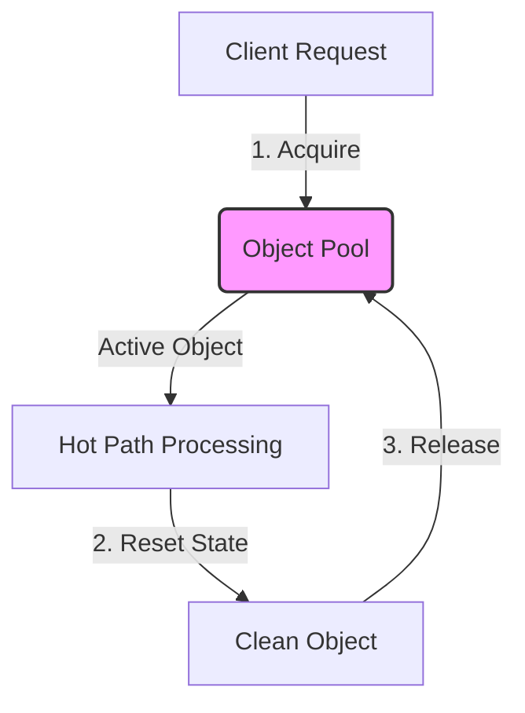

# Object Pooling & Memory Recycling: Tuning GC Pressure out of the Hot Path

1. 💡 The "Big Picture" (Plain English)
2. 🛠️ How it Works (Step-by-Step)
3. 🧠 The "Deep Dive" (For the Interview)
4. ✅ Summary Cheat Sheet

---

## 1. 💡 The "Big Picture" (Plain English)

### What is this in simple terms?
Instead of constantly creating new objects and throwing them away for the Garbage Collector (GC) to clean up, **Object Pooling** is the strategy of keeping a fixed set of initialized objects in a "pool." When your application needs an object, it borrows one from the pool, uses it, resets its data, and returns it to the pool.

### The Bowling Alley Analogy
Imagine running a bowling alley. When customers arrive, they need bowling shoes. 
* **The "Standard GC" Way:** You buy brand-new shoes for every customer. When they finish their game, they throw the shoes in the trash. Every hour, a janitor (the Garbage Collector) has to stop work, haul away bags of shoes, and clear out the bins.
* **The "Object Pool" Way:** You buy 50 pairs of shoes and keep them on a rack. A customer borrows a pair, plays, and returns them. You spray them down (resetting their state) and place them back on the rack for the next customer. The janitor has absolutely nothing to clean up.

```
Standard GC:      [Allocate] ──> [Use] ──> [Abandon] ──> [GC Sweeps Trash] (CPU Spike!)
Object Pooling:   [Acquire]  ──> [Use] ──> [Reset]   ──> [Return to Pool] (Zero Trash)
```

### Why should I care?
Garbage collection frequency and duration are directly tied to your **allocation rate** (how many megabytes of objects you create per second). 
If you are building high-frequency trading platforms, game engines, or high-throughput network servers (like Netty), allocating thousands of short-lived objects per second in your "hot path" (critical execution loops) will trigger frequent GC pauses. Object pooling bypasses the allocator and the GC entirely, delivering flat, ultra-low latency.

---

## 2. 🛠️ How it Works (Step-by-Step)

An Object Pool manages the lifecycle of reusable objects. The workflow follows a strict cycle:



### The Step-by-Step Lifecycle
1. **Initialization:** The pool pre-allocates a set number of objects (e.g., database packets, byte buffers) during application startup.
2. **Acquisition:** The application requests an object from the pool. If an idle object is available, it is marked as active and returned.
3. **Usage:** The application performs its high-speed operations using the object.
4. **Reset/Sanitization:** Before returning, the object's fields are cleared to prevent "dirty reads" (information leaks from the previous transaction).
5. **Release:** The object goes back into the pool's idle queue, ready for reuse.

### Code Snippet: A High-Performance, Thread-Safe Object Pool

Here is a clean implementation of a reusable `DatabaseEvent` pool using Java.

```java
import java.util.concurrent.ConcurrentLinkedQueue;
import java.util.function.Supplier;

/**
 * A highly reusable, thread-safe Object Pool.
 */
public class ObjectPool<T extends Recyclable> {
    private final ConcurrentLinkedQueue<T> pool;
    private final Supplier<T> creator;

    public ObjectPool(Supplier<T> creator, int initialSize) {
        this.creator = creator;
        this.pool = new ConcurrentLinkedQueue<>();
        
        // Pre-allocate objects during startup to avoid runtime allocations
        for (int i = 0; i < initialSize; i++) {
            pool.offer(creator.get());
        }
    }

    /**
     * Borrow an object from the pool.
     */
    public T acquire() {
        T object = pool.poll();
        if (object == null) {
            // Pool is exhausted under heavy load; fallback to dynamic allocation
            object = creator.get();
        }
        return object;
    }

    /**
     * Return the object back to the pool after resetting its state.
     */
    public void release(T object) {
        if (object == null) return;
        
        // CRITICAL: Clean the object before recycling to avoid memory/data leaks
        object.reset(); 
        pool.offer(object);
    }
}

/**
 * Interface to enforce state sanitization.
 */
interface Recyclable {
    void reset();
}

/**
 * Example of a high-frequency object used in the network hot path.
 */
class DatabaseEvent implements Recyclable {
    private String transactionId;
    private long payload;

    public void setData(String transactionId, long payload) {
        this.transactionId = transactionId;
        this.payload = payload;
    }

    @Override
    public void reset() {
        // Clear references to prevent Memory Leaks / Dirty Reads
        this.transactionId = null; 
        this.payload = 0L;
    }
}
```

---

## 3. 🧠 The "Deep Dive" (For the Interview)

To impress a senior interviewer, you must move past the basic definition and discuss the hardware-level impacts, memory mechanics, and architectural trade-offs of Object Pooling.

### The Hardware Reality: CPU Cache Locality vs. GC Pressure
Standard generational garbage collectors allocate objects contiguously in memory using Thread-Local Allocation Buffers (TLABs). Because these objects are allocated sequentially, they enjoy excellent **CPU L1/L2 Cache Locality** when processed together.

When you pool objects:
* They become **long-lived** objects (promoted to the Old/Tenured Generation).
* Over time, they scatter across different memory addresses in the heap.
* When you loop through pooled objects, the CPU may experience frequent **L1/L2 cache misses** because the objects are not contiguous in physical RAM.

$$\text{Performance Trade-off} = \text{Reduced GC Pauses (Benefit)} \ vs \ \text{Lower Cache Locality (Cost)}$$

### The Dark Side: Why Pooling Can Hurt You (The Trade-offs)
1. **Memory Bloat (High Watermark Problem):** If your application experiences a temporary traffic spike, you might dynamically scale your pool to 100,000 objects. After the spike, those 100,000 objects remain pinned in memory forever, starving other parts of your application.
2. **Synchronization Overhead:** If multiple application threads borrow from a single centralized pool, the synchronization lock on the pool can become a worse bottleneck than the GC itself. 
   * *Solution:* Use `ThreadLocal` pools or lock-free ring buffers (like the LMAX Disruptor).
3. **Object Leaks:** If a developer forgets to call `pool.release(obj)` in a `finally` block, that object is lost forever. If this happens continuously, the pool dries up—a leak reminiscent of manual memory management in C/C++.

---

### Interviewer Probes: Tricky Questions & How to Answer Them

#### **Probe 1:** *"We have a modern, highly optimized Garbage Collector like ZGC or Shenandoah with sub-millisecond pauses. Why would we still use Object Pooling?"*
* **How to answer:** 
  "While modern concurrent collectors like ZGC reduce stop-the-world pause times to microseconds, they do not make allocation free. High allocation rates still consume significant CPU cycles because the GC threads must run concurrently to reclaim memory. This 'GC pacing' steals CPU cycles away from application threads. By pooling objects in our ultra-hot path, we eliminate allocation altogether, freeing up CPU cores for pure business logic."

#### **Probe 2:** *"How do you prevent 'dirty reads' or data corruption when using an Object Pool?"*
* **How to answer:** 
  "We must enforce a strict sanitization contract. Any class designed for pooling must implement a `reset()` or `clear()` method. This method nullifies object references to prevent memory leaks (holding onto stale objects) and clears primitive values. Furthermore, we can use the **Flyweight Pattern** or wrap pooled objects in a 'Recyclable Wrapper' that automatically clears the state and returns the object to the pool when closed (e.g., implementing `AutoCloseable` in Java)."

#### **Probe 3:** *"How do you design an object pool that avoids thread contention under heavy, multi-threaded load?"*
* **How to answer:** 
  "A single global queue will suffer from thread contention. To solve this, we can use **Thread-Local Pooling** where each thread maintains its own private pool. If Thread A needs an object, it grabs it from its own localized stack without locking. If we must share a pool, we should use a lock-free, single-producer-single-consumer circular queue structure (like Ring Buffers) or partition the pool into multiple stripes to distribute lock contention."

---

## 4. ✅ Summary Cheat Sheet

### 3 Key Takeaways
1. **GC Triggers on Velocity:** Garbage collection is driven by your *allocation rate*. Object pooling stops GC pressure by dropping your allocation rate to near zero.
2. **State Hygiene is Vital:** Always reset the state of a recycled object before returning it to the pool to prevent memory leaks and security exploits (data leaks).
3. **Not a Silver Bullet:** Pooling turns dynamic memory allocation into static memory allocation. It trades CPU cycles (GC run-time) for memory footprint (permanently pinned heap space).

### 1 "Golden Rule" to Remember
> **"Only pool objects that are heavy to initialize, or objects allocated so frequently in the execution hot path that they dominate your GC profile. For lightweight, cold-path objects, let the JVM allocate and clean them normally."**