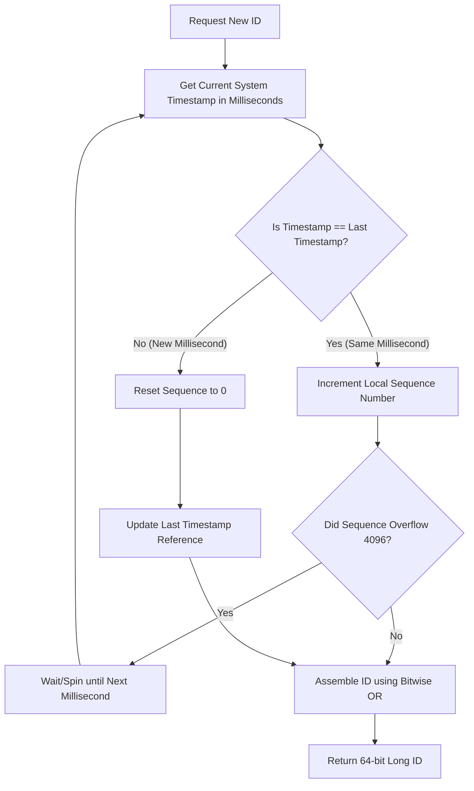

# Coordinate-Free Scaling: Designing a Distributed ID Generator (Snowflake ID)

## 1. 💡 The "Big Picture" (Plain English)

### What is this in simple terms?
Imagine you are building a massive application like Twitter or Instagram. Every time someone posts a tweet or uploads a photo, the system must assign it a unique identification number (an ID). 

If you have only one database, this is easy: the database just counts upward (`1, 2, 3, 4...`). But if your application is huge, you have hundreds of databases and servers spread across the globe. If they all have to ask a single central database for the "next number," your entire system will grind to a halt waiting in line.

A **Snowflake ID Generator** is a clever system design pattern that lets hundreds of independent servers generate globally unique, chronologically ordered IDs **at the exact same time without ever talking to each other**.

### The Real-World Analogy
Think of a massive international shipping company like FedEx. Instead of a single office in New York printing out tracking numbers for the whole world, every local sorting facility is given its own unique ID stamped onto their label printers (e.g., `Facility-42`). 

When a package arrives, the facility prints a label combining:
`[Current Time] + [Facility-42] + [A local counter that resets every millisecond]`

Because no two facilities share the same ID, and because time only moves forward, there is **zero chance** that two packages anywhere in the world will ever get the exact same tracking number—even if they are printed at the exact same millisecond, and without the facilities ever calling headquarters to double-check.

### Why should I care? What problem does it solve today?
1. **No Coordination Bottleneck:** Zero network latency. Your servers can generate IDs completely offline/locally at ultra-high speeds.
2. **Database Performance (B-Trees love them):** Standard random IDs like UUID v4 (e.g., `f81d4fae-7dec-11d0-a765-00a0c91e6bf6`) are strings. They are completely unsorted. When you insert them into a database, the index (usually a B-Tree) has to constantly re-shuffle itself, slowing down your database to a crawl. Snowflake IDs are 64-bit integers and are **roughly sorted by time**, making database inserts lightning-fast.
3. **Chronological Sorting:** You can easily sort posts or logs by ID without needing an extra `created_at` database index.

---

## 2. 🛠️ How it Works (Step-by-Step)

A Snowflake ID is a **64-bit integer** (stored as an 8-byte `long` in most languages). Instead of random noise, we split those 64 bits into structured segments:

```
+-------------------------------------------------------------------------------+
| 1 bit |  41 bits: Timestamp (ms)  | 10 bits: Node ID | 12 bits: Sequence No.  |
| (Sign)|  (Custom Epoch offset)    | (Machine ID)     | (Local Counter)        |
+-------------------------------------------------------------------------------+
```

### The Bit Breakdown:
1. **Sign Bit (1 bit):** Always set to `0`. This ensures the number is positive (important in programming languages like Java that don't support unsigned 64-bit integers easily).
2. **Timestamp (41 bits):** Represents milliseconds since a custom start date (epoch) of your choosing (e.g., your company's founding date). 41 bits of milliseconds gives you **69 years** of unique IDs before running out.
3. **Node/Worker ID (10 bits):** The unique ID of the machine generating the ID. This supports up to **1,024** separate servers working concurrently.
4. **Sequence Number (12 bits):** A local counter on each machine. It starts at `0` and increments for every ID generated within the same millisecond. It resets to `0` at the start of the next millisecond. This allows each machine to generate up to **4,096** IDs *per millisecond*.

### The Flow of Generation



### Implementation (Java)

Here is a clean, concurrency-safe implementation of a Snowflake ID Generator:

```java
public class SnowflakeIdGenerator {
    // Epoch start time (e.g., Jan 1, 2023, 00:00:00 UTC) in milliseconds
    private final long customEpoch = 1672531200000L;

    // Bit lengths allocated to each segment
    private final long nodeIdBits = 10L;
    private final long sequenceBits = 12L;

    // Max values to prevent bit overflow
    private final long maxNodeId = -1L ^ (-1L << nodeIdBits); // 1023
    private final long sequenceMask = -1L ^ (-1L << sequenceBits); // 4095

    // Bit-shift lengths to move segments into their correct slots
    private final long nodeIdShift = sequenceBits;
    private final long timestampLeftShift = sequenceBits + nodeIdBits;

    private final long nodeId;
    private long lastTimestamp = -1L;
    private long sequence = 0L;

    public SnowflakeIdGenerator(long nodeId) {
        if (nodeId < 0 || nodeId > maxNodeId) {
            throw new IllegalArgumentException(String.format("Node ID must be between 0 and %d", maxNodeId));
        }
        this.nodeId = nodeId;
    }

    // Thread-safe ID generation
    public synchronized long nextId() {
        long currentTimestamp = System.currentTimeMillis();

        if (currentTimestamp < lastTimestamp) {
            // Guard against clock moving backwards (NTP drift)
            throw new IllegalStateException("Clock moved backwards! Rejecting requests for " + (lastTimestamp - currentTimestamp) + "ms");
        }

        if (currentTimestamp == lastTimestamp) {
            // Same millisecond, increment local counter
            sequence = (sequence + 1) & sequenceMask;
            if (sequence == 0) {
                // Sequence overflow, block until next millisecond
                currentTimestamp = blockUntilNextMillis(lastTimestamp);
            }
        } else {
            // New millisecond, reset sequence to 0
            sequence = 0L;
        }

        lastTimestamp = currentTimestamp;

        // Shift bit values into position and merge them using bitwise OR (|)
        return ((currentTimestamp - customEpoch) << timestampLeftShift)
                | (nodeId << nodeIdShift)
                | sequence;
    }

    private long blockUntilNextMillis(long lastTimestamp) {
        long timestamp = System.currentTimeMillis();
        while (timestamp <= lastTimestamp) {
            timestamp = System.currentTimeMillis();
        }
        return timestamp;
    }
}
```

---

## 3. 🧠 The "Deep Dive" (For the Interview)

To stand out in a Senior System Design interview, you must go beyond the basic bits and address production-grade operational realities.

### The "Magic" of Bit Manipulation
Look at the assembly line code:
```java
return ((currentTimestamp - customEpoch) << timestampLeftShift) | (nodeId << nodeIdShift) | sequence;
```
By bit-shifting (`<<`), we align each value to its allocated slot in the 64-bit space. For example, shifting a timestamp by `22` positions moves those 41 timestamp bits to the far left of our 64-bit integer, leaving the remaining 22 bits empty (all zeros) for the Node ID and Sequence to be merged in via logical OR (`|`). 

This operation is executed at the CPU level in nanoseconds, bypassing memory allocations and garbage collection overhead entirely.

### Critical Edge Cases & Architectural Trade-offs

#### 1. Clock Drift & NTP Synchronization
The Snowflake algorithm assumes time only moves forward. However, in real production environments, servers use **NTP (Network Time Protocol)** to align their clocks. If NTP synchronization pulls a server’s system clock *backwards*, our generator could output duplicate IDs.

*   **Mitigation:** 
    *   If the clock drift is minor (e.g., under 5 milliseconds), wait/sleep until the clock catches up to `lastTimestamp`.
    *   If the clock drift is severe, throw an error alerting your orchestrator to temporarily remove this node from the active cluster, fallback to a backup node, or throw an HTTP 503 error back to the client.

#### 2. Node Coordination (How to assign Worker/Node IDs?)
We have 10 bits allocated for Node IDs, meaning we can run up to 1,024 nodes. But how does a freshly booted Docker container know its Node ID?
*   **Do NOT hardcode them.**
*   **The Scalable Solution:** Use a centralized configuration manager or service registry like **Zookeeper**, **Consul**, or **etcd**. When a node starts up, it registers with the coordinator, which assigns it a dynamic, unused Node ID between `0` and `1023` with a heartbeat TTL (Time-To-Live). If the node dies, its ID is released back to the pool.

---

### Interviewer Probes (Tricky Questions & How to Answer)

#### **Probe 1:** "What happens if a single node gets hit with more than 4,096 requests in a single millisecond?"
*   **Answer:** "The sequence counter will overflow (`sequence = (sequence + 1) & sequenceMask` evaluates to `0`). When this occurs, our thread safety guard calls `blockUntilNextMillis()`. The CPU enters a tight loop or sleeps for a fraction of a millisecond until the system clock ticks forward, resetting the sequence counter. Under heavy traffic, this self-throttles the thread slightly to prevent ID collision, safely capping output to 4.096 million IDs/second per node."

#### **Probe 2:** "If your IDs are rough-chronological, can we use them directly as database keys? Are there security risks?"
*   **Answer:** "Yes, they make excellent primary keys because their chronological ordering minimizes B-Tree fragmentation during indexing. However, they expose system information. Since Snowflake IDs encode timestamps, an attacker could extract the exact millisecond a user account or order was created. Furthermore, because IDs are sequentially increasing, competitors could scrape your site and estimate your daily volume (e.g., counting the difference in IDs generated over 24 hours). For public-facing endpoints, we should map Snowflake IDs to randomized tokens or obfuscated formats (like Hashids) while preserving Snowflake IDs internally."

---

## 4. ✅ Summary Cheat Sheet

### 3 Key Takeaways
1. **Coordination-Free Scaling:** A Snowflake ID generator constructs globally unique, 64-bit positive integers locally on each node without network overhead or central databases.
2. **Strict Bit Allocation:** The 64 bits are structured as: `1-bit Sign` (for positivity) | `41-bit custom-epoch millisecond timestamp` (69-year lifespan) | `10-bit Node ID` (1,024 machines) | `12-bit Sequence` (4,096 requests/ms per node).
3. **Double-Edged Time Dependency:** The generator's temporal ordering delivers ultra-efficient database inserts, but leaves it vulnerable to NTP system clock drift, which requires robust safety thresholds.

### 👑 The Golden Rule
> **"If you need decentralized, high-throughput, and sortable IDs, partition your bit space by time first, machine second, and a local counter third. Let physical reality, not database locking, guarantee your uniqueness."**