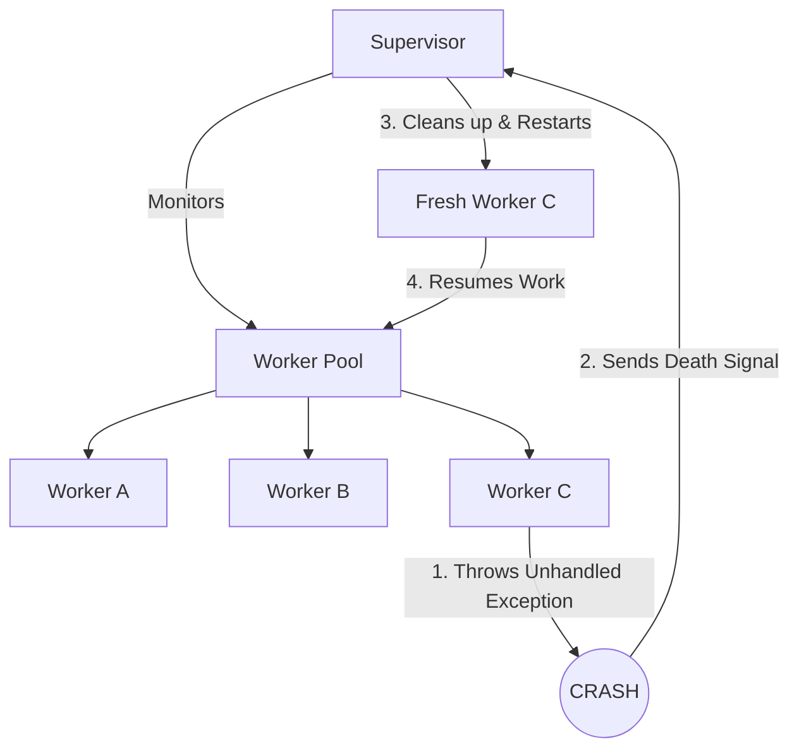

# Crash-Only Architecture: Managing Failures via Supervisor Trees

## 1. 💡 The "Big Picture" (Plain English)

### What is this in simple terms?
In traditional programming, when something goes wrong, we write massive webs of `try/catch` blocks to handle every imaginable error. But in a distributed system, unexpected errors (like network blips, memory corruption, or weird state bugs) happen constantly. 

**Crash-Only Architecture** throws away the idea of trying to gracefully patch over every error. Instead, it embraces a radical philosophy: **"Let it crash."** If a component encounters an unexpected error, we don't try to save it. We let it die immediately and have a dedicated parent component—called a **Supervisor**—clean up the mess and start a fresh, healthy instance of that component from a known, safe state.

### Real-World Analogy
Imagine a busy restaurant kitchen. 
* **The Traditional Way:** A line cook drops a tray of raw chicken on the floor. Instead of stopping, they try to wash the chicken, clean the floor while cooking, and keep track of orders all at once. They make a mess, contaminate the kitchen, and slow down the entire line.
* **The "Crash-Only" Way:** The moment the cook drops the chicken, they are immediately sent home for the day (they "crash"). The **Head Chef (the Supervisor)** instantly steps in, throws away the contaminated food, cleans the station, and brings in a fresh, well-rested backup cook to start the orders over from scratch. The rest of the kitchen keeps running smoothly.

### Why should I care today?
Writing code to handle every edge-case exception is exhausting, error-prone, and often leads to hidden bugs (like resource leaks or half-updated database states). By using a supervisor pattern, you:
1. **Simplify your code:** You stop writing defensive, nested try-catch blocks for unrecoverable errors.
2. **Eliminate memory leaks:** Crashing a damaged process completely frees up its memory, sockets, and file handles.
3. **Ensure High Availability:** Your system heals itself in milliseconds without requiring human intervention in the middle of the night.

---

## 2. 🛠️ How it Works (Step-by-Step)

### The Lifecycle of a Self-Healing Crash

1. **Isolation:** The worker performs its task inside an isolated boundary (like a thread, lightweight process, or microservice container) sharing no memory with other workers.
2. **Failure Detection:** An unhandled exception occurs (e.g., a database connection times out). The worker crashes instantly.
3. **Signal Propagation:** The supervisor, which constantly monitors the worker, receives a "death signal."
4. **Resolution (The Strategy):** The supervisor executes a predefined recovery plan (e.g., restarts only the dead worker, or restarts all workers in that group if they depend on each other).



### Python Implementation (Simulating a Supervisor Tree)

Here is a clean implementation of a supervisor monitoring stateless workers.

```python
import time
import random
import threading
from typing import Callable, Dict

class WorkerThread(threading.Thread):
    """
    An isolated worker that processes tasks. 
    It knows nothing about error recovery; it only knows how to work or crash.
    """
    def __init__(self, name: str, task: Callable[[], None]):
        super().__init__(name=name)
        self.task = task
        self.daemon = True
        self.is_active = True

    def run(self):
        try:
            print(f"🚀 [Worker {self.name}] Started.")
            while self.is_active:
                self.task()
                time.sleep(1)
        except Exception as e:
            print(f"💥 [Worker {self.name}] Crashed! Reason: {e}")
            # We let the thread exit naturally (crash). We do NOT try to handle it here.

class KitchenSupervisor:
    """
    The Supervisor. It monitors workers and restarts them if they die.
    """
    def __init__(self):
        self.workers: Dict[str, WorkerThread] = {}
        self.running = True

    def register_and_start_worker(self, name: str, task: Callable[[], None]):
        worker = WorkerThread(name, task)
        self.workers[name] = worker
        worker.start()

    def supervise_loop(self):
        print("🕵️ [Supervisor] Monitoring workers...")
        while self.running:
            time.sleep(1)
            for name, worker in list(self.workers.items()):
                # Check if the worker thread has terminated (crashed)
                if not worker.is_alive():
                    print(f"⚠️ [Supervisor] Detected {name} is dead. Restarting clean instance...")
                    # Re-create and restart the worker from a clean slate
                    self.register_and_start_worker(name, worker.task)

# --- Test driving our Crash-Only System ---

def prepare_soup():
    # Simulate a flakey task that randomly fails
    if random.random() < 0.3:
        raise RuntimeError("Burnt the soup! Unrecoverable error.")
    print("🍲 Cooking soup successfully...")

if __name__ == "__main__":
    supervisor = KitchenSupervisor()
    
    # Start our worker under supervision
    supervisor.register_and_start_worker("SoupChef", prepare_soup)
    
    # Run the supervisor monitoring loop in the main thread
    try:
        supervisor.supervise_loop()
    except KeyboardInterrupt:
        print("Stopping kitchen.")
```

---

## 3. 🧠 The "Deep Dive" (For the Interview)

### The Technical "Magic" Internals
* **Share-Nothing Architecture:** The magic of letting processes crash safely lies in memory isolation. In environments like Erlang/Elixir (BEAM VM) or Akka (JVM), actors do not share heap memory. When an actor crashes, its entire mailbox and private heap are instantly reclaimed by the garbage collector. There are no dangling pointers, no shared state corruption, and no leaked locks.
* **Linking and Monitors:** Supervisors use low-level OS/VM primitives called **links** or **monitors**. A link creates a bidirectional relationship: if one process dies, the other receives an exit signal. A monitor is unidirectional, allowing the supervisor to watch the worker without the worker's death taking the supervisor down.

### Key Trade-offs

| Strategy | Pros | Cons |
| :--- | :--- | :--- |
| **"Let It Crash"** | • Eliminates resource/memory leaks.<br>• Avoids defensive coding complexity.<br>• Guaranteed to start in a clean state. | • High startup cost if workers are heavy.<br>• Risk of **Restart Storms** (infinite crashing loop).<br>• Requires strict statelessness of workers. |
| **Traditional Try/Catch** | • Granular control over expected errors.<br>• Faster recovery for minor issues. | • High risk of stale memory/unreleased locks.<br>• Leads to massive, unmaintainable boilerplate. |

---

### Interviewer Probes (Tricky Questions & Winning Answers)

#### Probe 1: *"If a worker crashes because of a bad database record (poison pill), won't your supervisor just restart it infinitely, creating an infinite crash loop? How do you stop this?"*
> **Answer:** "Excellent point. To prevent infinite crash loops (known as **Restart Storms**), supervisors implement a **Max Restart Intensity** policy. For example, 'allow a maximum of 3 restarts within 10 seconds'. If the worker crashes more frequently than that limit, the supervisor gives up, escalates the failure to *its* parent supervisor, and flags the specific message/record as poison, moving it to a Dead Letter Queue rather than retrying it."

#### Probe 2: *"How does a Crash-Only architecture handle external resources like TCP sockets or open files held by the crashed worker? Won't they leak?"*
> **Answer:** "We rely on the **RAII (Resource Acquisition Is Initialization)** pattern and socket keep-alives/timeouts. In a modern actor model or containerized setup, the runtime environment (like the JVM, BEAM, or Kubernetes) automatically cleans up file descriptors and drops TCP connections associated with a terminated thread or container. Additionally, we design the downstream services to detect dropped connections via TCP keep-alive or application-level heartbeats, ensuring no resources remain hung."

#### Probe 3: *"What is the difference between a 'One-For-One' and a 'One-For-All' supervisor restart strategy?"*
> **Answer:** 
> * "**One-For-One:** If Worker A crashes, only Worker A is restarted. Use this when workers are completely independent.
> * **One-For-All:** If Worker A crashes, the supervisor kills Workers B and C as well, and restarts all of them. Use this when workers have tight dependencies (e.g., a multi-step pipeline where if one fails, the state of the others becomes invalid)."

---

## ✅ Summary Cheat Sheet

### 3 Key Takeaways
1. **Never catch what you can't fix:** If an exception is unexpected or unrecoverable, do not catch it. Let the process crash immediately to prevent corrupted state propagation.
2. **Isolate to survive:** Crash-only architectures require strict separation of concerns and stateless workers. If workers share mutable memory, a crash can corrupt the entire system.
3. **Supervisors own the recovery:** Workers focus entirely on the happy path. Supervisors focus entirely on the failure paths. This separation makes distributed code significantly easier to reason about.

### 📌 The Golden Rule
> *"It is better to clean up a dead process and start fresh than to try and nurse a corrupted, half-broken process back to health."*