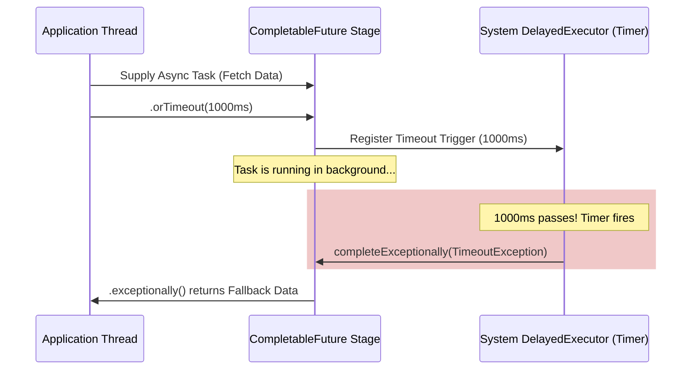
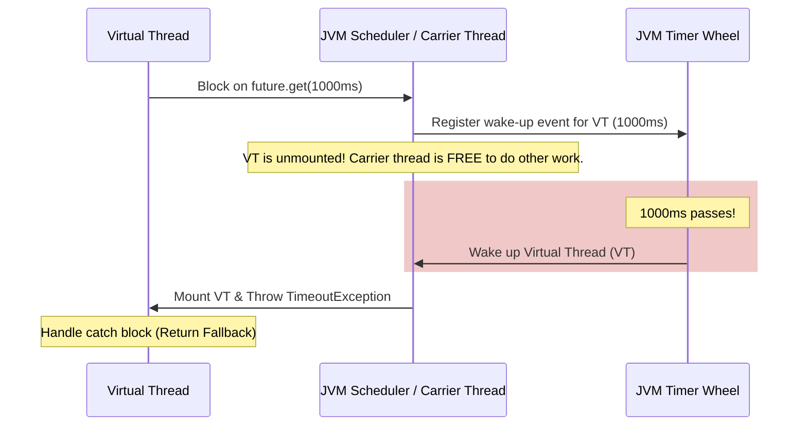

# Latency Budgets & Timeout Orchestration: Managing Deadlines with CompletableFuture and Virtual Threads

## 1. 💡 The "Big Picture" (Plain English)

### What is this in simple terms?
In modern software, your application rarely works alone. It talks to databases, payment gateways, and third-party APIs. **Latency Budgeting and Timeout Orchestration** is the art of setting a strict "stopwatch" on these external calls. It ensures that if a downstream system slows down, your application doesn't hang forever waiting for it.

### The Real-World Analogy
Imagine you are a chef in a busy restaurant preparing a complex three-course meal (the "Latency Budget" is **30 minutes** total):
*   **Course 1 (Appetizer):** Takes 5 minutes.
*   **Course 2 (Steak):** Needs to be grilled. You order it from the grill station. You tell the grill cook: *"I need this steak in 15 minutes. If it's not ready by then, cancel it, and I will serve a pre-made cold charcuterie board instead. I cannot keep the guest waiting."*
*   **Course 3 (Dessert):** Takes 5 minutes.

If the grill cook runs slow, you don't wait 45 minutes and ruin the guest's evening. You enforce a strict timeout, fall back to an alternative, and deliver the meal within the 30-minute budget.

### Why should I care today?
Without strict timeout orchestration, a single slow dependency can cause a catastrophic **cascading failure**. 
If an external payment API usually takes 100ms but suddenly takes 30 seconds due to a network outage, your application's threads will block, pile up, and eventually run out of memory or connection pool capacity. 

By mastering timeouts in both asynchronous (`CompletableFuture`) and synchronous (`Virtual Threads`) paradigms, you build resilient, self-healing systems that degrade gracefully under pressure.

---

## 2. 🛠️ How it Works (Step-by-Step)

Managing deadlines is handled differently depending on your concurrency model:
1.  **CompletableFuture (Asynchronous Pipeline):** Uses non-blocking scheduled tasks to inject exceptions or fallback values into your processing chain when a timer expires.
2.  **Virtual Threads (Thread-per-Task blocking):** Uses standard blocking calls combined with classic thread interruption or structured scope timeouts.

### The Code: Two Approaches to Latency Budgets

Here is how you execute a task with a strict **1-second timeout** and fallback logic.

```java
import java.util.concurrent.*;

public class LatencyOrchestrator {

    // Mock service representing an external database or API call
    private static String fetchUserPreferences(int delayMillis) {
        try {
            Thread.sleep(delayMillis);
            return "Dark Mode, English";
        } catch (InterruptedException e) {
            // Respect interruption!
            Thread.currentThread().interrupt();
            throw new RuntimeException("Fetch interrupted", e);
        }
    }

    /**
     * Approach A: Non-Blocking Timeout using CompletableFuture (Java 9+)
     */
    public CompletableFuture<String> getPreferencesAsync(int delayMillis) {
        return CompletableFuture.supplyAsync(() -> fetchUserPreferences(delayMillis))
                // If it takes > 1000ms, fail with TimeoutException
                .orTimeout(1000, TimeUnit.MILLISECONDS)
                // Gracefully catch the timeout and return a default value
                .exceptionally(ex -> {
                    if (ex.getCause() instanceof TimeoutException) {
                        System.err.println("Async timeout reached! Returning default preferences.");
                        return "Light Mode, English (Fallback)";
                    }
                    throw new CompletionException(ex);
                });
    }

    /**
     * Approach B: Clean Blocking Timeout using Virtual Threads (Java 21+)
     */
    public String getPreferencesVirtualThread(int delayMillis) {
        // We use a structured try-with-resources with a Virtual Thread Executor
        try (var executor = Executors.newVirtualThreadPerTaskExecutor()) {
            
            Future<String> future = executor.submit(() -> fetchUserPreferences(delayMillis));
            
            // Simply block the virtual thread. This is incredibly cheap!
            return future.get(1000, TimeUnit.MILLISECONDS);
            
        } catch (TimeoutException e) {
            System.err.println("Virtual Thread timeout reached! Returning default preferences.");
            return "Light Mode, English (Fallback)";
        } catch (InterruptedException | ExecutionException e) {
            throw new RuntimeException("Execution failed", e);
        }
    }
}
```

### Visualizing the Flow

#### CompletableFuture Timeout Pipeline:


#### Virtual Thread Timeout Pipeline:


---

## 3. 🧠 The "Deep Dive" (For the Interview)

To stand out in a senior interview, you must explain *how* these APIs coordinate threads and schedule delays without creating resource bottlenecks.

### Under the Hood: `CompletableFuture.orTimeout()`
How does `orTimeout()` work without blocking your application threads?
*   **The System Daemon:** Inside the JDK, there is a single, shared static scheduler: `CompletableFuture.DelayedExecutor`. It is backed by a highly optimized, single-threaded `ScheduledThreadPoolExecutor`.
*   **The Hook:** When you call `.orTimeout(1000, TimeUnit.MILLISECONDS)`, the JVM registers a lightweight task with this scheduled executor.
*   **The Race:** 
    *   If your actual task finishes *before* 1000ms, it completes the `CompletableFuture`. The scheduled timeout task fires later, sees that the future is already complete, and does nothing.
    *   If the timer fires first, the scheduled thread calls `CompletableFuture.completeExceptionally(new TimeoutException())`. 

### Under the Hood: Virtual Thread Park & Timeouts
In a traditional platform thread model, calling `future.get(1, TimeUnit.SECONDS)` blocks an OS-level thread. This is incredibly expensive.
*   **Unmounting on Timeout:** When a **Virtual Thread** calls a blocking method with a timeout (e.g., `future.get(...)` or a socket read), the JVM does *not* block the underlying physical Carrier Thread (`ForkJoinPool`).
*   **The Virtual Park:** The virtual thread state is saved to the heap, and it is **unmounted** from its carrier thread. 
*   **The JVM Timer Wheel:** The JVM uses an internal **Timer Wheel** architecture to manage millions of timeout deadlines. When the timer expires, the JVM scheduler marks the virtual thread as runnable again. A carrier thread picks it up, mounts it back, and throws a `TimeoutException`.
*   **Scale:** This allows you to have **1,000,000 concurrent timeouts** running simultaneously without exhausting system resources.

### The Trade-offs

| Feature | CompletableFuture (`orTimeout`) | Virtual Threads (`future.get`) |
| :--- | :--- | :--- |
| **Programming Style** | Reactive / Functional (Callback Hell risk) | Sequential / Imperative (Easy to debug & read) |
| **Resource Overhead** | Extremely low. Shared scheduler thread. | Slightly higher than CF, but orders of magnitude cheaper than platform threads. |
| **Interruption Handling** | Complex. Cancellation does *not* automatically interrupt the running thread (unless explicitly coded). | Simple. Standard Java thread interruption (`Thread.interrupt()`) works naturally. |
| **Debugging** | Hard. Stack traces are broken across different reactive execution stages. | Easy. Clean, continuous stack traces as if it were synchronous code. |

---

### Interviewer Probes (Tricky Questions & Advanced Answers)

#### 1. "If I call `completableFuture.cancel(true)` because a timeout occurred, does it actually stop the running task on the underlying Thread Pool?"
*   **The Junior Answer:** *"Yes, because I passed `true` to cancel, which interrupts the thread."*
*   **The Senior Answer:** *"No, it does not. In `CompletableFuture`, passing `true` to `cancel()` has no effect on the running thread. The flag is ignored. It only ensures that downstream stages reject the result and complete exceptionally. If the underlying task is performing a heavy loop or a blocking I/O operation, it will keep running and consuming CPU/threads in the background. To actually stop it, you must handle thread interruption yourself or pass a cancellation token/cooperative flag to your task."*

#### 2. "How do Virtual Threads solve the 'CompletableFuture Thread Hand-off' problem?"
*   **The Senior Answer:** *"With `CompletableFuture`, when a stage completes, the next stage might execute on a different thread depending on whether you use `.thenApply()` or `.thenApplyAsync()`. This constant context-switching and hand-off between thread pools destroys CPU cache locality and complicates context passing (like MDC logging or Transaction contexts).*
    
    *With Virtual Threads, we don't need these async pipelines. We write simple, blocking, linear code. The thread is unmounted and mounted seamlessly by the JVM, keeping the business logic on the same virtual thread execution context from start to finish. This preserves thread-local variables safely and simplifies debugging significantly."*

#### 3. "What happens if a Virtual Thread times out while holding a lock on a database connection or inside a `synchronized` block?"
*   **The Senior Answer:** *"This is a critical danger known as **Thread Pinning**. If a Virtual Thread is inside a `synchronized` block or calling a Native Method, the JVM cannot unmount it from its physical Carrier Thread. If a timeout occurs during this state, the carrier thread itself is blocked. If this happens frequently, the entire `ForkJoinPool` carrier pool will starve, degrading the performance of your entire application. The solution is to replace `synchronized` blocks with modern `ReentrantLock`s, which allow virtual threads to unmount safely."*

---

## 4. ✅ Summary Cheat Sheet

### 3 Key Takeaways
1.  **Don't block indefinitely:** Always set a timeout on every network request, database call, and thread coordination pool.
2.  **CompletableFuture uses timers:** `orTimeout()` relies on a centralized system-wide `ScheduledThreadPoolExecutor` daemon thread.
3.  **Virtual Threads are cheap to park:** Timeout execution with virtual threads is synchronous, highly readable, and doesn't waste physical OS threads because the JVM unmounts them when they block.

### 🌟 The Golden Rule
> **"Never write a `.get()` or an API call without a timeout limit. If you don't define your latency budget, your worst-performing dependency will eventually define it for you."**